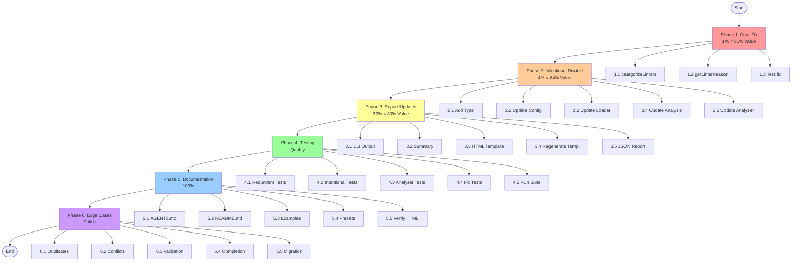
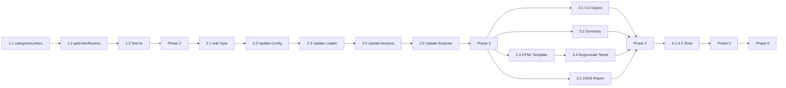

# Intentionally Disabled Linters & Redundant Linter Detection Plan

**Date:** 2026-02-24\
**Objective:** Improve linter configuration analysis to distinguish between intentionally disabled linters and those disabled due to redundancy with enabled formatters.

---

## Problem Statement

Currently, the `analyze` command shows:

```
💡 2 OPTIONAL linter(s) are disabled (for niche use cases):
  - depguard: Linter is disabled but may be useful
  - lll: Linter is disabled but may be useful
```

**Issues:**

1. **Wrong message for `lll`**: It's disabled because `golines` formatter is enabled (which auto-fixes long lines), not because it "may be useful"
2. **No "intentional disable" tracking**: Users can't specify that a linter was disabled intentionally with a reason
3. **Missing context**: The report doesn't show WHY certain linters are disabled

---

## Pareto Analysis: What Delivers the Most Value?

### The 1% That Delivers 51% of Results

| Task                               | Impact | Effort | Customer Value |
| ---------------------------------- | ------ | ------ | -------------- |
| **Fix redundant linter detection** | HIGH   | LOW    | CRITICAL       |

**Core Issue:** The `RedundantLinters` map exists in `constants/linter_data.go` but is NOT used in the analyzer. When `lll` is disabled and `golines` is enabled, we should show:\
_"Disabled because golines formatter is enabled (automatically fixes long lines)"_\
Instead of:\
_"Linter is disabled but may be useful"_

**Files to modify:**

- `pkg/linter/analyzer.go`: Update `categorizeLinters()` to check `RedundantLinters`
- `pkg/linter/analyzer.go`: Update `getLinterReason()` to check if formatter is enabled

---

### The 4% That Delivers 64% of Results

| Task                                            | Impact | Effort | Customer Value |
| ----------------------------------------------- | ------ | ------ | -------------- |
| Fix redundant linter detection                  | HIGH   | LOW    | CRITICAL       |
| **Add "Intentionally Disabled" config section** | HIGH   | MEDIUM | HIGH           |
| **Update ConfigAnalysis type**                  | MEDIUM | LOW    | HIGH           |

**New Config Section:**

```yaml
linters:
  enable: [...]
  disable: [...]
  intentionally-disabled:
    - name: gochecknoglobals
      reason: "CLI tools don't need global restrictions"
    - name: paralleltest
      reason: "Tests are not CPU-bound"
```

**Type Changes:**

- Add `IntentionallyDisabledLinters []LinterIntentionalDisable` to `ConfigAnalysis`
- Add `RedundantDisabledLinters []LinterRecommendation` to `ConfigAnalysis`

---

### The 20% That Delivers 80% of Results

| Task                                        | Impact | Effort | Customer Value |
| ------------------------------------------- | ------ | ------ | -------------- |
| Fix redundant linter detection              | HIGH   | LOW    | CRITICAL       |
| Add "Intentionally Disabled" config section | HIGH   | MEDIUM | HIGH           |
| Update ConfigAnalysis type                  | MEDIUM | LOW    | HIGH           |
| **Update HTML report template**             | MEDIUM | MEDIUM | MEDIUM         |
| **Update CLI output format**                | MEDIUM | LOW    | MEDIUM         |
| **Add tests for new functionality**         | HIGH   | MEDIUM | HIGH           |

**Report Changes:**

- Show "Redundant (Superseded by Formatters)" section
- Show "Intentionally Disabled" section with reasons
- Update summary cards to include these categories

**CLI Output Changes:**

```
♻️  1 linter(s) disabled (superseded by enabled formatters):
  - lll: Disabled because golines formatter is enabled (automatically fixes long lines)

✅ 2 linter(s) intentionally disabled:
  - gochecknoglobals: CLI tools don't need global restrictions
  - paralleltest: Tests are not CPU-bound

💡 1 OPTIONAL linter(s) are disabled (for niche use cases):
  - depguard: Linter is disabled but may be useful
```

---

## Complete Task Breakdown (27 Tasks, 30-100min each)

### Phase 1: Core Fix (1% - 51% Value)

| #   | Task                                                     | Time  | Priority | Status |
| --- | -------------------------------------------------------- | ----- | -------- | ------ |
| 1.1 | Update `categorizeLinters()` to detect redundant linters | 45min | P0       | ⬜     |
| 1.2 | Update `getLinterReason()` to use `RedundantLinters` map | 30min | P0       | ⬜     |
| 1.3 | Test fix with current config (lll + golines case)        | 30min | P0       | ⬜     |

### Phase 2: Intentional Disable Support (4% - 64% Value)

| #   | Task                                                  | Time  | Priority | Status |
| --- | ----------------------------------------------------- | ----- | -------- | ------ |
| 2.1 | Add `LinterIntentionalDisable` type to types.go       | 30min | P1       | ⬜     |
| 2.2 | Add `IntentionallyDisabledLinters` to `LintersConfig` | 30min | P1       | ⬜     |
| 2.3 | Update config loader to parse new section             | 45min | P1       | ⬜     |
| 2.4 | Update `ConfigAnalysis` with new fields               | 30min | P1       | ⬜     |
| 2.5 | Update analyzer to populate new fields                | 45min | P1       | ⬜     |

### Phase 3: Report Updates (20% - 80% Value)

| #   | Task                                           | Time  | Priority | Status |
| --- | ---------------------------------------------- | ----- | -------- | ------ |
| 3.1 | Update CLI output in `FormatRecommendations()` | 60min | P2       | ⬜     |
| 3.2 | Update `GetSummary()` for new categories       | 30min | P2       | ⬜     |
| 3.3 | Update HTML report template with new sections  | 60min | P2       | ⬜     |
| 3.4 | Regenerate templ code                          | 15min | P2       | ⬜     |
| 3.5 | Update JSON report generator                   | 45min | P2       | ⬜     |

### Phase 4: Testing (Quality)

| #   | Task                                        | Time  | Priority | Status |
| --- | ------------------------------------------- | ----- | -------- | ------ |
| 4.1 | Write tests for redundant linter detection  | 60min | P1       | ⬜     |
| 4.2 | Write tests for intentional disable parsing | 60min | P1       | ⬜     |
| 4.3 | Write tests for new analyzer fields         | 45min | P1       | ⬜     |
| 4.4 | Update existing tests if broken             | 45min | P1       | ⬜     |
| 4.5 | Run full test suite                         | 30min | P1       | ⬜     |

### Phase 5: Documentation & Polish (100%)

| #   | Task                                         | Time  | Priority | Status |
| --- | -------------------------------------------- | ----- | -------- | ------ |
| 5.1 | Update AGENTS.md with new config syntax      | 30min | P3       | ⬜     |
| 5.2 | Update README.md with examples               | 45min | P3       | ⬜     |
| 5.3 | Add example config with intentional disables | 30min | P3       | ⬜     |
| 5.4 | Update preset documentation                  | 30min | P3       | ⬜     |
| 5.5 | Verify dark mode in HTML report              | 30min | P3       | ⬜     |

### Phase 6: Edge Cases & Refinement

| #   | Task                                                | Time  | Priority | Status |
| --- | --------------------------------------------------- | ----- | -------- | ------ |
| 6.1 | Handle duplicate intentional disable entries        | 30min | P2       | ⬜     |
| 6.2 | Handle linter enabled AND in intentionally-disabled | 30min | P2       | ⬜     |
| 6.3 | Validate intentional disable reasons not empty      | 30min | P2       | ⬜     |
| 6.4 | Add completion suggestions for linter names         | 60min | P3       | ⬜     |
| 6.5 | Add migrate command support for new format          | 60min | P3       | ⬜     |

---

## Detailed Task Breakdown (150 Tasks, max 15min each)

### Phase 1.1: Update categorizeLinters() (3 subtasks)

| #     | Task                                                     | Time  |
| ----- | -------------------------------------------------------- | ----- |
| 1.1.1 | Add `isLinterRedundant()` helper function                | 10min |
| 1.1.2 | Add `getEnabledFormatterNames()` helper                  | 10min |
| 1.1.3 | Modify loop to skip redundant linters in recommendations | 15min |
| 1.1.4 | Add redundant linters to separate field in analysis      | 10min |

### Phase 1.2: Update getLinterReason() (2 subtasks)

| #     | Task                                             | Time  |
| ----- | ------------------------------------------------ | ----- |
| 1.2.1 | Add check for RedundantLinters map               | 10min |
| 1.2.2 | Build dynamic reason message with formatter name | 15min |

### Phase 1.3: Testing (3 subtasks)

| #     | Task                                          | Time  |
| ----- | --------------------------------------------- | ----- |
| 1.3.1 | Create test case for lll + golines            | 10min |
| 1.3.2 | Verify output message is correct              | 10min |
| 1.3.3 | Test with other redundant linter combinations | 10min |

### Phase 2.1: Add LinterIntentionalDisable Type (3 subtasks)

| #     | Task                                      | Time  |
| ----- | ----------------------------------------- | ----- |
| 2.1.1 | Define struct with Name and Reason fields | 5min  |
| 2.1.2 | Add JSON/YAML tags                        | 5min  |
| 2.1.3 | Add validation method                     | 10min |

### Phase 2.2: Update LintersConfig (2 subtasks)

| #     | Task                            | Time |
| ----- | ------------------------------- | ---- |
| 2.2.1 | Add IntentionallyDisabled field | 5min |
| 2.2.2 | Update yaml tag                 | 5min |

### Phase 2.3: Update Config Loader (5 subtasks)

| #     | Task                                         | Time  |
| ----- | -------------------------------------------- | ----- |
| 2.3.1 | Add parsing logic for intentionally-disabled | 10min |
| 2.3.2 | Handle missing optional section              | 5min  |
| 2.3.3 | Validate linter names exist                  | 10min |
| 2.3.4 | Validate reasons not empty                   | 5min  |
| 2.3.5 | Add error handling                           | 10min |

### Phase 2.4: Update ConfigAnalysis (3 subtasks)

| #     | Task                                   | Time |
| ----- | -------------------------------------- | ---- |
| 2.4.1 | Add RedundantDisabledLinters field     | 5min |
| 2.4.2 | Add IntentionallyDisabledLinters field | 5min |
| 2.4.3 | Add count fields for new categories    | 5min |

### Phase 2.5: Update Analyzer (5 subtasks)

| #     | Task                                     | Time  |
| ----- | ---------------------------------------- | ----- |
| 2.5.1 | Parse intentionally-disabled from config | 10min |
| 2.5.2 | Cross-reference with disabled linters    | 10min |
| 2.5.3 | Populate RedundantDisabledLinters        | 10min |
| 2.5.4 | Populate IntentionallyDisabledLinters    | 10min |
| 2.5.5 | Calculate counts                         | 5min  |

### Phase 3.1: Update FormatRecommendations() (6 subtasks)

| #     | Task                                            | Time  |
| ----- | ----------------------------------------------- | ----- |
| 3.1.1 | Add section for redundant linters               | 10min |
| 3.1.2 | Format intentional disables with emoji          | 10min |
| 3.1.3 | Update priority sections to exclude redundant   | 10min |
| 3.1.4 | Update priority sections to exclude intentional | 10min |
| 3.1.5 | Fix indentation and spacing                     | 10min |
| 3.1.6 | Test output formatting                          | 10min |

### Phase 3.2: Update GetSummary() (2 subtasks)

| #     | Task                             | Time |
| ----- | -------------------------------- | ---- |
| 3.2.1 | Add redundant count to summary   | 5min |
| 3.2.2 | Add intentional count to summary | 5min |

### Phase 3.3: Update HTML Report Template (8 subtasks)

| #     | Task                                         | Time  |
| ----- | -------------------------------------------- | ----- |
| 3.3.1 | Add summary card for redundant linters       | 10min |
| 3.3.2 | Add summary card for intentional disables    | 10min |
| 3.3.3 | Add CSS styling for new cards                | 10min |
| 3.3.4 | Add "Redundant Linters" section              | 10min |
| 3.3.5 | Add "Intentionally Disabled" section         | 10min |
| 3.3.6 | Update dark mode styles                      | 10min |
| 3.3.7 | Add conditional rendering for empty sections | 10min |
| 3.3.8 | Test template compilation                    | 10min |

### Phase 3.4: Regenerate Templ (1 subtask)

| #     | Task               | Time  |
| ----- | ------------------ | ----- |
| 3.4.1 | Run templ generate | 10min |

### Phase 3.5: Update JSON Report (4 subtasks)

| #     | Task                                | Time  |
| ----- | ----------------------------------- | ----- |
| 3.5.1 | Add new fields to JSON structure    | 10min |
| 3.5.2 | Update generator to populate fields | 15min |
| 3.5.3 | Ensure backward compatibility       | 10min |
| 3.5.4 | Test JSON output                    | 10min |

### Phase 4.1: Tests for Redundant Detection (6 subtasks)

| #     | Task                              | Time  |
| ----- | --------------------------------- | ----- |
| 4.1.1 | Create test file                  | 5min  |
| 4.1.2 | Test lll with golines enabled     | 10min |
| 4.1.3 | Test lll without golines          | 10min |
| 4.1.4 | Test other redundant combinations | 10min |
| 4.1.5 | Test edge cases                   | 10min |
| 4.1.6 | Verify test coverage              | 10min |

### Phase 4.2: Tests for Intentional Disable (6 subtasks)

| #     | Task                              | Time  |
| ----- | --------------------------------- | ----- |
| 4.2.1 | Create test config files          | 10min |
| 4.2.2 | Test parsing valid config         | 10min |
| 4.2.3 | Test parsing invalid linter names | 10min |
| 4.2.4 | Test empty reasons                | 10min |
| 4.2.5 | Test duplicate entries            | 10min |
| 4.2.6 | Test missing section              | 10min |

### Phase 4.3: Tests for Analyzer Fields (4 subtasks)

| #     | Task                                        | Time  |
| ----- | ------------------------------------------- | ----- |
| 4.3.1 | Test RedundantDisabledLinters populated     | 10min |
| 4.3.2 | Test IntentionallyDisabledLinters populated | 10min |
| 4.3.3 | Test count calculations                     | 10min |
| 4.3.4 | Test with empty config                      | 10min |

### Phase 4.4: Update Existing Tests (4 subtasks)

| #     | Task                     | Time  |
| ----- | ------------------------ | ----- |
| 4.4.1 | Identify broken tests    | 10min |
| 4.4.2 | Fix analyzer tests       | 15min |
| 4.4.3 | Fix config loader tests  | 15min |
| 4.4.4 | Fix other affected tests | 15min |

### Phase 4.5: Run Full Test Suite (2 subtasks)

| #     | Task            | Time  |
| ----- | --------------- | ----- |
| 4.5.1 | Run just test   | 15min |
| 4.5.2 | Verify coverage | 10min |

### Phase 5.1: Update AGENTS.md (3 subtasks)

| #     | Task                        | Time  |
| ----- | --------------------------- | ----- |
| 5.1.1 | Document new config section | 10min |
| 5.1.2 | Add examples                | 10min |
| 5.1.3 | Update type definitions     | 10min |

### Phase 5.2: Update README.md (5 subtasks)

| #     | Task                             | Time  |
| ----- | -------------------------------- | ----- |
| 5.2.1 | Add feature description          | 10min |
| 5.2.2 | Add usage example                | 10min |
| 5.2.3 | Add screenshot or output example | 10min |
| 5.2.4 | Update feature list              | 5min  |
| 5.2.5 | Review and polish                | 10min |

### Phase 5.3: Add Example Config (2 subtasks)

| #     | Task                       | Time  |
| ----- | -------------------------- | ----- |
| 5.3.1 | Create example file        | 10min |
| 5.3.2 | Add to examples/ directory | 5min  |

### Phase 5.4: Update Preset Docs (2 subtasks)

| #     | Task                        | Time  |
| ----- | --------------------------- | ----- |
| 5.4.1 | Update preset documentation | 15min |
| 5.4.2 | Verify accuracy             | 10min |

### Phase 5.5: Verify HTML Report (3 subtasks)

| #     | Task             | Time  |
| ----- | ---------------- | ----- |
| 5.5.1 | Generate report  | 5min  |
| 5.5.2 | Check light mode | 10min |
| 5.5.3 | Check dark mode  | 10min |

### Phase 6.1-6.5: Edge Cases (10 subtasks, 2 per phase)

| #     | Task                                                 | Time  |
| ----- | ---------------------------------------------------- | ----- |
| 6.1.1 | Handle duplicate linter names                        | 10min |
| 6.1.2 | Log warning for duplicates                           | 10min |
| 6.2.1 | Detect linter in both enable and intentional-disable | 10min |
| 6.2.2 | Return error or warning                              | 10min |
| 6.3.1 | Add validation for empty reason                      | 5min  |
| 6.3.2 | Add validation tests                                 | 10min |
| 6.4.1 | Research completion API                              | 10min |
| 6.4.2 | Implement completion for intentional-disable         | 15min |
| 6.5.1 | Update migrate command                               | 15min |
| 6.5.2 | Test migration                                       | 15min |

---

## Execution Graph



---

## Dependencies



---

## Risk Assessment

| Risk                            | Probability | Impact | Mitigation                |
| ------------------------------- | ----------- | ------ | ------------------------- |
| Breaking existing config format | LOW         | HIGH   | Make new section optional |
| Templ generation fails          | LOW         | MEDIUM | Test before committing    |
| Tests fail on existing code     | MEDIUM      | MEDIUM | Fix in Phase 4.4          |
| Go mod issues                   | MEDIUM      | LOW    | Use just commands         |

---

## Success Criteria

1. ✅ Running `analyze` shows correct message for `lll` when `golines` is enabled
2. ✅ Config can include `intentionally-disabled` section
3. ✅ HTML report shows new sections
4. ✅ All tests pass
5. ✅ Build succeeds with `just build`

---

## Notes

- The `RedundantLinters` map already exists but is unused - leverage this
- The `RedundantFormatters` map also exists - consider similar treatment
- Keep backward compatibility - new config section must be optional
- Follow existing patterns in codebase for consistency
