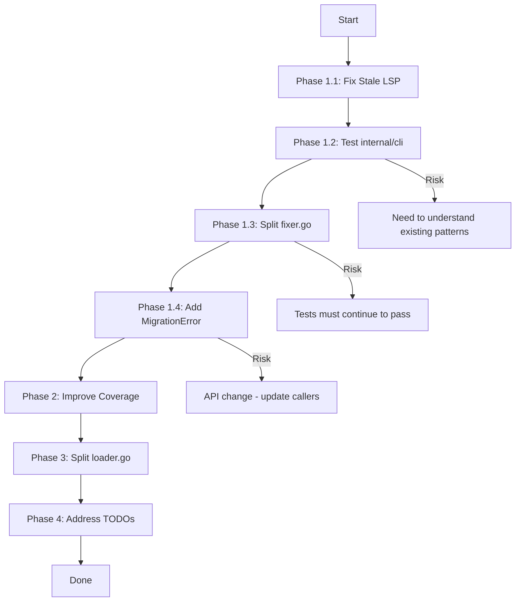

# Comprehensive Execution Plan: golangci-lint-auto-configure

**Generated:** 2026-03-26  
**Author:** AI Assistant  
**Purpose:** Improve code quality, architecture, and test coverage

---

## Executive Summary

### Current State Analysis

| Metric                 | Value                           | Status               |
| ---------------------- | ------------------------------- | -------------------- |
| Build                  | Passes                          | ✅                   |
| Tests                  | Pass (52.6% composite)          | ⚠️ Needs improvement |
| Lint                   | Stale diagnostics (ghost files) | ❌                   |
| Internal/cli coverage  | 0%                              | 🔴 Critical          |
| pkg/linter coverage    | 60.1%                           | 🟡 Could improve     |
| pkg/diff coverage      | 96%                             | ✅ Good              |
| pkg/config coverage    | 71.6%                           | 🟡 OK                |
| pkg/detection coverage | 72%                             | 🟡 OK                |
| Files >350 lines       | 3                               | 🔴 Need refactor     |
| TODO comments          | 16                              | 🟡 Track/address     |

### Key Issues Identified

1. **Ghost Systems**: `wizard.go` and `spinner.go` referenced in deleted files
2. **Zero Coverage**: `internal/cli` package has 0% test coverage
3. **Large Files**: `fixer.go` (471 lines), `loader.go` (389 lines), `workflow.go` (205 lines)
4. **Stale LSP**: `golangci-lint_ls` running in parallel causing errors
5. **Missing Error Types**: No dedicated `MigrationError` type

---

## Critical Issues (Must Fix)

### 1. Test Coverage for internal/cli Package

| Item               | Detail                                   |
| ------------------ | ---------------------------------------- |
| **Impact**         | High - No verification of CLI commands   |
| **Effort**         | 60 min                                   |
| **Customer Value** | Prevents regressions in command behavior |

**Tasks:**

- [ ] 1.1 Review existing test patterns in `internal/cli/commands_test.go`
- [ ] 1.2 Add tests for `runConfigure` function
- [ ] 1.3 Add tests for `applyPreset` function
- [ ] 1.4 Add tests for command flags (priority, preset, dry-run, config-path)

### 2. Fix Stale LSP Diagnostics

| Item               | Detail                       |
| ------------------ | ---------------------------- |
| **Impact**         | Medium - Causes confusion    |
| **Effort**         | 10 min                       |
| **Customer Value** | Clean development experience |

**Tasks:**

- [ ] 2.1 Kill all `golangci-lint` processes
- [ ] 2.2 Clear gopls cache
- [ ] 2.3 Verify diagnostics are clean

---

## High Priority Issues

### 3. Split Large Files

| File          | Current Lines | Target       | Effort  |
| ------------- | ------------- | ------------ | ------- |
| `fixer.go`    | 471           | Split into 3 | 120 min |
| `loader.go`   | 389           | Split into 2 | 60 min  |
| `workflow.go` | 205           | OK for now   | 0 min   |

#### 3.1 Split fixer.go (471 lines)

**Reasoning:** This file handles multiple concerns:

1. Config fixing logic
2. Pre-fix version
3. Pre-fix deprecated linters
4. Dry-run calculation

**New Structure:**

```
pkg/linter/
├── fixer.go              (150 lines - main orchestration)
├── fixer_deprecated.go   (100 lines - deprecated linter handling)
├── fixer_version.go      (50 lines - version handling)
├── fixer_dryrun.go       (80 lines - dry-run logic)
├── fixer_apply.go        (91 lines - apply fixes logic)
```

#### 3.2 Split loader.go (389 lines)

**New Structure:**

```
pkg/config/
├── loader.go             (150 lines - main loader interface)
├── loader_parse.go       (100 lines - parsing logic)
├── loader_validate.go    (80 lines - validation)
├── loader_defaults.go    (59 lines - defaults)
```

### 4. Add MigrationError Type

| Item               | Detail                         |
| ------------------ | ------------------------------ |
| **Impact**         | Medium - Better error handling |
| **Effort**         | 30 min                         |
| **Customer Value** | More actionable errors         |

**Current Problem:** `MigrationResult` uses boolean `Success` field instead of proper error types.

**Tasks:**

- [ ] 4.1 Create `MigrationError` type in `pkg/errors/errors.go`
- [ ] 4.2 Update `MigrationResult` to use error instead of bool
- [ ] 4.3 Update fixer.go to return proper errors
- [ ] 4.4 Update tests for new error handling

---

## Medium Priority Issues

### 5. Address TODO Comments

| Category      | Count | Action                                             |
| ------------- | ----- | -------------------------------------------------- |
| Config loader | 4     | Evaluate and address                               |
| Fixer         | 4     | Some can be addressed, others are design decisions |
| Types         | 2     | Evaluate generics proposal                         |
| Detection     | 5     | Defer - not critical path                          |

**Recommended Approach:**

- Keep TODOs that are legitimate future improvements
- Remove TODOs that are completed
- Create issues for complex TODOs instead of inline comments

### 6. Improve pkg/linter Coverage (60.1% → 75%)

| Item               | Detail                     |
| ------------------ | -------------------------- |
| **Impact**         | Medium - Better confidence |
| **Effort**         | 90 min                     |
| **Customer Value** | Fewer regressions          |

**Tasks:**

- [ ] 6.1 Add tests for `preFixVersion` function
- [ ] 6.2 Add tests for `preFixDeprecatedLinters` function
- [ ] 6.3 Add tests for `calculateDryRunResultWithDeprecated`
- [ ] 6.4 Add tests for formatter handling

---

## Low Priority / Nice to Have

### 7. Update go.mod for Toolchain Issues

The build works but LSP has issues with toolchain caching. Consider:

- Pinning toolchain version more explicitly
- Cleaning cache more aggressively

### 8. Architecture Enforcement

| Item               | Detail                                 |
| ------------------ | -------------------------------------- |
| **Tool**           | `fe3dback/go-arch-lint`                |
| **Impact**         | Low - Prevents architecture violations |
| **Effort**         | 60 min                                 |
| **Customer Value** | Long-term maintainability              |

---

## Execution Order (Priority Matrix)

```
Impact
  HIGH │  [1-Test internal/cli]  [3-Split fixer.go]  [4-Add MigrationError]
       │
 MEDIUM │  [6-Improve coverage]   [5-Address TODOs]
       │
  LOW  │  [3b-Split loader.go]  [2-Fix LSP]         [7-Update toolchain]
       │
        └─────────────────────────────────────────────────────────────
                          Effort
        30min    60min    90min    120min   180min+
```

---

## Detailed Task Breakdown (Phase 1 - Critical)

### Phase 1.1: Fix Stale LSP (10 min)

```
┌─────────────────────────────────────┐
│ Kill golangci-lint processes        │
│ Clear gopls cache                  │
│ Verify diagnostics clean             │
└─────────────────────────────────────┘
```

### Phase 1.2: Test internal/cli (60 min)

```
┌─────────────────────────────────────┐
│ Review commands_test.go patterns     │
│ Add runConfigure tests               │
│ Add applyPreset tests               │
│ Test flag combinations              │
└─────────────────────────────────────┘
```

### Phase 1.3: Split fixer.go (120 min)

```
┌─────────────────────────────────────┐
│ Extract fixer_deprecated.go         │
│ Extract fixer_version.go            │
│ Extract fixer_dryrun.go            │
│ Extract fixer_apply.go             │
│ Update imports and exports          │
│ Verify tests pass                   │
└─────────────────────────────────────┘
```

### Phase 1.4: Add MigrationError (30 min)

```
┌─────────────────────────────────────┐
│ Create MigrationError type          │
│ Update MigrationResult struct       │
│ Update fixer to use error           │
│ Update tests                        │
└─────────────────────────────────────┘
```

---

## Success Metrics

| Metric                | Current | Target |
| --------------------- | ------- | ------ |
| Internal/cli coverage | 0%      | 50%    |
| Linter coverage       | 60.1%   | 75%    |
| Files >350 lines      | 3       | 1      |
| Stale diagnostics     | Yes     | No     |
| Proper error types    | No      | Yes    |

---

## Mermaid Execution Graph



---

## Appendix: Current TODO Comments

| File                      | Line | TODO                                            |
| ------------------------- | ---- | ----------------------------------------------- |
| pkg/config/loader.go      | 3    | Extract LinterList type into types package      |
| pkg/config/loader.go      | 4    | Add context.Context support for cancellation    |
| pkg/config/loader.go      | 5    | Consider using io.Reader/Writer interfaces      |
| pkg/config/loader.go      | 6    | Extract default config values into constants    |
| pkg/linter/fixer.go       | 3    | Consider using transaction pattern              |
| pkg/linter/fixer.go       | 4    | Extract duplicate linter detection              |
| pkg/linter/fixer.go       | 5    | Add rollback mechanism                          |
| pkg/linter/fixer.go       | 6    | Consider using immutable config copies          |
| pkg/types/types.go        | 3    | Consider using generics for ConfigResult        |
| pkg/types/types.go        | 4    | Use time.Duration instead of string for timeout |
| pkg/detection/detector.go | 3    | 327 lines - consider splitting                  |
| pkg/detection/detector.go | 4    | Add caching for repeated detection              |
| pkg/detection/detector.go | 5    | Extract framework detection patterns            |
| pkg/detection/detector.go | 6    | Consider using AST parsing                      |
| pkg/detection/detector.go | 7    | Add support for test-only projects              |

---

## Appendix: Test Coverage by Package

| Package       | Coverage  | Test Files | Priority    |
| ------------- | --------- | ---------- | ----------- |
| internal/cli  | 0.0%      | 1          | 🔴 Critical |
| pkg/config    | 71.6%     | 1          | 🟡 OK       |
| pkg/detection | 72.0%     | 2          | 🟡 OK       |
| pkg/diff      | 96.0%     | 1          | ✅ Good     |
| pkg/linter    | 60.1%     | 2          | 🟡 Improve  |
| **Composite** | **52.6%** | **9**      | 🟡 OK       |

---

**Last Updated:** 2026-03-26  
**Next Review:** After Phase 1 completion
