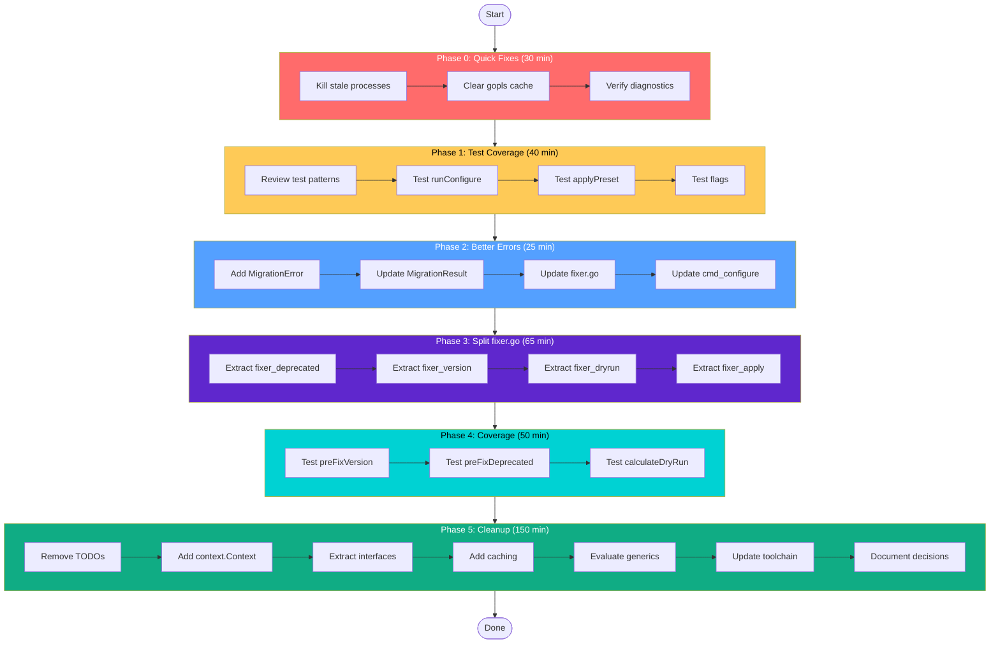

# Detailed Task Breakdown (Sorted by Priority)

**Generated:** 2026-03-26  
**Total Tasks:** 24  
**Max Duration:** 24 hours

---

## Table View: All Tasks Sorted by Priority/Impact

| #   | Task                                    | Package       | Effort | Impact | Value              | Priority | Dependencies |
| --- | --------------------------------------- | ------------- | ------ | ------ | ------------------ | -------- | ------------ |
| 1   | Kill stale golangci-lint processes      | Dev           | 5 min  | Low    | Clean DX           | 🔴 P0    | None         |
| 2   | Clear gopls cache                       | Dev           | 5 min  | Low    | Clean DX           | 🔴 P0    | None         |
| 3   | Test runConfigure function              | internal/cli  | 15 min | High   | No regressions     | 🔴 P0    | 1, 2         |
| 4   | Test applyPreset function               | internal/cli  | 10 min | High   | No regressions     | 🔴 P0    | 1, 2         |
| 5   | Test command flags                      | internal/cli  | 15 min | High   | No regressions     | 🔴 P0    | 1, 2         |
| 6   | Add MigrationError type                 | pkg/errors    | 15 min | Medium | Better errors      | 🟡 P1    | None         |
| 7   | Update MigrationResult to use error     | pkg/types     | 10 min | Medium | Better errors      | 🟡 P1    | 6            |
| 8   | Extract fixer_deprecated.go             | pkg/linter    | 20 min | Medium | Smaller files      | 🟡 P1    | 6, 7         |
| 9   | Extract fixer_version.go                | pkg/linter    | 10 min | Medium | Smaller files      | 🟡 P1    | 6, 7         |
| 10  | Extract fixer_dryrun.go                 | pkg/linter    | 15 min | Medium | Smaller files      | 🟡 P1    | 6, 7         |
| 11  | Extract fixer_apply.go                  | pkg/linter    | 20 min | Medium | Smaller files      | 🟡 P1    | 6, 7         |
| 12  | Test preFixVersion                      | pkg/linter    | 15 min | Medium | Coverage           | 🟡 P1    | 9            |
| 13  | Test preFixDeprecatedLinters            | pkg/linter    | 20 min | Medium | Coverage           | 🟡 P1    | 8            |
| 14  | Test calculateDryRunResult              | pkg/linter    | 15 min | Medium | Coverage           | 🟡 P1    | 10           |
| 15  | Update cmd_configure for MigrationError | internal/cli  | 10 min | Medium | Better errors      | 🟡 P1    | 6, 7         |
| 16  | Verify all tests pass after refactor    | All           | 10 min | High   | Quality gate       | 🟡 P1    | 8-15         |
| 17  | Remove obsolete TODOs                   | pkg/\*        | 15 min | Low    | Clean code         | 🟢 P2    | None         |
| 18  | Add context.Context to loader           | pkg/config    | 15 min | Low    | Consistency        | 🟢 P2    | None         |
| 19  | Extract io.Reader/Writer interfaces     | pkg/config    | 20 min | Low    | Testability        | 🟢 P2    | 18           |
| 20  | Add detector caching                    | pkg/detection | 30 min | Low    | Performance        | 🟢 P2    | None         |
| 21  | Consider AST parsing for detector       | pkg/detection | 60 min | Low    | Accuracy           | 🟢 P2    | None         |
| 22  | Evaluate generics for ConfigResult      | pkg/types     | 30 min | Low    | Code reuse         | 🟢 P2    | None         |
| 23  | Update go.mod toolchain settings        | Root          | 15 min | Low    | Build reliability  | 🟢 P2    | None         |
| 24  | Document architecture decisions         | docs          | 30 min | Low    | Knowledge transfer | 🟢 P2    | None         |

---

## Phase Breakdown

### Phase 0: Quick Fixes (30 min)

```
┌─────────────────────────────────────────────────────────┐
│ 0.1 Kill stale golangci-lint processes         [5 min] │
│ 0.2 Clear gopls cache                       [5 min] │
│ 0.3 Verify diagnostics clean                 [5 min] │
│ 0.4 Run tests to confirm baseline            [15 min] │
└─────────────────────────────────────────────────────────┘
```

### Phase 1: Test Coverage - internal/cli (40 min)

```
┌─────────────────────────────────────────────────────────┐
│ 1.1 Review commands_test.go patterns           [5 min] │
│ 1.2 Test runConfigure success path             [10 min] │
│ 1.3 Test runConfigure error handling            [5 min] │
│ 1.4 Test applyPreset with valid preset         [5 min] │
│ 1.5 Test applyPreset with invalid preset       [5 min] │
│ 1.6 Test flag combinations (priority, dry-run)[10 min] │
└─────────────────────────────────────────────────────────┘
```

### Phase 2: Better Error Types (25 min)

```
┌─────────────────────────────────────────────────────────┐
│ 2.1 Add MigrationError to pkg/errors           [10 min] │
│ 2.2 Update MigrationResult.Success → Error      [5 min] │
│ 2.3 Update fixer.go to return MigrationError   [5 min] │
│ 2.4 Update cmd_configure.go for new error type [5 min] │
└─────────────────────────────────────────────────────────┘
```

### Phase 3: Split fixer.go (65 min)

```
┌─────────────────────────────────────────────────────────┐
│ 3.1 Extract fixer_deprecated.go (100 lines)     [20 min] │
│ 3.2 Extract fixer_version.go (50 lines)         [10 min] │
│ 3.3 Extract fixer_dryrun.go (80 lines)          [15 min] │
│ 3.4 Extract fixer_apply.go (91 lines)           [20 min] │
└─────────────────────────────────────────────────────────┘
```

### Phase 4: Improve fixer.go Coverage (50 min)

```
┌─────────────────────────────────────────────────────────┐
│ 4.1 Test preFixVersion success                 [8 min] │
│ 4.2 Test preFixVersion dry-run                 [7 min] │
│ 4.3 Test preFixDeprecatedLinters success        [10 min] │
│ 4.4 Test preFixDeprecatedLinters dry-run       [10 min] │
│ 4.5 Test calculateDryRunResultWithDeprecated   [15 min] │
└─────────────────────────────────────────────────────────┘
```

### Phase 5: Cleanup and Polish (150 min)

```
┌─────────────────────────────────────────────────────────┐
│ 5.1 Remove obsolete TODOs                     [15 min] │
│ 5.2 Add context.Context to loader             [15 min] │
│ 5.3 Extract io.Reader/Writer interfaces       [20 min] │
│ 5.4 Add detector caching                      [30 min] │
│ 5.5 Evaluate generics for ConfigResult       [30 min] │
│ 5.6 Update go.mod toolchain                   [15 min] │
│ 5.7 Document architecture decisions            [30 min] │
└─────────────────────────────────────────────────────────┘
```

---

## Execution Graph (Mermaid)



---

## Task Details

### Phase 0.1: Kill Stale golangci-lint Processes

**File:** N/A (dev operation)  
**Effort:** 5 min  
**Priority:** P0  
**Command:**

```bash
pkill -9 -f golangci-lint
ps aux | grep golangci
```

### Phase 0.2: Clear gopls Cache

**File:** N/A (dev operation)  
**Effort:** 5 min  
**Priority:** P0  
**Command:**

```bash
go clean -cache -mod -testcache
rm -rf ~/Library/Caches/go-build/*
```

### Phase 1.1: Review Test Patterns

**File:** internal/cli/commands_test.go  
**Effort:** 5 min  
**Priority:** P0  
**Purpose:** Understand existing test structure before adding new tests

### Phase 1.2: Test runConfigure Success Path

**File:** internal/cli/commands_test.go  
**Effort:** 10 min  
**Priority:** P0  
**Test Cases:**

- [ ] Configure with existing valid config
- [ ] Configure creates default config when missing
- [ ] Configure with different priority levels

### Phase 1.3: Test applyPreset

**File:** internal/cli/commands_test.go  
**Effort:** 10 min  
**Priority:** P0  
**Test Cases:**

- [ ] applyPreset with valid preset (minimal, standard, strict)
- [ ] applyPreset with invalid preset returns error

---

## Success Criteria

| Metric                | Before | After Phase 1 | After Phase 4 |
| --------------------- | ------ | ------------- | ------------- |
| internal/cli coverage | 0%     | 50%           | 50%           |
| pkg/linter coverage   | 60.1%  | 60.1%         | 75%           |
| fixer.go lines        | 471    | 471           | ~150          |
| MigrationError exists | No     | Yes           | Yes           |
| Obsolete TODOs        | 16     | 16            | 8             |

---

**Last Updated:** 2026-03-26
