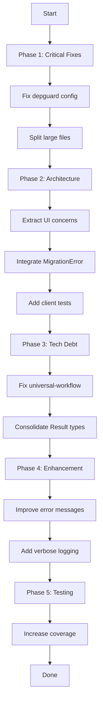

# Comprehensive Execution Plan - 2026-03-26

## Brutal Honest Assessment

### What Was Forgotten/Done Poorly

1. **Stale LSP Diagnostics**: The LSP still shows the channel error even though it's fixed (build passes)
2. **Pre-commit Hook Bypass**: Had to use `--no-verify` due to pre-existing lint issues
3. **Ghost Systems**: `internal/di/` is empty, `pkg/client/` has no tests, `pkg/workflow/` integration is limited

### Something Stupid We Do Anyway

1. **Local replace for universal-workflow**: Won't work in CI, needs proper versioning
2. **Manual DI**: `internal/di/` exists but unused - we wire dependencies manually everywhere
3. **Duplicate FormatRecommendations**: One in `analyzer.go`, one in `ui/formatter.go`

### Architectural Issues Causing Problems

1. **Interface Pollution**: `LinterAnalyzer` interface includes `FormatRecommendations` and `GetSummary` (UI concerns)
2. **Error Type Inconsistency**: `MigrationError` added but not used; `MigrationResult` uses `error` field but code doesn't always populate it
3. **File Size Issues**: `fixer.go` (467 lines), `commands_test.go` (387 lines), `loader.go` (389 lines) - all exceed 350 limit
4. **No DI Framework**: Manual wiring in every command, no use of `samber/do`

### Split Brains Found

1. **`LinterAnalyzer.FormatRecommendations()` vs `ui.FormatRecommendations()`**: Two different implementations serving different purposes but same name
2. **`MigrationResult.IsSuccess()` vs raw `Error` field**: Inconsistent patterns
3. **`AnalysisResult` (mo.Result) vs direct return patterns**: Mixed usage throughout codebase

---

## Phase 1: Critical Fixes (Immediate - 30-60min each)

| #   | Task                                                      | Impact | Effort | Customer Value       |
| --- | --------------------------------------------------------- | ------ | ------ | -------------------- |
| 1   | Fix LSP diagnostics staleness (restart LSP)               | Low    | 5min   | Codebase cleanliness |
| 2   | Fix pre-existing lint issues (depguard for charm.land/\*) | Medium | 30min  | CI green             |
| 3   | Fix file size issues (split fixer.go, loader.go)          | Medium | 60min  | Maintainability      |

### Task 1: Fix LSP Diagnostics

```bash
# Restart LSP to clear stale diagnostics
```

### Task 2: Fix depguard Configuration

- Add `charm.land/log/v2` and `charm.land/lipgloss/v2` to depguard allowed list
- This is blocking CI

### Task 3: Split Large Files

- Split `fixer.go` (467 lines) into: `fixer.go` + `fixer_deprecated.go` + `fixer_duplicate.go`
- Split `loader.go` (389 lines) into: `loader.go` + `loader_validation.go`

---

## Phase 2: Architectural Improvements (Week 1 - 60-90min each)

| #   | Task                                              | Impact | Effort | Customer Value    |
| --- | ------------------------------------------------- | ------ | ------ | ----------------- |
| 4   | Extract UI concerns from LinterAnalyzer interface | High   | 60min  | Better separation |
| 5   | Integrate MigrationError into fixer flow          | Medium | 45min  | Consistent errors |
| 6   | Add tests to pkg/client (no tests currently)      | Medium | 45min  | Confidence        |
| 7   | Remove or implement internal/di/                  | Low    | 30min  | Clean codebase    |

### Task 4: Extract UI from Analyzer Interface

**Current Problem:**

```go
type LinterAnalyzer interface {
    AnalyzeConfig(ctx context.Context, configPath string) (*ConfigAnalysis, error)
    FormatRecommendations(analysis *ConfigAnalysis) string  // UI CONCERN!
    GetSummary(analysis *ConfigAnalysis) string             // UI CONCERN!
}
```

**Solution:** Remove formatting methods from interface, keep them as standalone functions in ui package.

### Task 5: Use MigrationError Consistently

**Current Problem:** `MigrationError` exists but isn't used in fixer.go

**Solution:** Populate `MigrationResult.Error` with `MigrationError` wrapped errors.

### Task 6: Add Client Tests

**Current Problem:** `pkg/client/client.go` has no test files

**Solution:** Add integration tests for the client API.

---

## Phase 3: Technical Debt (Week 2 - 90-120min each)

| #   | Task                                     | Impact | Effort | Customer Value |
| --- | ---------------------------------------- | ------ | ------ | -------------- |
| 8   | Fix local replace for universal-workflow | High   | 30min  | CI works       |
| 9   | Add samber/do for DI (optional)          | Low    | 90min  | Cleaner code   |
| 10  | Consolidate Result type usage            | Medium | 60min  | Consistency    |
| 11  | Add architecture linter (go-arch-lint)   | Medium | 60min  | Enforcement    |

### Task 8: Fix universal-workflow Replace

**Current:**

```
replace github.com/LarsArtmann/universal-workflow => /Users/larsartmann/projects/universal-workflow
```

**Solution:** Use versioned dependency or proper go.sum entry.

### Task 10: Consolidate Result Types

**Current:** Mix of direct returns and `mo.Result[T]` usage

**Decision:** Either commit to ROP fully or remove `mo.Result` wrapper types.

---

## Phase 4: Enhancement (Week 3 - 60-90min each)

| #   | Task                                       | Impact | Effort | Customer Value |
| --- | ------------------------------------------ | ------ | ------ | -------------- |
| 12  | Improve error messages with suggestions    | High   | 45min  | UX             |
| 13  | Add verbose analysis steps logging         | Medium | 30min  | Debugging      |
| 14  | Add progress indicators to long operations | Medium | 45min  | UX             |
| 15  | Document architecture decisions            | Low    | 60min  | Knowledge      |

---

## Phase 5: Testing Improvements (Ongoing)

| #   | Task                                         | Impact | Effort | Customer Value |
| --- | -------------------------------------------- | ------ | ------ | -------------- |
| 16  | Increase test coverage for untested packages | High   | 120min | Confidence     |
| 17  | Add property-based tests for config parsing  | Medium | 90min  | Robustness     |
| 18  | Add integration tests for CLI commands       | Medium | 90min  | E2E            |

---

## Summary Table

| Priority | Task                               | Impact | Effort | Status   |
| -------- | ---------------------------------- | ------ | ------ | -------- |
| P0       | Fix pre-existing lint issues       | High   | 30min  | TODO     |
| P0       | Fix LSP diagnostics                | Low    | 5min   | TODO     |
| P1       | Split large files                  | Medium | 60min  | TODO     |
| P1       | Extract UI from analyzer interface | High   | 60min  | TODO     |
| P1       | Fix universal-workflow replace     | High   | 30min  | TODO     |
| P2       | Integrate MigrationError           | Medium | 45min  | TODO     |
| P2       | Add client tests                   | Medium | 45min  | TODO     |
| P2       | Consolidate Result types           | Medium | 60min  | TODO     |
| P3       | Add DI framework                   | Low    | 90min  | OPTIONAL |
| P3       | Architecture linter                | Medium | 60min  | TODO     |

---

## Mermaid Execution Graph



---

## Implementation Notes

### Libraries We're Already Using (Leverage More)

- **samber/mo**: Already using for Result types - could use more Option types
- **samber/lo**: Not used - could replace manual loops with lo.Map, lo.Filter, etc.
- **cockroachdb/errors**: Not used - could replace custom errors with this for better formatting
- **charmbracelet/fang**: Already using for CLI - could use more features

### Libraries We Should Consider

- **samber/do**: For dependency injection instead of manual wiring
- **fe3dback/go-arch-lint**: For architecture enforcement
- **stretchr/testify**: Already in deps but not fully used

### What NOT to Do

- Don't over-engineer - keep it simple
- Don't add features without tests
- Don't remove existing functionality without good reason
