# Micro-Task Breakdown - 2026-03-26

## Phase 1: Critical Fixes (12min each)

### Task 1.1: Restart LSP (5min)

- [ ] Restart LSP client to clear stale diagnostics
- **Effort**: 5min | **Impact**: Low | **Status**: TODO

### Task 1.2: Fix depguard for charm.land imports (15min)

- [ ] Add `charm.land/log/v2` to depguard allowed list in .golangci.yml
- [ ] Add `charm.land/lipgloss/v2` to depguard allowed list
- [ ] Verify with `golangci-lint run`
- **Effort**: 15min | **Impact**: High | **Status**: TODO

### Task 1.3: Add missing exhaustruct exclusion (5min)

- [ ] Add exclusion for `charmbracelet/log.Options` in exhaustruct settings
- **Effort**: 5min | **Impact**: Medium | **Status**: TODO

### Task 1.4: Split fixer.go - extract deprecated logic (12min)

- [ ] Create `pkg/linter/fixer_deprecated.go`
- [ ] Move `calculateDeprecatedLinters` function
- **Effort**: 12min | **Impact**: Medium | **Status**: TODO

### Task 1.5: Split fixer.go - extract duplicate logic (12min)

- [ ] Create `pkg/linter/fixer_duplicate.go`
- [ ] Move `calculateRedundantLinters` function
- **Effort**: 12min | **Impact**: Medium | **Status**: TODO

### Task 1.6: Review split files (8min)

- [ ] Verify build passes after split
- [ ] Run tests to ensure nothing broke
- **Effort**: 8min | **Impact**: Medium | **Status**: TODO

---

## Phase 2: Architectural Improvements (12min each)

### Task 2.1: Remove FormatRecommendations from interface (12min)

- [ ] Edit `pkg/types/types.go`
- [ ] Remove `FormatRecommendations` from `LinterAnalyzer` interface
- [ ] Remove `GetSummary` from `LinterAnalyzer` interface
- **Effort**: 12min | **Impact**: High | **Status**: TODO

### Task 2.2: Update analyzer.go to match new interface (8min)

- [ ] Remove formatting methods from `Analyzer` struct implementation
- [ ] Keep methods as standalone functions (or move to ui package)
- **Effort**: 8min | **Impact**: High | **Status**: TODO

### Task 2.3: Update all callers of removed methods (12min)

- [ ] Update `pkg/workflow/workflow.go` to use `ui.FormatRecommendations`
- [ ] Update any other callers
- **Effort**: 12min | **Impact**: High | **Status**: TODO

### Task 2.4: Populate MigrationError in fixer.go (12min)

- [ ] Wrap errors with `NewMigrationError` in fixer.go
- [ ] Ensure `MigrationResult.Error` is always populated on failure
- **Effort**: 12min | **Impact**: Medium | **Status**: TODO

### Task 2.5: Create client tests - basic integration (12min)

- [ ] Create `pkg/client/client_test.go`
- [ ] Add basic test for `New()` and `AnalyzeConfig()`
- **Effort**: 12min | **Impact**: Medium | **Status**: TODO

### Task 2.6: Create client tests - mock analyzer (12min)

- [ ] Add test with mocked analyzer for testing error paths
- **Effort**: 12min | **Impact**: Medium | **Status**: TODO

### Task 2.7: Document internal/di decision (5min)

- [ ] Either remove empty `internal/di/` directory
- [ ] Or document why it's empty (for future use)
- **Effort**: 5min | **Impact**: Low | **Status**: TODO

---

## Phase 3: Technical Debt (12min each)

### Task 3.1: Fix universal-workflow replace (15min)

- [ ] Check if there's a proper versioned release
- [ ] Update go.mod with versioned replace or remove local replace
- **Effort**: 15min | **Impact**: High | **Status**: TODO

### Task 3.2: Decide on Result type strategy (12min)

- [ ] Audit all usages of mo.Result types
- [ ] Decide: Use consistently OR remove wrapper types
- **Effort**: 12min | **Impact**: Medium | **Status**: TODO

### Task 3.3: Refactor to consistent Result usage (30min)

- [ ] If keeping ROP: Refactor all code to use mo.Result consistently
- [ ] If removing: Remove Result types, use direct returns
- **Effort**: 30min | **Impact**: Medium | **Status**: TODO

### Task 3.4: Add go-arch-lint configuration (12min)

- [ ] Add `fe3dback/go-arch-lint` to dependencies
- [ ] Create `.arch-lint.yaml` with layer rules
- **Effort**: 12min | **Impact**: Medium | **Status**: TODO

### Task 3.5: Verify architecture rules (8min)

- [ ] Run go-arch-lint to verify rules
- [ ] Fix any violations found
- **Effort**: 8min | **Impact**: Medium | **Status**: TODO

---

## Phase 4: Enhancement (12min each)

### Task 4.1: Add suggestion to ConfigError (12min)

- [ ] Add `Suggestion` field to `ConfigError` struct
- [ ] Update `Error()` method to include suggestion
- **Effort**: 12min | **Impact**: High | **Status**: TODO

### Task 4.2: Add suggestion to AnalysisError (12min)

- [ ] Add `Suggestion` field to `AnalysisError` struct
- [ ] Update `Error()` method to include suggestion
- **Effort**: 12min | **Impact**: High | **Status**: TODO

### Task 4.3: Add suggestion to MigrationError (8min)

- [ ] Add `Suggestion` field to `MigrationError` struct
- [ ] Update `Error()` method to include suggestion
- **Effort**: 8min | **Impact**: High | **Status**: TODO

### Task 4.4: Add verbose logging to analyzer (12min)

- [ ] Add debug logs at key points in `AnalyzeConfig`
- [ ] Log each step: version check, linters command, formatters command
- **Effort**: 12min | **Impact**: Medium | **Status**: TODO

### Task 4.5: Add progress to fixer operations (12min)

- [ ] Add spinner similar to analyze command for long-running fixes
- **Effort**: 12min | **Impact**: Medium | **Status**: TODO

---

## Phase 5: Testing (12min each)

### Task 5.1: Increase config loader coverage (12min)

- [ ] Add tests for edge cases in `LoadConfig`
- **Effort**: 12min | **Impact**: Medium | **Status**: TODO

### Task 5.2: Add detection package coverage (12min)

- [ ] Add tests for project type detection edge cases
- **Effort**: 12min | **Impact**: Medium | **Status**: TODO

### Task 5.3: Add error handling tests (12min)

- [ ] Add tests for error paths in analyzer
- **Effort**: 12min | **Impact**: Medium | **Status**: TODO

### Task 5.4: Add fixer edge case tests (12min)

- [ ] Add tests for empty config, invalid config scenarios
- **Effort**: 12min | **Impact**: Medium | **Status**: TODO

### Task 5.5: Add property-based tests for config (20min)

- [ ] Add go-fuzz or property-based test for config parsing
- **Effort**: 20min | **Impact**: Medium | **Status**: TODO

### Task 5.6: Add CLI integration tests (20min)

- [ ] Add tests for each CLI command using test CLI binary
- **Effort**: 20min | **Impact**: High | **Status**: TODO

---

## Summary Table (Sorted by Priority)

| #   | Task                                        | Phase | Impact | Effort | Status |
| --- | ------------------------------------------- | ----- | ------ | ------ | ------ |
| 1.2 | Fix depguard for charm.land                 | P1    | High   | 15min  | TODO   |
| 1.3 | Add exhaustruct exclusion                   | P1    | Medium | 5min   | TODO   |
| 2.1 | Remove FormatRecommendations from interface | P2    | High   | 12min  | TODO   |
| 2.2 | Update analyzer.go                          | P2    | High   | 8min   | TODO   |
| 2.3 | Update all callers                          | P2    | High   | 12min  | TODO   |
| 2.4 | Populate MigrationError                     | P2    | Medium | 12min  | TODO   |
| 2.5 | Create client tests                         | P2    | Medium | 12min  | TODO   |
| 3.1 | Fix universal-workflow replace              | P3    | High   | 15min  | TODO   |
| 4.1 | Add suggestion to ConfigError               | P4    | High   | 12min  | TODO   |
| 4.2 | Add suggestion to AnalysisError             | P4    | High   | 12min  | TODO   |
| 5.6 | Add CLI integration tests                   | P5    | High   | 20min  | TODO   |
| 1.4 | Split fixer.go deprecated                   | P1    | Medium | 12min  | TODO   |
| 1.5 | Split fixer.go duplicate                    | P1    | Medium | 12min  | TODO   |
| 2.6 | Create client tests mock                    | P2    | Medium | 12min  | TODO   |
| 3.2 | Decide Result type strategy                 | P3    | Medium | 12min  | TODO   |
| 4.3 | Add suggestion to MigrationError            | P4    | High   | 8min   | TODO   |
| 4.4 | Add verbose logging                         | P4    | Medium | 12min  | TODO   |
| 4.5 | Add progress to fixer                       | P4    | Medium | 12min  | TODO   |
| 5.1 | Increase config loader coverage             | P5    | Medium | 12min  | TODO   |
| 5.2 | Add detection coverage                      | P5    | Medium | 12min  | TODO   |
| 5.3 | Add error handling tests                    | P5    | Medium | 12min  | TODO   |
| 5.4 | Add fixer edge case tests                   | P5    | Medium | 12min  | TODO   |
| 1.1 | Restart LSP                                 | P1    | Low    | 5min   | TODO   |
| 1.6 | Review split files                          | P1    | Medium | 8min   | TODO   |
| 2.7 | Document internal/di                        | P2    | Low    | 5min   | TODO   |
| 3.3 | Refactor to consistent Result               | P3    | Medium | 30min  | TODO   |
| 3.4 | Add go-arch-lint                            | P3    | Medium | 12min  | TODO   |
| 3.5 | Verify architecture rules                   | P3    | Medium | 8min   | TODO   |
| 5.5 | Add property-based tests                    | P5    | Medium | 20min  | TODO   |

---

## Mermaid Execution Graph

```mermaid
graph TD
    START([Start]) --> P1[Phase 1: Critical]
    P1 --> P1_1[Task 1.1]
    P1_1 --> P1_2[Task 1.2]
    P1_2 --> P1_3[Task 1.3]
    P1_3 --> P1_4[Task 1.4]
    P1_4 --> P1_5[Task 1.5]
    P1_5 --> P1_6[Task 1.6]
    P1_6 --> P2[Phase 2: Architecture]
    P2 --> P2_1[Task 2.1]
    P2_1 --> P2_2[Task 2.2]
    P2_2 --> P2_3[Task 2.3]
    P2_3 --> P2_4[Task 2.4]
    P2_4 --> P2_5[Task 2.5]
    P2_5 --> P2_6[Task 2.6]
    P2_6 --> P2_7[Task 2.7]
    P2_7 --> P3[Phase 3: Tech Debt]
    P3 --> P3_1[Task 3.1]
    P3_1 --> P3_2[Task 3.2]
    P3_2 --> P3_3[Task 3.3]
    P3_3 --> P3_4[Task 3.4]
    P3_4 --> P3_5[Task 3.5]
    P3_5 --> P4[Phase 4: Enhancement]
    P4 --> P4_1[Task 4.1]
    P4_1 --> P4_2[Task 4.2]
    P4_2 --> P4_3[Task 4.3]
    P4_3 --> P4_4[Task 4.4]
    P4_4 --> P4_5[Task 4.5]
    P4_5 --> P5[Phase 5: Testing]
    P5 --> P5_1[Task 5.1]
    P5_1 --> P5_2[Task 5.2]
    P5_2 --> P5_3[Task 5.3]
    P5_3 --> P5_4[Task 5.4]
    P5_4 --> P5_5[Task 5.5]
    P5_5 --> P5_6[Task 5.6]
    P5_6 --> DONE([Done])
```

