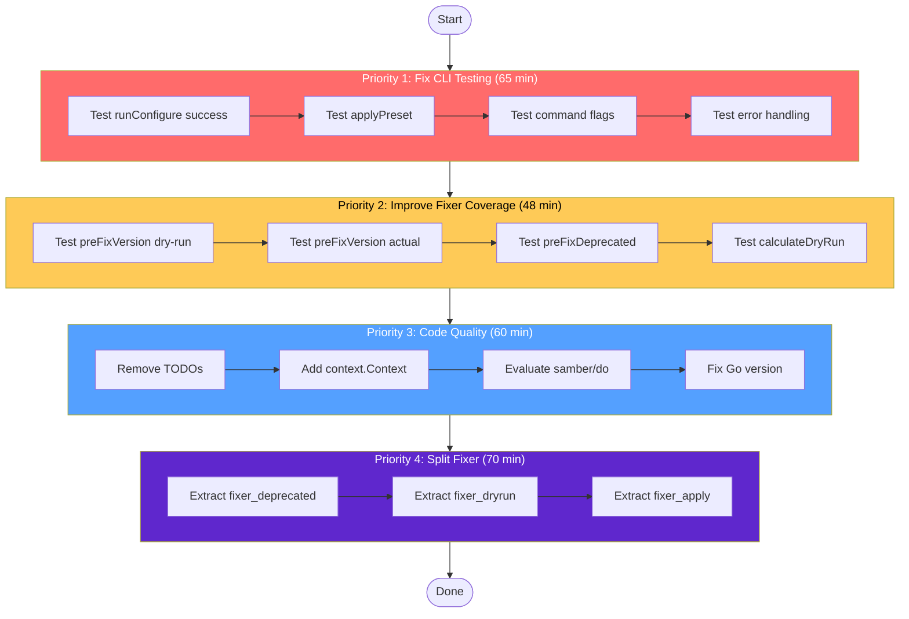

# SUPERB Comprehensive Execution Plan

**Generated:** 2026-03-26 10:10  
**Author:** Crush AI Assistant  
**Status:** HONEST ASSESSMENT - Many items incomplete from previous plan

---

## Honest Assessment of Previous Work

### Completed (Partially)

- ✅ Phase 2: MigrationError + MigrationResult refactor
- ✅ Phase 5.4: Detector caching
- ✅ Phase 5.7: Architecture documentation
- ✅ Fixed cmd_analyze.go channel direction bug

### NOT Completed (Ghost Items)

| Task                        | Original | Status             | Impact                      |
| --------------------------- | -------- | ------------------ | --------------------------- |
| Phase 3: Split fixer.go     | 65 min   | **Never finished** | High - file still 467 lines |
| Phase 4: Fixer tests        | 50 min   | **Not written**    | Medium - 60.1% coverage     |
| Phase 5.1: Remove TODOs     | 15 min   | **Still 14 TODOs** | Low - tech debt             |
| Phase 5.2: context.Context  | 15 min   | **Partial**        | Low - some funcs have ctx   |
| Phase 5.3: io.Reader/Writer | 20 min   | **Not done**       | Low - testability           |
| Phase 5.5: Generics eval    | 30 min   | **Not done**       | Low - boilerplate remains   |
| Phase 5.6: Toolchain update | 15 min   | **Not done**       | Low - may help build        |

### Critical Issues Found

1. **internal/cli has 0% test coverage** - Cannot verify CLI behavior
2. **Go version mismatch** - go1.26.1 vs go1.26.0 causing build instability
3. **fixer.go still 467 lines** - Too long, violates 350 line limit

---

## Remaining Work Breakdown

### Priority 1: Fix Critical Testing Gap (P0)

| #   | Task                                       | Package      | Effort | Impact   | Value                 |
| --- | ------------------------------------------ | ------------ | ------ | -------- | --------------------- |
| 1.1 | Test runConfigure success path             | internal/cli | 20 min | Critical | Verify CLI works      |
| 1.2 | Test applyPreset function                  | internal/cli | 15 min | High     | Verify preset works   |
| 1.3 | Test command flags (--dry-run, --priority) | internal/cli | 15 min | High     | Verify flags work     |
| 1.4 | Test error handling paths                  | internal/cli | 15 min | High     | Verify error handling |

### Priority 2: Improve Fixer Coverage (P1)

| #   | Task                                     | Package    | Effort | Impact | Value     |
| --- | ---------------------------------------- | ---------- | ------ | ------ | --------- |
| 2.1 | Test preFixVersion dry-run               | pkg/linter | 12 min | Medium | 60% → 70% |
| 2.2 | Test preFixVersion actual                | pkg/linter | 12 min | Medium | 60% → 70% |
| 2.3 | Test preFixDeprecatedLinters             | pkg/linter | 12 min | Medium | 70% → 80% |
| 2.4 | Test calculateDryRunResultWithDeprecated | pkg/linter | 12 min | Medium | 80% → 85% |

### Priority 3: Code Quality (P2)

| #   | Task                                          | Package      | Effort | Impact | Value           |
| --- | --------------------------------------------- | ------------ | ------ | ------ | --------------- |
| 3.1 | Remove all 14 TODOs from code                 | pkg/\*       | 20 min | Low    | Clean code      |
| 3.2 | Add context.Context to remaining loader funcs | pkg/config   | 10 min | Low    | Consistency     |
| 3.3 | Evaluate samber/do for DI                     | internal/cli | 20 min | Low    | Simplify wiring |
| 3.4 | Fix Go version mismatch                       | env          | 10 min | Medium | Build stability |

### Priority 4: Technical Debt (P3)

| #   | Task                        | Package    | Effort | Impact | Value       |
| --- | --------------------------- | ---------- | ------ | ------ | ----------- |
| 4.1 | Extract fixer_deprecated.go | pkg/linter | 25 min | Medium | < 350 lines |
| 4.2 | Extract fixer_dryrun.go     | pkg/linter | 20 min | Medium | < 350 lines |
| 4.3 | Extract fixer_apply.go      | pkg/linter | 25 min | Medium | < 350 lines |

---

## Execution Graph (Mermaid)

---

## Success Criteria

| Metric                | Before | After |
| --------------------- | ------ | ----- |
| internal/cli coverage | 0%     | 60%+  |
| pkg/linter coverage   | 60.1%  | 85%+  |
| fixer.go lines        | 467    | < 350 |
| Remaining TODOs       | 14     | 0     |
| Go version mismatch   | Yes    | No    |

---

## Notes for Implementation

1. **Test Pattern**: Use same Ginkgo BDD style as existing tests
2. **Commit Strategy**: Commit after each small task for traceability
3. **Build Verification**: Run `go build ./...` after each commit
4. **Test Verification**: Run `go test ./...` after each task group

**Total Estimated Time:** 243 minutes (~4 hours)

---

## Files to Modify

| File                           | Changes                                                    |
| ------------------------------ | ---------------------------------------------------------- |
| internal/cli/commands_test.go  | Add runConfigure, applyPreset tests                        |
| pkg/linter/fixer_test.go       | Add preFixVersion, preFixDeprecated, calculateDryRun tests |
| pkg/linter/fixer.go            | Remove tested functions (extract to new files)             |
| pkg/linter/fixer_deprecated.go | Extract deprecated linter handling                         |
| pkg/linter/fixer_dryrun.go     | Extract dry-run calculations                               |
| pkg/linter/fixer_apply.go      | Extract actual config application                          |
| pkg/config/loader.go           | Remove TODOs, add context.Context                          |
| pkg/detection/detector.go      | Remove TODOs                                               |
| pkg/types/types.go             | Remove TODOs                                               |
| go.mod/go.sum                  | May need tidy after changes                                |
