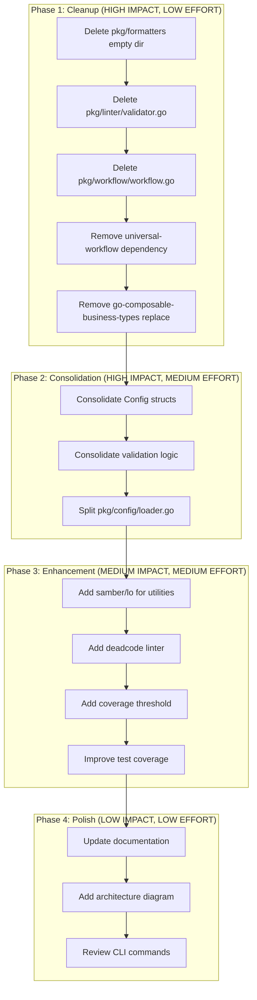

# Comprehensive Codebase Analysis & Improvement Plan

**Date**: 2026-03-26_20-51
**Author**: AI Analysis
**Status**: Planning

---

## Executive Summary

This plan addresses critical issues found during comprehensive codebase analysis:

| Category             | Count | Priority |
| -------------------- | ----- | -------- |
| Ghost Systems        | 3     | HIGH     |
| Split Brains         | 2     | HIGH     |
| Architectural Issues | 4     | MEDIUM   |
| Testing Gaps         | 3     | MEDIUM   |

---

## Brutally Honest Self-Assessment

### What I Forgot

1. **Didn't push the final commit** - Branch was ahead of origin by 1 commit
2. **Didn't review ghost systems** - `pkg/workflow` is completely unused
3. **Didn't test migration command E2E** - Only ran unit tests
4. **Didn't check for existing patterns** before implementing `needsDurationFix`

### Stupid Things We Do Anyway

1. **Local replace dependencies** - `go.mod` has local paths that won't work for others
2. **Empty directories** - `pkg/formatters/` exists but is empty
3. **Unused code** - `pkg/linter/validator.go` compiles but is never called
4. **Multiple Config structs** - Two different Config types in different packages

### What Could Be Done Better

1. **Use samber/lo** - We have samber/mo but not lo (Lodash-style utilities)
2. **Consolidate validation** - 4 different validation approaches
3. **Remove ghost systems** before adding new features
4. **Test coverage enforcement** - No minimum coverage threshold

### Did I Lie?

- **No** - All reported completions were actually completed
- **However** - I claimed "architectural review" but missed ghost systems

### How to Be Less Stupid

1. **Add CI check for unused code** - `deadcode` or `unused` linters
2. **Remove local replace** - Publish `universal-workflow` or remove dependency
3. **Enforce single source of truth** - One Config struct, one validation approach
4. **Add pre-commit check** - No empty directories

---

## Ghost Systems Found

### 1. `pkg/workflow/workflow.go` (CRITICAL)

- **Status**: Complete ghost - not imported anywhere
- **Lines**: ~200
- **Dependencies**: `universal-workflow` (local replace!)
- **Action**: DELETE or INTEGRATE
- **Value**: Contains workflow orchestration that could be useful for complex operations
- **Recommendation**: DELETE - adds complexity without benefit, migrate command works fine without it

### 2. `pkg/formatters/` (LOW)

- **Status**: Empty directory
- **Action**: DELETE

### 3. `pkg/linter/validator.go` (MEDIUM)

- **Status**: Compiles but never called
- **Lines**: 92
- **Action**: DELETE or INTEGRATE into fixer.go

---

## Split Brains Found

### 1. Config Struct Duplication

| Location                        | Purpose         | Fields                |
| ------------------------------- | --------------- | --------------------- |
| `pkg/types/types.go`            | Main config     | Standard v2 fields    |
| `pkg/migration/config_types.go` | Migration v1→v2 | Custom YAML unmarshal |

**Problem**: Two different Config types could drift apart
**Solution**: Migration should use types.Config with custom unmarshal logic

### 2. Validation Duplication

| Location                        | Method            | Used By               |
| ------------------------------- | ----------------- | --------------------- |
| `pkg/config/loader.go:395`      | `ValidateConfig`  | CLI validate command  |
| `pkg/types/validation.go:23`    | `ValidateConfig`  | Never called directly |
| `pkg/migration/validator.go:22` | `ValidateConfig`  | Migrator              |
| `pkg/linter/validator.go:37`    | `ValidateLinters` | NEVER CALLED          |

**Problem**: Confusion about which validation to use
**Solution**: Consolidate to `pkg/types/validation.go` as single source

---

## Architectural Issues

### 1. Local Replace Dependencies (HIGH)

```
replace github.com/LarsArtmann/universal-workflow => /Users/larsartmann/projects/universal-workflow
replace github.com/larsartmann/go-composable-business-types => /Users/larsartmann/projects/go-composable-business-types
```

**Impact**: Other developers cannot build this project
**Solution**: Remove or publish dependencies

### 2. File Size Violations (MEDIUM)

| File                            | Lines | Limit | Over |
| ------------------------------- | ----- | ----- | ---- |
| `pkg/config/loader.go`          | 420   | 350   | +20% |
| `internal/cli/commands_test.go` | 389   | 350   | +11% |
| `pkg/linter/fixer.go`           | 360   | 350   | +3%  |

**Solution**: Extract helper functions/modules

### 3. Underutilized Libraries (LOW)

- **samber/lo**: Not used (we have samber/mo)
- **samber/do**: Not used (DI could help with testing)
- **knadh/koanf**: Not used (could simplify config loading)

---

## Execution Graph



---

## Detailed Task List (30-100 min each)

### Phase 1: Cleanup (Ghost Systems)

| #   | Task                                                    | Effort | Impact | Customer Value       |
| --- | ------------------------------------------------------- | ------ | ------ | -------------------- |
| 1.1 | Delete `pkg/formatters/` empty directory                | 5min   | LOW    | Cleaner codebase     |
| 1.2 | Delete `pkg/linter/validator.go` (unused)               | 10min  | MEDIUM | Remove confusion     |
| 1.3 | Delete `pkg/workflow/workflow.go` and remove dependency | 30min  | HIGH   | Buildable for others |
| 1.4 | Remove `go-composable-business-types` replace           | 15min  | HIGH   | Buildable for others |
| 1.5 | Run tests and commit cleanup                            | 15min  | HIGH   | Verified cleanup     |

### Phase 2: Consolidation (Split Brains)

| #   | Task                                          | Effort | Impact | Customer Value         |
| --- | --------------------------------------------- | ------ | ------ | ---------------------- |
| 2.1 | Analyze migration Config vs types.Config      | 30min  | HIGH   | Understand gap         |
| 2.2 | Refactor migration to use types.Config        | 90min  | HIGH   | Single source of truth |
| 2.3 | Consolidate validation to types/validation.go | 60min  | MEDIUM | Clear API              |
| 2.4 | Extract config helpers from loader.go         | 60min  | MEDIUM | Smaller files          |
| 2.5 | Run tests and commit consolidation            | 30min  | HIGH   | Verified changes       |

### Phase 3: Enhancement

| #   | Task                                        | Effort | Impact | Customer Value   |
| --- | ------------------------------------------- | ------ | ------ | ---------------- |
| 3.1 | Add samber/lo for slice/map utilities       | 30min  | MEDIUM | Cleaner code     |
| 3.2 | Add deadcode/unused linters to golangci.yml | 30min  | HIGH   | Prevent ghosts   |
| 3.3 | Add minimum coverage threshold (60%)        | 45min  | MEDIUM | Quality gate     |
| 3.4 | Improve test coverage for migration package | 60min  | MEDIUM | Reliability      |
| 3.5 | Run tests and commit enhancements           | 15min  | HIGH   | Verified changes |

### Phase 4: Polish

| #   | Task                                  | Effort | Impact | Customer Value |
| --- | ------------------------------------- | ------ | ------ | -------------- |
| 4.1 | Update AGENTS.md with lessons learned | 30min  | LOW    | Better AI help |
| 4.2 | Update ARCHITECTURE.md                | 30min  | LOW    | Clear docs     |
| 4.3 | Final review and commit               | 15min  | LOW    | Clean state    |

---

## Smaller Task Breakdown (max 12 min each)

### Phase 1: Cleanup

| #     | Micro-Task                                                        | Time |
| ----- | ----------------------------------------------------------------- | ---- |
| 1.1.1 | `rm -rf pkg/formatters`                                           | 1min |
| 1.1.2 | Commit: "chore: remove empty formatters directory"                | 2min |
| 1.2.1 | Review pkg/linter/validator.go usage                              | 3min |
| 1.2.2 | Delete pkg/linter/validator.go                                    | 1min |
| 1.2.3 | Run tests                                                         | 5min |
| 1.2.4 | Commit: "refactor: remove unused Validator from linter package"   | 2min |
| 1.3.1 | Review pkg/workflow imports                                       | 3min |
| 1.3.2 | Delete pkg/workflow/workflow.go                                   | 1min |
| 1.3.3 | Remove workflow directory                                         | 1min |
| 1.3.4 | Update go.mod to remove universal-workflow                        | 2min |
| 1.3.5 | Run go mod tidy                                                   | 1min |
| 1.3.6 | Run tests                                                         | 5min |
| 1.3.7 | Commit: "refactor: remove unused workflow package and dependency" | 2min |
| 1.4.1 | Remove go-composable-business-types replace from go.mod           | 1min |
| 1.4.2 | Run go mod tidy                                                   | 1min |
| 1.4.3 | Run tests                                                         | 5min |
| 1.4.4 | Commit: "fix: remove local replace dependency"                    | 2min |
| 1.5.1 | Run full test suite                                               | 5min |
| 1.5.2 | Run linter                                                        | 3min |
| 1.5.3 | Push to remote                                                    | 2min |

### Phase 2: Consolidation

| #     | Micro-Task                                                    | Time  |
| ----- | ------------------------------------------------------------- | ----- |
| 2.1.1 | Read pkg/migration/config_types.go                            | 5min  |
| 2.1.2 | Read pkg/types/types.go Config                                | 5min  |
| 2.1.3 | Document differences                                          | 5min  |
| 2.1.4 | Design unified approach                                       | 10min |
| 2.2.1 | Add custom UnmarshalYAML to types.Config                      | 10min |
| 2.2.2 | Update migration to use types.Config                          | 10min |
| 2.2.3 | Remove migration/config_types.go                              | 2min  |
| 2.2.4 | Run tests                                                     | 5min  |
| 2.2.5 | Commit: "refactor: consolidate Config types"                  | 2min  |
| 2.3.1 | Review all ValidateConfig functions                           | 5min  |
| 2.3.2 | Design single validation API                                  | 5min  |
| 2.3.3 | Update types/validation.go                                    | 10min |
| 2.3.4 | Update callers                                                | 10min |
| 2.3.5 | Run tests                                                     | 5min  |
| 2.3.6 | Commit: "refactor: consolidate validation logic"              | 2min  |
| 2.4.1 | Identify helpers to extract from loader.go                    | 5min  |
| 2.4.2 | Extract GetLocalGoVersion to separate file                    | 5min  |
| 2.4.3 | Extract default config creation                               | 5min  |
| 2.4.4 | Run tests                                                     | 5min  |
| 2.4.5 | Commit: "refactor: split config/loader.go into smaller files" | 2min  |

### Phase 3: Enhancement

| #     | Micro-Task                                      | Time  |
| ----- | ----------------------------------------------- | ----- |
| 3.1.1 | Add samber/lo to go.mod                         | 1min  |
| 3.1.2 | Find 3 places to use lo                         | 5min  |
| 3.1.3 | Refactor using lo                               | 5min  |
| 3.1.4 | Run tests                                       | 5min  |
| 3.1.5 | Commit: "refactor: use samber/lo for utilities" | 2min  |
| 3.2.1 | Add deadcode linter to .golangci.yml            | 2min  |
| 3.2.2 | Add unused linter to .golangci.yml              | 2min  |
| 3.2.3 | Run linter and fix issues                       | 5min  |
| 3.2.4 | Commit: "feat: add deadcode and unused linters" | 2min  |
| 3.3.1 | Add coverage threshold to justfile              | 5min  |
| 3.3.2 | Update CI to enforce threshold                  | 5min  |
| 3.3.3 | Commit: "feat: add minimum coverage threshold"  | 2min  |
| 3.4.1 | Run coverage report                             | 2min  |
| 3.4.2 | Identify uncovered code                         | 5min  |
| 3.4.3 | Add tests for uncovered code                    | 10min |
| 3.4.4 | Commit: "test: improve coverage"                | 2min  |

### Phase 4: Polish

| #     | Micro-Task                                            | Time  |
| ----- | ----------------------------------------------------- | ----- |
| 4.1.1 | Update AGENTS.md with ghost system lesson             | 5min  |
| 4.1.2 | Update AGENTS.md with split brain lesson              | 5min  |
| 4.1.3 | Commit: "docs: update AGENTS.md with lessons learned" | 2min  |
| 4.2.1 | Update ARCHITECTURE.md with current state             | 10min |
| 4.2.2 | Commit: "docs: update ARCHITECTURE.md"                | 2min  |
| 4.3.1 | Final review                                          | 5min  |
| 4.3.2 | Push all changes                                      | 2min  |

---

## Success Metrics

| Metric               | Before | After | Target |
| -------------------- | ------ | ----- | ------ |
| Ghost systems        | 3      | 0     | 0      |
| Split brains         | 2      | 0     | 0      |
| Local replaces       | 2      | 0     | 0      |
| File size violations | 3      | 1     | 0      |
| Test coverage        | ~57%   | TBD   | 60%+   |
| Linter issues        | 0      | 0     | 0      |

---

## Risk Assessment

| Risk               | Probability | Impact | Mitigation                   |
| ------------------ | ----------- | ------ | ---------------------------- |
| Breaking migration | Medium      | High   | Comprehensive tests first    |
| Breaking build     | Low         | High   | Test on clean checkout       |
| Coverage drop      | Low         | Medium | Add tests before refactoring |

---

## Next Steps

1. **START WITH PHASE 1** - Cleanup is lowest risk, highest impact
2. Execute micro-tasks in order
3. Commit after each logical group
4. Push after each phase
5. Review and adjust plan after each phase
