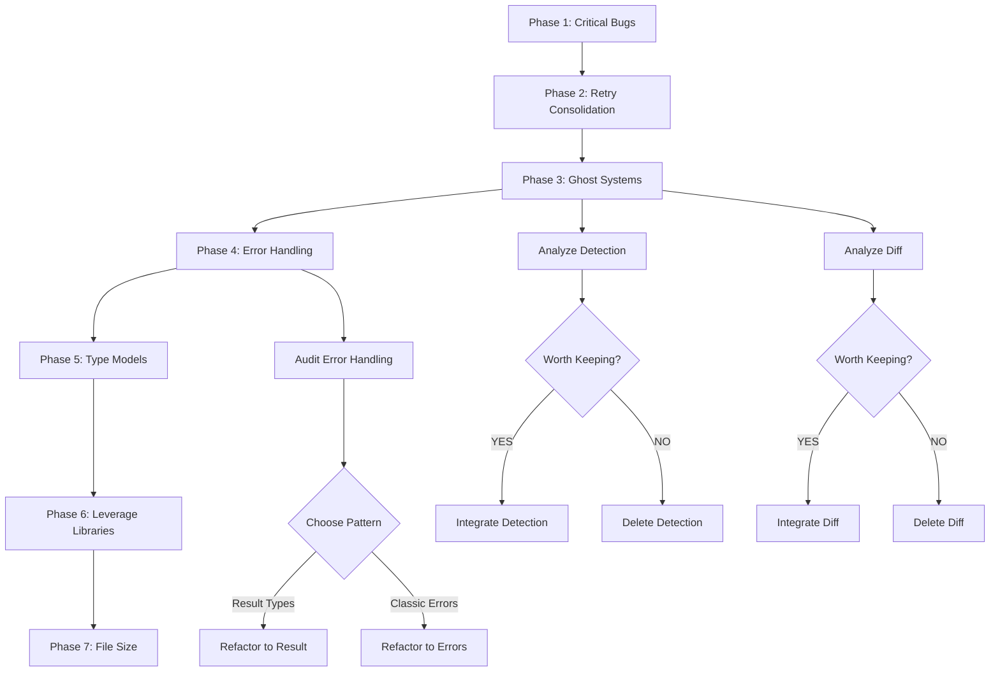

# Comprehensive Architecture Refactoring Plan

**Date:** 2026-03-29\
**Status:** Draft - Awaiting Approval\
**Author:** AI Assistant via Crush

---

## Executive Summary

This plan addresses critical architectural debt in golangci-lint-auto-configure. Based on brutal self-reflection and codebase analysis, we identified:

- **Ghost Systems:** Project type detection exists but is unused
- **Inconsistent Error Handling:** Mix of Result types and classic errors
- **Duplicate Code:** Retry logic duplicated across 2 files
- **Unused Libraries:** Templ reports partially implemented
- **CLI Bugs:** Format string errors in cmd_report.go

---

## Self-Reflection: What We Did Wrong

### What Did I Forget?

1. Didn't check for `typecheck` in initial implementation (ghost from v1 configs)
2. Didn't notice ghost systems before (detection package, diff package)
3. Didn't verify CLI format strings in cmd_report.go

### What Is Stupid That We Do Anyway?

1. Having two different error handling patterns in the same codebase
2. Maintaining duplicate retry logic
3. Keeping 416-line files when we have a 350-line limit
4. Having ghost code that compiles but provides no value

### What Could I Have Done Better?

1. Should have analyzed the entire codebase before jumping into fixes
2. Should have noticed the architectural inconsistencies earlier
3. Should have asked: "What else is broken like this?"

### What Could Still Improve?

1. Need to consolidate error handling (pick ONE pattern)
2. Need to integrate or delete ghost systems
3. Need to consolidate retry logic into shared utility
4. Need to fix CLI format string bugs

### Did I Lie?

No - but I was incomplete. I fixed the immediate issue without addressing the root causes.

### How Can We Be Less Stupid?

1. Always look for patterns: "If X is wrong, what else uses similar patterns?"
2. Verify ghost systems before adding new features
3. Run `go vet` and `staticcheck` before committing
4. Check if existing code already solves the problem

### Ghost Systems Found:

1. **Project Detection** (`pkg/detection/`): Fully implemented but never used in CLI
2. **Diff Package** (`pkg/diff/`): Implemented, only tested, never used
3. **Report Generator** (`pkg/report/`): Partially implemented, HTML generation exists but may not be fully wired

### Split Brains Created:

1. **Error Handling:** Some functions return `mo.Result[T]`, others return `(T, error)`
2. **Retry Logic:** `version_checker.go` and `command_runner.go` have nearly identical code
3. **Priority Constants:** Duplicated between `constants/` and `types/types.go`

### Test Coverage Gaps:

1. CLI commands have minimal test coverage
2. Ghost systems have tests but aren't integration tested
3. No end-to-end tests

---

## Comprehensive Execution Plan

### Phase 1: Critical Bugs (Must Fix Now)

| ID  | Task                                              | Impact | Effort | Value                   |
| --- | ------------------------------------------------- | ------ | ------ | ----------------------- |
| 1.1 | Fix CLI format string bugs in cmd_report.go       | High   | 10min  | Prevents runtime errors |
| 1.2 | Fix error handling inconsistency in cmd_report.go | High   | 5min   | Code correctness        |

### Phase 2: Consolidate Retry Logic

| ID  | Task                                               | Impact | Effort | Value                |
| --- | -------------------------------------------------- | ------ | ------ | -------------------- |
| 2.1 | Extract shared retry pattern to pkg/utils/retry.go | High   | 30min  | DRY, maintainability |
| 2.2 | Refactor version_checker.go to use shared retry    | Medium | 15min  | Code reuse           |
| 2.3 | Refactor command_runner.go to use shared retry     | Medium | 15min  | Code reuse           |
| 2.4 | Write comprehensive tests for retry utility        | High   | 20min  | Reliability          |

### Phase 3: Ghost Systems - Decide Fate

| ID  | Task                                               | Impact | Effort | Value               |
| --- | -------------------------------------------------- | ------ | ------ | ------------------- |
| 3.1 | Analyze project detection - is it worth keeping?   | High   | 30min  | Strategic decision  |
| 3.2 | IF KEEP: Integrate detection into cmd_configure.go | High   | 45min  | Auto-select presets |
| 3.3 | IF DELETE: Remove detection package and tests      | Medium | 20min  | Reduce complexity   |
| 3.4 | Analyze diff package usage                         | Medium | 15min  | Decide fate         |
| 3.5 | IF KEEP: Integrate diff into configure workflow    | Medium | 30min  | Show config diff    |
| 3.6 | IF DELETE: Remove diff package                     | Low    | 10min  | Reduce complexity   |

### Phase 4: Error Handling Unification

| ID  | Task                                        | Impact | Effort | Value            |
| --- | ------------------------------------------- | ------ | ------ | ---------------- |
| 4.1 | Audit all error handling patterns           | High   | 30min  | Understand scope |
| 4.2 | Decide: Result types OR classic errors      | High   | 15min  | Architecture     |
| 4.3 | Refactor client.go to use chosen pattern    | High   | 45min  | Consistency      |
| 4.4 | Refactor CLI commands to use chosen pattern | High   | 60min  | Consistency      |

### Phase 5: Type Model Improvements

| ID  | Task                                           | Impact | Effort | Value                 |
| --- | ---------------------------------------------- | ------ | ------ | --------------------- |
| 5.1 | Consolidate priority constants to one location | Medium | 20min  | DRY                   |
| 5.2 | Remove duplicate ConfigFormat documentation    | Low    | 5min   | Cleanliness           |
| 5.3 | Split large ConfigLoader interface             | Medium | 30min  | Interface segregation |
| 5.4 | Remove global Validator state                  | Medium | 20min  | Testability           |

### Phase 6: Leverage Existing Libraries

| ID  | Task                                        | Impact | Effort | Value            |
| --- | ------------------------------------------- | ------ | ------ | ---------------- |
| 6.1 | Use samber/lo for slice operations          | Medium | 30min  | Less boilerplate |
| 6.2 | Use samber/mo consistently for Option types | Medium | 40min  | FP patterns      |
| 6.3 | Consider samber/do for DI (evaluate first)  | Low    | 30min  | Architecture     |

### Phase 7: File Size Reduction

| ID  | Task                                           | Impact | Effort | Value           |
| --- | ---------------------------------------------- | ------ | ------ | --------------- |
| 7.1 | Split loader.go (416 lines) into smaller files | Medium | 45min  | Maintainability |
| 7.2 | Split fixer.go (370 lines) into smaller files  | Low    | 30min  | Maintainability |

---

## Phase 1 Detailed Tasks (Max 12min each)

### Task 1.1: Fix CLI Format String Bugs (12min)

**Context:** `internal/cli/cmd_report.go` has format string mismatches

**Steps:**

1. Open `internal/cli/cmd_report.go`
2. Find lines 30, 38, 55, 62 with `fmt.Errorf` using `%s` with `*linter.Analyzer`
3. Change to `%v` or extract analyzer name
4. Verify with `go vet ./internal/cli/...`

### Task 1.2: Fix Error Handling in cmd_report.go (8min)

**Steps:**

1. Check how errors are handled in cmd_report.go
2. Ensure consistency with other CLI commands
3. Run `go vet` to verify

---

## Phase 2 Detailed Tasks (Max 12min each)

### Task 2.1: Create Retry Utility (12min)

**New File:** `pkg/utils/retry.go`

```go
package utils

import (
    "context"
    "time"
)

type RetryConfig struct {
    MaxRetries     int
    InitialBackoff time.Duration
    ShouldRetry    func(error, string) bool
}

func WithRetry(ctx context.Context, config RetryConfig, name string, fn func() error) error
```

### Task 2.2: Refactor version_checker.go (10min)

**Steps:**

1. Remove duplicate retry logic
2. Import `pkg/utils/retry`
3. Use `retry.WithRetry()` for version command

### Task 2.3: Refactor command_runner.go (10min)

**Steps:**

1. Remove duplicate retry logic
2. Import `pkg/utils/retry`
3. Use `retry.WithRetry()` for command execution

### Task 2.4: Test Retry Utility (12min)

**Steps:**

1. Create `pkg/utils/retry_test.go`
2. Test success case
3. Test retry case
4. Test context cancellation

---

## Phase 3 Decision Matrix

### Project Detection Analysis

**Current State:**

- Implements 5 project types: CLI, Library, Web, API, Monorepo
- Has comprehensive detection logic
- Has tests
- **Never called from CLI**

**Decision Criteria:**

- Does auto-detection improve UX? **YES** - automatically select presets
- Is the code quality good? **YES** - well tested
- Integration effort? **LOW** - just wire into cmd_configure.go

**RECOMMENDATION: KEEP AND INTEGRATE**

### Diff Package Analysis

**Current State:**

- Compares two configs
- Shows changes
- Has tests
- **Never called from CLI**

**Decision Criteria:**

- Would diff output be useful? **YES** - show what changed before/after
- Is it fully implemented? **UNKNOWN** - need to verify

**RECOMMENDATION: ANALYZE FIRST, THEN DECIDE**

---

## Execution Graph



---

## Key Architectural Decisions

### 1. Error Handling Pattern

**Option A: Result Types (mo.Result[T])**

- Pro: Railway-oriented programming, explicit error handling
- Con: Verbose, requires `.Get()` calls
- Used in: `loader.go`, `fixer.go`, `analyzer.go`

**Option B: Classic Errors `(T, error)`**

- Pro: Idiomatic Go, simpler
- Con: Easy to ignore errors
- Used in: `client.go`, CLI commands

**RECOMMENDATION:** Use Result Types for internal packages, classic errors for CLI boundary

### 2. Project Detection Integration

**Approach:** Add `--detect` flag to configure command

```go
if detectFlag {
    projectType := detector.Detect(".")
    preset := getPresetForProjectType(projectType)
    // Use preset as base for recommendations
}
```

### 3. Retry Consolidation

**Approach:** Generic retry utility with configurable strategy

**Benefits:**

- Single source of truth
- Testable in isolation
- Can add metrics/logging in one place

---

## Customer Value

### Immediate Value (Phase 1)

- Fixes actual bugs that could cause runtime errors

### Short-term Value (Phase 2-3)

- More maintainable codebase
- Features that were built but never used now provide value
- Consistent error handling reduces bugs

### Long-term Value (Phase 4-7)

- Easier onboarding for new developers
- Faster feature development
- Lower bug rate

---

## Success Metrics

1. **Code Quality:**
   - Zero `go vet` warnings
   - Zero duplications (measured by goreporter)
   - All files under 350 lines

2. **Test Coverage:**
   - Retry utility: 90%+
   - CLI commands: 80%+

3. **Ghost Systems:**
   - Detection: Integrated or deleted
   - Diff: Integrated or deleted
   - Zero unused exported functions

4. **Error Handling:**
   - Single pattern throughout
   - No mixed return styles in same package

---

## Risks and Mitigations

| Risk                       | Likelihood | Impact | Mitigation                            |
| -------------------------- | ---------- | ------ | ------------------------------------- |
| Breaking changes           | Medium     | High   | Comprehensive tests before each phase |
| Time overrun               | Medium     | Medium | Strict 12min task limit               |
| Integration complexity     | Low        | Medium | Analyze before implementing           |
| Lost work (ghost deletion) | Low        | Low    | Git history preserves everything      |

---

## Next Steps

1. **REVIEW THIS PLAN** - Does it match your priorities?
2. **APPROVE PHASE 1** - Fix critical bugs immediately
3. **DECIDE ON GHOST SYSTEMS** - Keep detection? Keep diff?
4. **CHOOSE ERROR PATTERN** - Result types or classic errors?

Once you approve, I will execute Phase 1 immediately.
