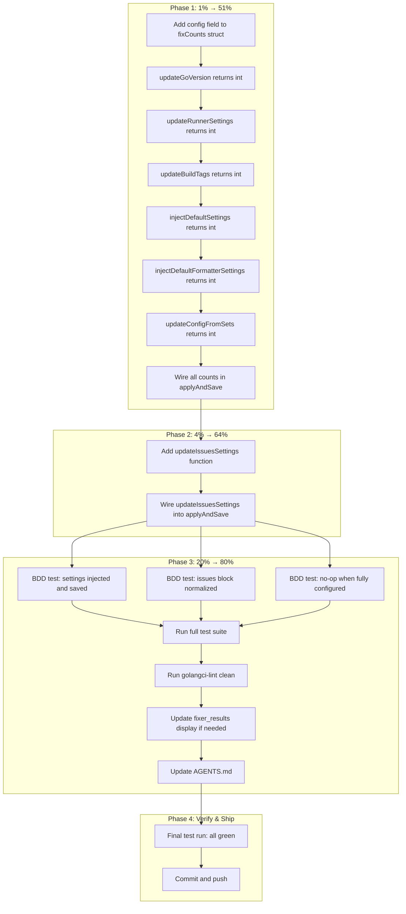

# Auto-Fixer Improvement Sprint: Silent-Drop Fix & Issues Normalization
> **Archived 2026-09-11 (docs-health pass).** Executed 2026-06-17 (auto-fixer audit sprint; see the 2026-06-17 status reports).

**Date:** 2026-06-17
**Status:** ✅ COMPLETED — All tasks executed, all tests green, committed and pushed.
**Sprint goal:** Fix the two P0 issues found in the cross-project config audit to make the auto-fixer reliably heal all 136 real-world configs.

## Context

A cross-project audit of 184 golangci-lint configs revealed two critical gaps:

1. **Silent fix-drop bug** (`fixer.go:261`): `updateGoVersion`, `updateRunnerSettings`, `updateBuildTags`, and `injectDefaultSettings` all mutate `cfg` without incrementing `counts`. When `counts.total() == 0`, the guard returns `noFixesResult()` and discards all mutations. This is why 108 configs lack `ginkgolinter` settings and 105 lack `testifylint` settings despite the tool having correct defaults.

2. **Issues block never normalized**: 64 configs (47%) ship `issues: {}`, inheriting golangci-lint's default `max-same-issues: 3` which hides duplicate CI problems.

## Pareto Breakdown

### 1% → 51% of result

Fix `applyAndSave` to count ALL mutating steps. Auto-heals 213 settings injections across 136 projects.

### 4% → 64% of result

Above + add `updateIssuesSettings` to normalize `issues.max-issues-per-linter` and `issues.max-same-issues`. Heals 64 configs hiding CI problems.

### 20% → 80% of result

Above + BDD tests + lint clean + docs update.

## Mermaid.js Execution Graph

## Medium Tasks (30-100min each)

| #   | Task                                                       | Impact   | Effort | Phase |
| --- | ---------------------------------------------------------- | -------- | ------ | ----- |
| T1  | Add `config` field to `fixCounts` struct, update `total()` | Critical | 10min  | 1     |
| T2  | Make `updateGoVersion` return int                          | Critical | 10min  | 1     |
| T3  | Make `updateRunnerSettings` return int                     | Critical | 10min  | 1     |
| T4  | Make `updateBuildTags` return int                          | Critical | 10min  | 1     |
| T5  | Make `injectDefaultSettings` return int                    | Critical | 15min  | 1     |
| T6  | Make `injectDefaultFormatterSettings` return int           | Critical | 10min  | 1     |
| T7  | Make `updateConfigFromSets` return int sum                 | Critical | 10min  | 1     |
| T8  | Wire all counts in `applyAndSave`, remove uncounted calls  | Critical | 15min  | 1     |
| T9  | Add `updateIssuesSettings` function                        | High     | 15min  | 2     |
| T10 | Wire `updateIssuesSettings` into `applyAndSave`            | High     | 10min  | 2     |
| T11 | BDD test: settings injected + saved (proves P0 fix)        | High     | 30min  | 3     |
| T12 | BDD test: issues block normalized                          | High     | 30min  | 3     |
| T13 | BDD test: no-op when already fully configured              | Medium   | 20min  | 3     |
| T14 | Run full test suite, fix any regressions                   | High     | 30min  | 3     |
| T15 | Run golangci-lint, fix any lint issues                     | High     | 15min  | 3     |
| T16 | Update `fixer_results.go` for new count display if needed  | Low      | 15min  | 3     |
| T17 | Update AGENTS.md with new normalization behavior           | Medium   | 15min  | 3     |
| T18 | Final full test run: all green                             | High     | 15min  | 4     |
| T19 | Commit and push                                            | High     | 10min  | 4     |

**Total: 19 tasks**

## Fine Tasks (max 15min each)

| #   | Task                                                                           | Parent | Est   |
| --- | ------------------------------------------------------------------------------ | ------ | ----- |
| F1  | Read `fixer.go:161-172` to confirm `fixCounts` fields                          | T1     | 5min  |
| F2  | Add `config int` field to `fixCounts` struct                                   | T1     | 5min  |
| F3  | Add `config` to `total()` return expression                                    | T1     | 2min  |
| F4  | Read `fixer_config.go:27-37` (`updateGoVersion`)                               | T2     | 5min  |
| F5  | Change `updateGoVersion` signature to `(ctx, cfg) int`                         | T2     | 5min  |
| F6  | Add return count (0 or 1) to `updateGoVersion`                                 | T2     | 5min  |
| F7  | Read `fixer_config.go:40-50` (`updateRunnerSettings`)                          | T3     | 5min  |
| F8  | Change `updateRunnerSettings` signature to `(cfg) int`                         | T3     | 5min  |
| F9  | Track count for parallel + serial runners                                      | T3     | 5min  |
| F10 | Read `fixer_config.go:53-65` (`updateBuildTags`)                               | T4     | 5min  |
| F11 | Change `updateBuildTags` signature to `(cfg) int`                              | T4     | 5min  |
| F12 | Return count of tags added                                                     | T4     | 5min  |
| F13 | Read `fixer_config.go:214-229` (`injectDefaultSettings`)                       | T5     | 5min  |
| F14 | Change `injectDefaultSettings` signature to return int                         | T5     | 5min  |
| F15 | Count each injected setting in `injectDefaultSettings`                         | T5     | 10min |
| F16 | Read `fixer_config.go:246-263` (`injectDefaultFormatterSettings`)              | T6     | 5min  |
| F17 | Change signature and add count                                                 | T6     | 5min  |
| F18 | Read `fixer_config.go:178-209` (`updateConfigFromSets`)                        | T7     | 5min  |
| F19 | Change `updateConfigFromSets` to return int sum                                | T7     | 10min |
| F20 | Read `fixer.go:242-274` (`applyAndSave`)                                       | T8     | 5min  |
| F21 | Replace uncounted calls with counted versions in `applyAndSave`                | T8     | 10min |
| F22 | Read `config/loader.go` for `DefaultMaxIssuesPerLinter`/`DefaultMaxSameIssues` | T9     | 5min  |
| F23 | Write `updateIssuesSettings` function                                          | T9     | 10min |
| F24 | Add `updateIssuesSettings` call in `applyAndSave`                              | T10    | 5min  |
| F25 | Read existing `fixer_test.go` for BDD test patterns                            | T11    | 5min  |
| F26 | Write test: config with missing ginkgolinter settings gets healed              | T11    | 10min |
| F27 | Write test: config with missing runner settings gets healed                    | T11    | 10min |
| F28 | Write test: config with missing build tags gets healed                         | T11    | 10min |
| F29 | Read existing test for issues block patterns                                   | T12    | 5min  |
| F30 | Write test: config with `issues: {}` gets limits added                         | T12    | 10min |
| F31 | Write test: config with explicit limits stays unchanged                        | T12    | 10min |
| F32 | Write test: fully configured config gets 0 fixes, no save                      | T13    | 10min |
| F33 | Write test: partially configured config counts correctly                       | T13    | 10min |
| F34 | Run `just test` and read output                                                | T14    | 5min  |
| F35 | Fix any test failures from signature changes                                   | T14    | 15min |
| F36 | Fix any callers of changed function signatures                                 | T14    | 10min |
| F37 | Run `just lint`                                                                | T15    | 5min  |
| F38 | Fix any lint issues in changed files                                           | T15    | 10min |
| F39 | Read `fixer_results.go` to check if `config` needs display                     | T16    | 5min  |
| F40 | Update result message if needed for config count                               | T16    | 10min |
| F41 | Read AGENTS.md fixer section                                                   | T17    | 5min  |
| F42 | Add note about issues normalization behavior                                   | T17    | 10min |
| F43 | Add note about settings auto-injection behavior                                | T17    | 10min |
| F44 | Run `just test` final time                                                     | T18    | 5min  |
| F45 | Run `just build` final time                                                    | T18    | 5min  |
| F46 | Commit with detailed message                                                   | T19    | 5min  |
| F47 | Push to remote                                                                 | T19    | 5min  |

**Total: 47 fine tasks**
