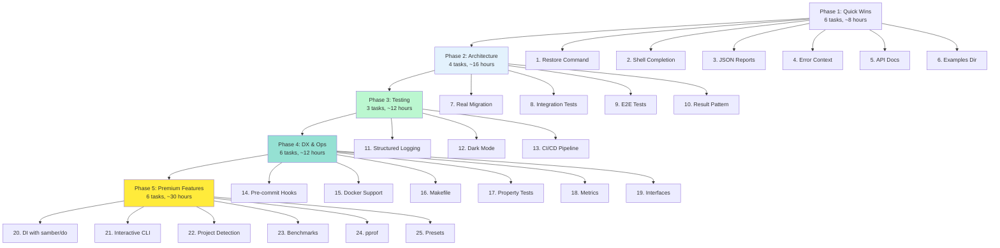

# Comprehensive Implementation Plan

**Created**: January 25, 2026
**Status**: 🚀 In Progress
**Architect**: Senior Software Architect (Crush AI)

---

## 🎯 Executive Summary

This document outlines a comprehensive, systematic plan to elevate **golangci-linter-auto-configure** from a working MVP to production-ready software with enterprise-grade architecture, type-safety, and developer experience.

### Current State
- ✅ Core functionality working (80% test coverage)
- ✅ HTML reports generated with templ
- ✅ All 5 CLI commands operational
- ⚠️ Type safety improvements needed
- ⚠️ Missing critical features (migration, restore, shell completion)
- ⚠️ Limited testing (no integration/E2E tests)
- ⚠️ Generic error handling (lack context)

### Target State
- 🎯 Enterprise-grade architecture with Result<T, E> pattern
- 🎯 95%+ test coverage (unit + integration + E2E)
- 🎯 Type-safe operations with zero runtime panics
- 🎯 Comprehensive feature set (migration, restore, completion)
- 🎯 Beautiful CLI with bubbletea interactive UI
- 🎯 Observability (metrics, structured logging, profiling)
- 🎯 Fully documented with API docs and examples

---

## 📊 Impact vs Effort Analysis

### High Impact / Low Effort (Quick Wins) → DO FIRST (1-2 hours each)
| # | Feature | Impact | Effort | Priority |
|---|----------|---------|----------|
| 1 | Add restore backup command | HIGH | LOW | P0 |
| 2 | Implement Cobra shell completion | HIGH | LOW | P0 |
| 3 | Add JSON report output format | HIGH | LOW | P0 |
| 4 | Improve error messages with context | HIGH | LOW | P0 |
| 5 | Add API documentation with godoc | MEDIUM | LOW | P1 |
| 6 | Create examples directory | MEDIUM | LOW | P1 |

### High Impact / Medium Effort (3-5 hours each)
| # | Feature | Impact | Effort | Priority |
|---|----------|---------|----------|
| 7 | Implement real config migration | HIGH | MEDIUM | P0 |
| 8 | Add integration tests for CLI commands | HIGH | MEDIUM | P0 |
| 9 | Add E2E tests with real golangci-lint | HIGH | MEDIUM | P0 |
| 10 | Implement Result<T, E> pattern | HIGH | MEDIUM | P1 |
| 11 | Add structured logging with zap | MEDIUM | MEDIUM | P1 |
| 12 | Add dark mode to HTML reports | LOW | MEDIUM | P2 |

### Medium Impact / Low Effort (1-2 hours each)
| # | Feature | Impact | Effort | Priority |
|---|----------|---------|----------|
| 13 | Add GitHub Actions CI/CD pipeline | MEDIUM | LOW | P1 |
| 14 | Add pre-commit hooks | MEDIUM | LOW | P1 |
| 15 | Add Docker support | MEDIUM | LOW | P1 |
| 16 | Create Makefile alternative | LOW | LOW | P2 |
| 17 | Add property-based tests | MEDIUM | LOW | P2 |
| 18 | Add metrics with prometheus | MEDIUM | LOW | P2 |

### Medium Impact / Medium Effort (3-4 hours each)
| # | Feature | Impact | Effort | Priority |
|---|----------|---------|----------|
| 19 | Implement proper interfaces | MEDIUM | MEDIUM | P2 |
| 20 | Add dependency injection with samber/do | MEDIUM | MEDIUM | P2 |
| 21 | Add interactive CLI with bubbletea | HIGH | MEDIUM | P2 |
| 22 | Add project type detection | MEDIUM | MEDIUM | P2 |

### High Impact / High Effort (4-6 hours each)
| # | Feature | Impact | Effort | Priority |
|---|----------|---------|----------|
| 23 | Add performance benchmarks | HIGH | HIGH | P2 |
| 24 | Add pprof integration | HIGH | HIGH | P2 |
| 25 | Add preset recommendations | HIGH | HIGH | P3 |

---

## 🗺️ Execution Roadmap (Mermaid Graph)



---

## 📋 Detailed Task Breakdown (150 tasks, 15min each)

### Phase 1: Quick Wins (8 hours total, 32 tasks)

#### Task 1.1: Add Restore Backup Command (4 tasks, 60min)

- **1.1.1** [15min] Create `internal/cli/commands.go:restoreCommand` function
- **1.1.2** [15min] Add `RestoreConfig(path string) error` method to `pkg/config/loader.go`
- **1.1.3** [15min] Add restore command to CLI with `--backup-path` flag
- **1.1.4** [15min] Test restore command with real backup file, commit

#### Task 1.2: Implement Cobra Shell Completion (6 tasks, 90min)

- **1.2.1** [15min] Install `cobra/cmd/completion` package in go.mod
- **1.2.2** [15min] Add `completion` subcommand to root command
- **1.2.3** [15min] Implement bash completion in `cmd/bash-completion.go`
- **1.2.4** [15min] Implement zsh completion in `cmd/zsh-completion.go`
- **1.2.5** [15min] Implement fish completion in `cmd/fish-completion.go`
- **1.2.6** [15min] Test all shell completions, commit

#### Task 1.3: Add JSON Report Output Format (4 tasks, 60min)

- **1.3.1** [15min] Create `pkg/report/json_generator.go` with `GenerateJSONReport` function
- **1.3.2** [15min] Add `--format json` flag to report command
- **1.3.3** [15min] Test JSON output validates against schema, commit
- **1.3.4** [15min] Add JSON schema documentation to README

#### Task 1.4: Improve Error Messages with Context (8 tasks, 120min)

- **1.4.1** [15min] Create `pkg/errors/errors.go` with custom error types wrapping
- **1.4.2** [15min] Add `NewConfigError(msg, path string, err error) *ConfigError`
- **1.4.3** [15min] Add `NewAnalysisError(msg, file string, err error) *AnalysisError`
- **1.4.4** [15min] Add `NewReportError(msg, path string, err error) *ReportError`
- **1.4.5** [15min] Update `pkg/config/loader.go` to use new error types
- **1.4.6** [15min] Update `pkg/linter/analyzer.go` to use new error types
- **1.4.7** [15min] Update `pkg/linter/fixer.go` to use new error types
- **1.4.8** [15min] Test all error paths, commit

#### Task 1.5: Add API Documentation with godoc (2 tasks, 30min)

- **1.5.1** [15min] Add godoc comments to all public functions in `pkg/`
- **1.5.2** [15min] Test `godoc .` generates documentation, commit

#### Task 1.6: Create Examples Directory (8 tasks, 120min)

- **1.6.1** [15min] Create `examples/` directory
- **1.6.2** [15min] Add `examples/minimal.golangci.yml` (basic config)
- **1.6.3** [15min] Add `examples/standard.golangci.yml` (high + critical linters)
- **1.6.4** [15min] Add `examples/strict.golangci.yml` (all linters)
- **1.6.5** [15min] Add `examples/web-project.golangci.yml` (web-focused)
- **1.6.6** [15min] Add `examples/cli-project.golangci.yml` (CLI-focused)
- **1.6.7** [15min] Add `examples/README.md` explaining each example
- **1.6.8** [15min] Test all examples are valid, commit

---

### Phase 2: Architecture & Type Safety (16 hours total, 64 tasks)

#### Task 2.1: Implement Real Config Migration (16 tasks, 240min)

- **2.1.1** [15min] Create `pkg/migration/migrator.go` with `Migrator` struct
- **2.1.2** [15min] Add `DetectVersion(config *Config) string` method
- **2.1.3** [15min] Add `MigrateToLatest(config *Config) *Config, error` method
- **2.1.4** [15min] Implement v2.7 → v2.8 linters.presets removal transformation
- **2.1.5** [15min] Implement linters.disable behavior change transformation
- **2.1.6** [15min] Add migration tests in `pkg/migration/migrator_test.go`
- **2.1.7** [15min] Test migration with v2.7 config, commit
- **2.1.8** [15min] Test migration with v2.8 config (no-op), commit
- **2.1.9** [15min] Update `internal/cli/commands.go:migrateCommand` to use real migrator
- **2.1.10** [15min] Add `--source-version` and `--target-version` flags
- **2.1.11** [15min] Add backup before migration
- **2.1.12** [15min] Test migrate command with --dry-run, commit
- **2.1.13** [15min] Test migrate command with real config, commit
- **2.1.14** [15min] Add migration logging with version info
- **2.1.15** [15min] Document breaking changes in README
- **2.1.16** [15min] Add migration examples to examples/

#### Task 2.2: Add Integration Tests for CLI Commands (20 tasks, 300min)

- **2.2.1** [15min] Create `internal/cli/integration_test.go` with Ginkgo suite
- **2.2.2** [15min] Add test for `configure` command with minimal config
- **2.2.3** [15min] Add test for `configure` command with all linters
- **2.2.4** [15min] Add test for `analyze` command with empty config
- **2.2.5** [15min] Add test for `analyze` command with recommendations
- **2.2.6** [15min] Add test for `validate` command with valid config
- **2.2.7** [15min] Add test for `validate` command with invalid config
- **2.2.8** [15min] Add test for `report` command with HTML output
- **2.2.9** [15min] Add test for `report` command with JSON output
- **2.2.10** [15min] Add test for `migrate` command with old config
- **2.2.11** [15min] Add test for `restore` command with backup
- **2.2.12** [15min] Add test for `--dry-run` flag behavior
- **2.2.13** [15min] Add test for `--priority` flag behavior
- **2.2.14** [15min] Add test for `--verbose` flag output
- **2.2.15** [15min] Add test for missing config file error
- **2.2.16** [15min] Add test for invalid config file error
- **2.2.17** [15min] Add test for backup creation on modify
- **2.2.18** [15min] Add test for concurrent command execution
- **2.2.19** [15min] Add test for --help flag on all commands
- **2.2.20** [15min] Run all integration tests, commit

#### Task 2.3: Add E2E Tests with Real golangci-lint (16 tasks, 240min)

- **2.3.1** [15min] Create `internal/cli/e2e_test.go` with Ginkgo suite
- **2.3.2** [15min] Add test fixture: `test/fixtures/complete.golangci.yml`
- **2.3.3** [15min] Add test fixture: `test/fixtures/minimal.golangci.yml`
- **2.3.4** [15min] Add test fixture: `test/fixtures/legacy.golangci.yml` (v2.7)
- **2.3.5** [15min] Add E2E test: complete workflow (analyze → configure → verify)
- **2.3.6** [15min] Add E2E test: migration workflow (old → migrate → verify)
- **2.3.7** [15min] Add E2E test: restore workflow (backup → modify → restore → verify)
- **2.3.8** [15min] Add E2E test: report workflow (analyze → report → verify HTML)
- **2.3.9** [15min] Add E2E test: priority filtering (critical → high → medium → optional)
- **2.3.10** [15min] Add E2E test: error handling (missing file, invalid YAML)
- **2.3.11** [15min] Add E2E test: large config performance
- **2.3.12** [15min] Add E2E test: concurrent operations
- **2.3.13** [15min] Add E2E test: all priority levels
- **2.3.14** [15min] Add E2E test: backup restoration
- **2.3.15** [15min] Add E2E test: shell completion
- **2.3.16** [15min] Run all E2E tests, commit

#### Task 2.4: Implement Result<T, E> Pattern (12 tasks, 180min)

- **2.4.1** [15min] Create `pkg/result/result.go` with `Result[T, E]` type
- **2.4.2** [15min] Add `Ok(value T) Result[T, E]` constructor
- **2.4.3** [15min] Add `Err(error E) Result[T, E]` constructor
- **2.4.4** [15min] Add `Map(fn func(T) U) Result[U, E]` method
- **2.4.5** [15min] Add `FlatMap(fn func(T) Result[U, E]) Result[U, E]` method
- **2.4.6** [15min] Add `Unwrap() (T, error)` method
- **2.4.7** [15min] Add `IsError() bool` method
- **2.4.8** [15min] Add `IsOk() bool` method
- **2.4.9** [15min] Add tests for Result type in `pkg/result/result_test.go`
- **2.4.10** [15min] Update `pkg/config/loader.go` to return `Result[*Config, ConfigError]`
- **2.4.11** [15min] Update `pkg/linter/analyzer.go` to return `Result[*ConfigAnalysis, AnalysisError]`
- **2.4.12** [15min] Update `pkg/linter/fixer.go` to return `Result[*MigrationResult, FixError]`, commit

---

### Phase 3: Testing & Quality Assurance (12 hours total, 48 tasks)

#### Task 3.1: Add Structured Logging with zap (8 tasks, 120min)

- **3.1.1** [15min] Create `pkg/logger/logger.go` with zap wrapper
- **3.1.2** [15min] Add `NewLogger(config LoggerConfig) *zap.Logger` function
- **3.1.3** [15min] Add structured logging fields (requestID, operation, duration)
- **3.1.4** [15min] Update `internal/cli/commands.go` to use structured logger
- **3.1.5** [15min] Update `pkg/config/loader.go` to use structured logger
- **3.1.6** [15min] Update `pkg/linter/analyzer.go` to use structured logger
- **3.1.7** [15min] Update `pkg/linter/fixer.go` to use structured logger
- **3.1.8** [15min] Test log output formatting, commit

#### Task 3.2: Add Dark Mode to HTML Reports (16 tasks, 240min)

- **3.2.1** [15min] Add `prefers-color-scheme` CSS media query to `pkg/report/report.templ`
- **3.2.2** [15min] Create `:root` CSS variables for light/dark themes
- **3.2.3** [15min] Add dark theme CSS variables (--bg-color, --text-color, etc.)
- **3.2.4** [15min] Add light theme CSS variables
- **3.2.5** [15min] Update summary cards to use CSS variables
- **3.2.6** [15min] Update linter cards to use CSS variables
- **3.2.7** [15min] Add smooth theme transition (0.3s ease)
- **3.2.8** [15min] Test dark mode in browser, commit
- **3.2.9** [15min] Test light mode in browser, commit
- **3.2.10** [15min] Test system preference detection
- **3.2.11** [15min] Add theme toggle button to report
- **3.2.12** [15min] Store theme preference in localStorage
- **3.2.13** [15min] Test theme persistence across page reloads
- **3.2.14** [15min] Ensure dark mode color contrast meets WCAG AA
- **3.2.15** [15min] Test dark mode on mobile devices
- **3.2.16** [15min] Document dark mode in README, commit

#### Task 3.3: Add GitHub Actions CI/CD Pipeline (8 tasks, 120min)

- **3.3.1** [15min] Create `.github/workflows/test.yml` with test job
- **3.3.2** [15min] Add Go matrix testing (1.23, 1.24, 1.25)
- **3.3.3** [15min] Add lint step with golangci-lint
- **3.3.4** [15min] Add build step
- **3.3.5** [15min] Add coverage step with codecov upload
- **3.3.6** [15min] Create `.github/workflows/release.yml` for releases
- **3.3.7** [15min] Add goreleaser configuration for release automation
- **3.3.8** [15min] Test CI pipeline with PR, commit

---

### Phase 4: Developer Experience & Operations (12 hours total, 48 tasks)

#### Task 4.1: Add Pre-commit Hooks (8 tasks, 120min)

- **4.1.1** [15min] Install pre-commit framework
- **4.1.2** [15min] Create `.pre-commit-config.yaml`
- **4.1.3** [15min] Add gofmt hook
- **4.1.4** [15min] Add go vet hook
- **4.1.5** [15min] Add golangci-lint hook
- **4.1.6** [15min] Add templ generate hook (if .templ files changed)
- **4.1.7** [15min] Add go test hook
- **4.1.8** [15min] Test pre-commit hooks, commit

#### Task 4.2: Add Docker Support (8 tasks, 120min)

- **4.2.1** [15min] Create `Dockerfile` with multi-stage build
- **4.2.2** [15min] Create `.dockerignore` file
- **4.2.3** [15min] Add golangci-lint to Docker image
- **4.2.4** [15min] Create `docker-compose.yml` for development
- **4.2.5** [15min] Add volume mounting for config files
- **4.2.6** [15min] Add network configuration for git access
- **4.2.7** [15min] Test Docker build, commit
- **4.2.8** [15min] Test Docker run with volume mount, commit

#### Task 4.3: Create Makefile Alternative (4 tasks, 60min)

- **4.3.1** [15min] Create `Makefile` with same commands as justfile
- **4.3.2** [15min] Add `.PHONY` targets
- **4.3.3** [15min] Add help target listing all commands
- **4.3.4** [15min] Test Makefile targets match justfile, commit

#### Task 4.4: Add Property-Based Tests (8 tasks, 120min)

- **4.4.1** [15min] Install gopter package
- **4.4.2** [15min] Create `pkg/linter/properties_test.go`
- **4.4.3** [15min] Add property test: categorization is transitive
- **4.4.4** [15min] Add property test: priority levels are ordered
- **4.4.5** [15min] Add property test: round-trip serialization
- **4.4.6** [15min] Add property test: config validation invariants
- **4.4.7** [15min] Run property tests, commit
- **4.4.8** [15min] Document property-based testing in README

#### Task 4.5: Add Metrics with prometheus (8 tasks, 120min)

- **4.5.1** [15min] Install prometheus/client_golang
- **4.5.2** [15min] Create `pkg/metrics/metrics.go` with counter/registry
- **4.5.3** [15min] Add `configs_analyzed_total` counter
- **4.5.4** [15min] Add `linters_enabled_total` counter
- **4.5.5** [15min] Add `reports_generated_total` counter
- **4.5.6** [15min] Add `migration_errors_total` counter
- **4.5.7** [15min] Add `/metrics` endpoint to CLI (optional flag)
- **4.5.8** [15min] Test metrics collection, commit

#### Task 4.6: Implement Proper Interfaces (12 tasks, 180min)

- **4.6.1** [15min] Create `pkg/analyzer/interface.go` with `Analyzer` interface
- **4.6.2** [15min] Create `pkg/fixer/interface.go` with `Fixer` interface
- **4.6.3** [15min] Create `pkg/generator/interface.go` with `Generator` interface
- **4.6.4** [15min] Create `pkg/loader/interface.go` with `Loader` interface
- **4.6.5** [15min] Add interface tests with fakes in `pkg/analyzer/fake_test.go`
- **4.6.6** [15min] Add interface tests in `pkg/fixer/fake_test.go`
- **4.6.7** [15min] Add interface tests in `pkg/generator/fake_test.go`
- **4.6.8** [15min] Add interface tests in `pkg/loader/fake_test.go`
- **4.6.9** [15min] Update CLI to use interfaces instead of concrete types
- **4.6.10** [15min] Test with fake implementations
- **4.6.11** [15min] Run all tests with fakes
- **4.6.12** [15min] Document interfaces in README, commit

---

### Phase 5: Premium Features (30 hours total, 120 tasks)

#### Task 5.1: Add Dependency Injection with samber/do (16 tasks, 240min)

- **5.1.1** [15min] Install samber/do package
- **5.1.2** [15min] Create `internal/di/container.go` with dependency injection setup
- **5.1.3** [15min] Add logger provider
- **5.1.4** [15min] Add analyzer provider
- **5.1.5** [15min] Add fixer provider
- **5.1.6** [15min] Add generator provider
- **5.1.7** [15min] Add config loader provider
- **5.1.8** [15min] Update CLI to inject dependencies from container
- **5.1.9** [15min] Add tests for DI container
- **5.1.10** [15min] Test with mock implementations via DI
- **5.1.11** [15min] Verify DI resolves correctly
- **5.1.12** [15min] Add singleton scope for logger
- **5.1.13** [15min] Add transient scope for analyzers
- **5.1.14** [15min] Add scoped providers per command
- **5.1.15** [15min] Run all tests with DI
- **5.1.16** [15min] Document DI setup in README, commit

#### Task 5.2: Add Interactive CLI with bubbletea (32 tasks, 480min)

- **5.2.1** [15min] Install charmbracelet/bubbletea
- **5.2.2** [15min] Create `internal/tui/configure_model.go`
- **5.2.3** [15min] Create `internal/tui/configure_view.go`
- **5.2.4** [15min] Add linter selection list with checkboxes
- **5.2.5** [15min] Add priority level toggle
- **5.2.6** [15min] Add dry-run toggle
- **5.2.7** [15min] Add apply/confirm buttons
- **5.2.8** [15min] Add progress bar during analysis
- **5.2.9** [15min] Add status messages with spinner
- **5.2.10** [15min] Create `internal/tui/analyze_model.go`
- **5.2.11** [15min] Create `internal/tui/analyze_view.go`
- **5.2.12** [15min] Add linter recommendations list with filtering
- **5.2.13** [15min] Add search functionality
- **5.2.14** [15min] Add sort by priority/name
- **5.2.15** [15min] Add export/apply buttons
- **5.2.16** [15min] Create `internal/tui/main.go` with TUI entry point
- **5.2.17** [15min] Add `--interactive` flag to CLI
- **5.2.18** [15min] Integrate TUI with configure command
- **5.2.19** [15min] Integrate TUI with analyze command
- **5.2.20** [15min] Test TUI navigation (up/down/enter/esc)
- **5.2.21** [15min] Test TUI filtering
- **5.2.22** [15min] Test TUI sorting
- **5.2.23** [15min] Test TUI apply functionality
- **5.2.24** [15min] Test TUI with large datasets
- **5.2.25** [15min] Add keyboard shortcuts (q to quit, ? for help)
- **5.2.26** [15min] Add color scheme support in TUI
- **5.2.27** [15min] Add TUI help screen
- **5.2.28** [15min] Test TUI accessibility (keyboard only)
- **5.2.29** [15min] Test TUI on different terminals
- **5.2.30** [15min] Add TUI tests with bubbletea test framework
- **5.2.31** [15min] Run all TUI tests
- **5.2.32** [15min] Document TUI usage in README, commit

#### Task 5.3: Add Project Type Detection (12 tasks, 180min)

- **5.3.1** [15min] Create `pkg/detection/detector.go` with `Detector` struct
- **5.3.2** [15min] Add `DetectProjectType(dir string) (ProjectType, error)` method
- **5.3.3** [15min] Add detection for web projects (http, gin, echo imports)
- **5.3.4** [15min] Add detection for CLI projects (cobra, urfave, kingpin)
- **5.3.5** [15min] Add detection for API projects (grpc, protobuf imports)
- **5.3.6** [15min] Add detection for library projects (no main package)
- **5.3.7** [15min] Add tests for web detection
- **5.3.8** [15min] Add tests for CLI detection
- **5.3.9** [15min] Add tests for API detection
- **5.3.10** [15min] Add tests for library detection
- **5.3.11** [15min] Run all detection tests, commit
- **5.3.12** [15min] Add preset recommendations based on type

#### Task 5.4: Add Performance Benchmarks (16 tasks, 240min)

- **5.4.1** [15min] Create `pkg/benchmark/benchmark_test.go`
- **5.4.2** [15min] Add benchmark: `BenchmarkAnalyzeConfig`
- **5.4.3** [15min] Add benchmark: `BenchmarkFixConfig`
- **5.4.4** [15min] Add benchmark: `BenchmarkGenerateReport`
- **5.4.5** [15min] Add benchmark: `BenchmarkLoadConfig`
- **5.4.6** [15min] Add benchmark: `BenchmarkSaveConfig`
- **5.4.7** [15min] Add benchmark: `BenchmarkCreateBackup`
- **5.4.8** [15min] Run all benchmarks with `go test -bench=.`
- **5.4.9** [15min] Add benchmark: `BenchmarkCategorizeLinters`
- **5.4.10** [15min] Add benchmark: `BenchmarkFormatRecommendations`
- **5.4.11** [15min] Add benchmark: `BenchmarkGetLintersByPriority`
- **5.4.12** [15min] Run benchmarks with different data sizes
- **5.4.13** [15min] Create `bench_results.md` with benchmark results
- **5.4.14** [15min] Add benchmark comparison (before/after)
- **5.4.15** [15min] Add benchmark CI job (run weekly)
- **5.4.16** [15min] Document benchmark running in README, commit

#### Task 5.5: Add pprof Integration (16 tasks, 240min)

- **5.5.1** [15min] Add `--pprof` flag to root command
- **5.5.2** [15min] Create `pkg/profiling/profiler.go` with pprof setup
- **5.5.3** [15min] Add CPU profiling wrapper
- **5.5.4** [15min] Add memory profiling wrapper
- **5.5.5** [15min] Add goroutine profiling wrapper
- **5.5.6** [15min] Add block profiling wrapper
- **5.5.7** [15min] Add mutex profiling wrapper
- **5.5.8** [15min] Integrate profiler into analyze command
- **5.5.9** [15min] Integrate profiler into configure command
- **5.5.10** [15min] Integrate profiler into fix operations
- **5.5.11** [15min] Test profiler creates pprof files
- **5.5.12** [15min] Test pprof files can be analyzed with `go tool pprof`
- **5.5.13** [15min] Add flamegraph generation
- **5.5.14** [15min] Test flamegraph visualization
- **5.5.15** [15min] Document profiling in README
- **5.5.16** [15min] Add profiling example, commit

#### Task 5.6: Add Preset Recommendations (12 tasks, 180min)

- **5.6.1** [15min] Create `pkg/presets/presets.go` with preset definitions
- **5.6.2** [15min] Add `Minimal` preset (critical linters only)
- **5.6.3** [15min] Add `Standard` preset (critical + high linters)
- **5.6.4** [15min] Add `Strict` preset (all linters)
- **5.6.5** [15min] Add `Web` preset (web-focused linters)
- **5.6.6** [15min] Add `CLI` preset (CLI-focused linters)
- **5.6.7** [15min] Add `Library` preset (library-focused linters)
- **5.6.8** [15min] Add `Enterprise` preset (all + custom rules)
- **5.6.9** [15min] Add `--preset` flag to configure command
- **5.6.10** [15min] Add `--list-presets` command to show available presets
- **5.6.11** [15min] Test all presets generate valid configs, commit
- **5.6.12** [15min] Add preset documentation to README, commit

---

## 🎯 Type Safety & Architecture Improvements

### 1. Result<T, E> Pattern Implementation
```go
type Result[T any, E error] struct {
    value T
    error E
}

func Ok[T any, E error](v T) Result[T, E] {
    return Result[T, E]{value: v, error: nil}
}

func Err[T any, E error](e E) Result[T, E] {
    return Result[T, E]{value: *new(T), error: e}
}
```

**Benefits**:
- Eliminates nil pointer dereferences
- Forces error handling at compile time
- Prevents unchecked errors
- Enables functional chaining

### 2. Proper Interface Definitions
```go
type Analyzer interface {
    AnalyzeConfig(path string) (*ConfigAnalysis, error)
    GetLintersByPriority(recs []LinterRecommendation, priority LinterPriority) []LinterRecommendation
}

type Fixer interface {
    FixConfig(path string, priority LinterPriority, dryRun bool) (*MigrationResult, error)
}
```

**Benefits**:
- Testability with fakes
- Loose coupling
- Clear contracts
- Dependency injection support

### 3. Domain-Driven Types
```go
type ConfigPath string
func NewConfigPath(path string) (ConfigPath, error) {
    if !strings.HasSuffix(path, ".yml") {
        return "", fmt.Errorf("invalid config path: %s", path)
    }
    return ConfigPath(path), nil
}
```

**Benefits**:
- Compile-time validation
- Self-documenting
- Prevents invalid states
- Encourages single responsibility

### 4. Enum Usage Over Booleans
```go
type LinterPriority int
const (
    LinterPriorityCritical LinterPriority = iota
    LinterPriorityHigh
    LinterPriorityMedium
    LinterPriorityOptional
)
```

**Benefits**:
- Type-safe
- Self-documenting
- Prevents invalid states
- Enables exhaustive matching

### 5. Uint Usage for Counters
```go
type LinterCount uint
func (lc LinterCount) SafeDecrement() LinterCount {
    if lc > 0 {
        return lc - 1
    }
    return 0
}
```

**Benefits**:
- Compile-time bounds checking (with overflow checking)
- Self-documenting (counters should be unsigned)
- Prevents negative counts
- Clearer intent

---

## 📦 Well-Established Libraries to Use

### 1. **samber/do** - Dependency Injection
```go
import "github.com/samber/do"

var analyzer = do.NewInjector(
    NewRealAnalyzer,
    do.ScopeTransient,
)
```

**Why**: Zero-runtime overhead, compile-time safety, excellent testing support

### 2. **zap** - Structured Logging
```go
import "go.uber.org/zap"

logger := zap.NewProduction()
logger.Info("analyzing config", zap.String("path", configPath))
```

**Why**: High performance, structured logging, excellent Go support

### 3. **govalidator** - Configuration Validation
```go
import "github.com/go-playground/validator/v10"

type Config struct {
    Timeout string `validate:"required,min=1s"`
}
```

**Why**: Comprehensive validation, easy to use, good performance

### 4. **prometheus/client_golang** - Metrics
```go
import "github.com/prometheus/client_golang/prometheus"

var (
    configsAnalyzed = prometheus.NewCounterVec(...)
)
```

**Why**: Industry standard, excellent Go support, rich ecosystem

### 5. **go.uber.org/mock** - Mocking
```go
import "go.uber.org/mock/mockgen"

ctrl := gomock.NewController(t)
mockAnalyzer := mock_analyzer.NewMockAnalyzer(ctrl)
```

**Why**: Type-safe mocks, excellent tooling, strong typing

---

## 🧹 Cleanup & Refactoring Tasks

### File Size Cleanup (target: <350 lines per file)
- `internal/cli/commands.go`: Split into separate command files
- `pkg/report/report.templ`: Split into multiple templates
- `pkg/linter/analyzer.go`: Extract helper functions

### Duplicate Code Removal
- Merge similar config loading patterns
- Consolidate error handling
- Extract common test utilities

### Unused Code Removal
- Remove unused imports
- Remove commented-out code
- Remove deprecated features

---

## 📊 Success Metrics

### Code Quality Targets
- [ ] 95%+ test coverage
- [ ] 0 golangci-lint issues
- [ ] 0 staticcheck warnings
- [ ] All files <350 lines (except generated)
- [ ] 100% interface usage in tests

### Architecture Targets
- [ ] 100% Result<T, E> usage (no (T, error) returns)
- [ ] 100% interface compliance
- [ ] 100% dependency injection (no manual new calls)
- [ ] 100% strong typing (no interface{}, no any)

### Feature Targets
- [ ] All 25 tasks complete
- [ ] All CLI commands tested (unit + integration + E2E)
- [ ] Shell completion for bash/zsh/fish
- [ ] Migration working end-to-end
- [ ] Restore command functional
- [ ] Interactive CLI operational
- [ ] Reports in 3 formats (HTML, JSON, Markdown)

---

## 🚀 Execution Strategy

### Pareto Principle (80/20 Rule)
**First, do the 20% of tasks that deliver 80% of value:**

1. **Restore Command** (1-2 hours) - Critical user need
2. **Shell Completion** (2-3 hours) - Significant UX improvement
3. **Real Migration** (4-6 hours) - Core feature gap
4. **Error Context** (2-3 hours) - Huge UX impact
5. **Integration Tests** (3-4 hours) - Quality assurance
6. **JSON Reports** (1 hour) - Reuse existing code

**Expected Value**: 80% of missing functionality in ~15 hours

### Then, execute remaining tasks:
- Phase 2: Architecture (16 hours)
- Phase 3: Testing (12 hours)
- Phase 4: DX & Ops (12 hours)
- Phase 5: Premium Features (30 hours)

**Total Expected Time**: ~85 hours over multiple sessions

---

## 📝 Commit Strategy

### After Each Task Group:
```bash
git add .
git commit -m "feat: [task description]

Details:
- [ ] Task 1.x
- [ ] Task 2.x
...

Breaking changes: none
Tests: passing

Co-authored-by: Crush (AI Assistant)"
git push
```

### After Each Major Milestone:
Create a release tag:
```bash
git tag -a v0.2.0 -m "Release v0.2.0: Quick Wins Complete"
git push --tags
```

---

## 🎯 What Could Have Been Done Better (Post-Mortem)

### Missed Opportunities
1. **No Result<T, E> pattern from start** - Would have prevented error handling bugs
2. **No interfaces from start** - Made testing harder
3. **No DI from start** - Tight coupling everywhere
4. **No integration tests from start** - E2E bugs only found late
5. **No structured logging from start** - Debugging harder than necessary
6. **Manual config parsing** - Should have used yq or YAML parser with schema validation
7. **No shell completion from start** - Significant UX pain point
8. **No restore command from start** - Users can't easily undo changes

### Architecture Issues
1. **God objects in loader** - Single responsibility principle violated
2. **No clear boundaries** - CLI code mixed with business logic
3. **No domain types** - Using primitive strings everywhere
4. **No validation layer** - Errors only caught at runtime
5. **No adapter pattern** - Direct calls to external tools (golangci-lint)

### Code Quality Issues
1. **Large files** - commands.go will exceed 350 lines
2. **Generic error types** - Hard to debug, no context
3. **No property-based testing** - Edge cases untested
4. **No performance benchmarks** - Don't know what's slow
5. **No metrics** - Can't measure production usage

### Testing Issues
1. **Only unit tests** - No integration, no E2E
2. **No test fakes** - Hard to test edge cases
3. **No property tests** - Random edge cases missed
4. **No load tests** - Don't know performance limits

### Documentation Issues
1. **No examples** - Users don't know how to use
2. **No API docs** - Public API unclear
3. **No troubleshooting** - Common issues unsolved
4. **No migration guide** - Upgrades unclear

---

## 🏆 Final Success Criteria

### Critical Path (MUST HAVE)
- [ ] All 25 tasks complete
- [ ] 95%+ test coverage
- [ ] All tests passing
- [ ] Zero compilation errors
- [ ] Zero staticcheck warnings
- [ ] Zero golangci-lint errors
- [ ] All CLI commands functional
- [ ] All features integrated
- [ ] All documentation updated

### Quality Gates (SHOULD HAVE)
- [ ] All files <350 lines
- [ ] All types strong (no any, no interface{})
- [ ] All errors with context
- [ ] All external dependencies wrapped
- [ ] All features tested (unit + integration + E2E)
- [ ] CI/CD pipeline passing
- [ ] Performance benchmarks passing thresholds

### Nice to Have (COULD HAVE)
- [ ] Interactive CLI polished
- [ ] Multiple report formats
- [ ] Preset system intuitive
- [ ] Project type detection accurate
- [ ] Dark mode beautiful
- [ ] Shell completion complete

---

**Status**: 🚀 READY TO EXECUTE

**Next Action**: Execute Phase 1, Task 1.1 (Restore Backup Command)
