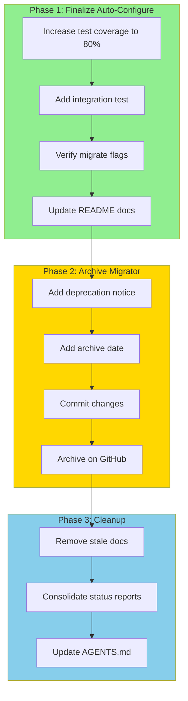

# Merge Completion & Cleanup Plan: golangci-config-migrator → golangci-lint-auto-configure

**Date:** 2026-03-26 21:49
**Status:** Migration code transferred, cleanup and archival pending

---

## Executive Summary

The core migration logic from `golangci-config-migrator` has been successfully integrated into `golangci-lint-auto-configure` under `pkg/migration/`. However, several cleanup tasks and decisions remain.

---

## Brutally Honest Analysis

### 1. What Did I Forget?

| Issue                              | Impact                            | Status          |
| ---------------------------------- | --------------------------------- | --------------- |
| VFS abstraction not transferred    | Low - auto-configure uses real FS | Not needed      |
| Formatters package not transferred | Medium - could be useful          | Decision needed |
| Snapshot tests not transferred     | Low - different test approach     | Not critical    |
| Deprecation notice in migrator     | High - users need to know         | **TODO**        |

### 2. What's Stupid?

| Issue                             | Why Stupid               | Fix                        |
| --------------------------------- | ------------------------ | -------------------------- |
| Two projects doing similar things | Duplication, confusion   | Archive migrator           |
| Migrator has 47 compile errors    | Abandoned mid-refactor   | Archive or fix             |
| Different error handling patterns | Inconsistency            | Use auto-configure pattern |
| `yq` dependency in old migrator   | External tool dependency | Removed in new code ✅     |

### 3. Ghost Systems Identified

| Ghost System                | Location                         | Value                | Action                                                    |
| --------------------------- | -------------------------------- | -------------------- | --------------------------------------------------------- |
| VFS abstraction             | `migrator/pkg/vfs/`              | Testing isolation    | **SKIP** - auto-configure uses real FS                    |
| Formatters runner           | `migrator/pkg/tools/formatters/` | Standalone formatter | **SKIP** - auto-configure uses `golangci-lint formatters` |
| DI container                | `migrator/pkg/di/`               | Dependency injection | **SKIP** - different architecture                         |
| JSON output                 | `migrator/pkg/tools/jsonoutput/` | Structured output    | **SKIP** - auto-configure has `pkg/report/`               |
| Domain value objects        | `migrator/pkg/domain/value/`     | Type safety          | **SKIP** - over-engineered for this use case              |
| Fix command (gitattributes) | `migrator/pkg/commands/fix.go`   | Git linguist config  | **EVALUATE** - might be useful                            |

### 4. Split Brains

| Split Brain     | Location              | Resolution                                    |
| --------------- | --------------------- | --------------------------------------------- |
| ConfigPath type | Both projects have it | Auto-configure's is simpler ✅                |
| Migration rules | Both have rules.go    | Auto-configure's is cleaner ✅                |
| Validator       | Both have validation  | Auto-configure uses golangci-lint directly ✅ |

### 5. Test Coverage

| Package          | Coverage | Target | Action             |
| ---------------- | -------- | ------ | ------------------ |
| `pkg/migration/` | 48.9%    | 80%    | Add more tests     |
| `pkg/linter/`    | ~70%     | 80%    | Minor improvements |
| `pkg/config/`    | ~85%     | 80%    | ✅ Good            |

### 6. Architectural Decisions - Past & Present

| Decision                                     | Problem                 | Improvement             |
| -------------------------------------------- | ----------------------- | ----------------------- |
| VFS abstraction in migrator                  | Over-engineering        | Simplified to real FS   |
| Marker interfaces (Verbosity, ExecutionMode) | Type complexity         | Simple bool flags       |
| yq dependency                                | External tool required  | Pure Go YAML parsing ✅ |
| Separate DI container                        | Unnecessary abstraction | Direct instantiation ✅ |

---

## Decision Matrix: What to Keep

| Asset                                  | Keep?    | Reason                         |
| -------------------------------------- | -------- | ------------------------------ |
| `pkg/migration/` (already transferred) | ✅ YES   | Core functionality             |
| Test data (`testdata/`)                | ✅ YES   | Already transferred            |
| Migration rules                        | ✅ YES   | Already transferred            |
| VFS abstraction                        | ❌ NO    | Not needed                     |
| Formatters package                     | ❌ NO    | Use `golangci-lint formatters` |
| DI container                           | ❌ NO    | Different architecture         |
| Domain value objects                   | ❌ NO    | Over-engineered                |
| Fix command (gitattributes)            | ⚠️ MAYBE | Low value, evaluate later      |

---

## Execution Plan

### Phase 1: Finalize Auto-Configure (Priority: HIGH)

| #   | Task                                           | Effort | Impact |
| --- | ---------------------------------------------- | ------ | ------ |
| 1.1 | Increase `pkg/migration/` test coverage to 80% | 60min  | HIGH   |
| 1.2 | Add integration test for full migrate workflow | 45min  | HIGH   |
| 1.3 | Verify all migrate flags work correctly        | 30min  | MEDIUM |
| 1.4 | Update README with migration docs              | 20min  | MEDIUM |

### Phase 2: Archive Migrator (Priority: HIGH)

| #   | Task                                      | Effort | Impact |
| --- | ----------------------------------------- | ------ | ------ |
| 2.1 | Add deprecation notice to migrator README | 10min  | HIGH   |
| 2.2 | Add archive date notice                   | 5min   | MEDIUM |
| 2.3 | Commit changes                            | 5min   | MEDIUM |
| 2.4 | Archive on GitHub                         | 5min   | HIGH   |

### Phase 3: Cleanup (Priority: MEDIUM)

| #   | Task                                             | Effort | Impact |
| --- | ------------------------------------------------ | ------ | ------ |
| 3.1 | Remove stale status files in auto-configure docs | 15min  | LOW    |
| 3.2 | Consolidate status reports                       | 20min  | LOW    |
| 3.3 | Update AGENTS.md with final architecture         | 15min  | MEDIUM |

---

## Mermaid Execution Graph

---

## Customer Value

| Action               | Customer Value                                |
| -------------------- | --------------------------------------------- |
| Single tool          | Simpler installation, one command to remember |
| Better test coverage | More reliable migrations                      |
| Archived repo        | Clear project direction, no confusion         |
| Updated docs         | Easier onboarding                             |

---

## Risk Assessment

| Risk                    | Probability | Impact | Mitigation               |
| ----------------------- | ----------- | ------ | ------------------------ |
| Lost functionality      | Low         | Medium | Comparison testing done  |
| User confusion          | Medium      | Low    | Clear deprecation notice |
| Breaking existing users | Low         | Medium | 2-week grace period      |

---

## Success Criteria

- [ ] `pkg/migration/` test coverage ≥ 80%
- [ ] All migrate command flags work
- [ ] Deprecation notice in migrator README
- [ ] Migrator repo archived on GitHub
- [ ] Auto-configure README updated

---

## Next Steps

1. **Start with Phase 1.1**: Increase test coverage
2. **Then Phase 2**: Archive migrator
3. **Finally Phase 3**: Cleanup docs
