# Detailed Execution Plan - Architecture Refactoring

**Date:** 2026-03-29  
**Status:** Ready for Execution  
**Author:** AI Assistant via Crush  

---

## Phase 1: High-Level Tasks (30-100 min each)

| ID | Task | Impact | Effort | Customer Value | Priority |
|----|------|--------|--------|----------------|----------|
| 1 | **Consolidate Retry Logic** - Extract duplicate retry patterns from version_checker.go and command_runner.go into a shared utility | High | 60min | Reduces bugs from divergent implementations, easier maintenance | P0 |
| 2 | **Integrate Project Detection** - Wire up the ghost detection system into cmd_configure.go to auto-select presets based on project type | High | 90min | Major UX improvement - automatic preset selection | P0 |
| 3 | **Fix Error Handling Inconsistency** - Audit and unify error handling (Result types vs classic errors) across codebase | High | 80min | Prevents subtle bugs, easier debugging | P0 |
| 4 | **Analyze and Decide on Diff Package** - Determine if diff functionality should be integrated or deleted | Medium | 30min | Remove dead code or add useful feature | P1 |
| 5 | **Split Oversized Files** - Refactor loader.go (416 lines) and fixer.go (370 lines) into smaller, focused files | Medium | 70min | Better maintainability, easier code reviews | P1 |
| 6 | **Consolidate Priority Constants** - Remove duplication between constants/ and types/ packages | Medium | 40min | DRY principle, single source of truth | P2 |
| 7 | **Leverage samber/lo Library** - Replace manual slice operations with lo helper functions | Low | 50min | Less boilerplate, more readable code | P2 |
| 8 | **Remove Global State** - Refactor global Validator in validation.go to be injectable | Medium | 45min | Better testability | P2 |
| 9 | **Improve Report Generation** - Verify and complete integration of HTML/JSON report generation | Medium | 60min | Feature completion | P2 |
| 10 | **Interface Segregation** - Split large ConfigLoader interface into smaller, focused interfaces | Low | 40min | Better architecture, easier mocking | P3 |
| 11 | **Clean up Comment Duplications** - Remove duplicate ConfigFormat documentation | Low | 15min | Code cleanliness | P3 |
| 12 | **Add Integration Tests** - Create end-to-end tests for critical paths | High | 90min | Prevents regressions, increases confidence | P1 |

---

## Phase 2: Micro Tasks (Max 12 min each)

### Task 1: Consolidate Retry Logic (60min total)

| Subtask | Description | Time | Verification |
|---------|-------------|------|--------------|
| 1.1 | Create pkg/utils/retry.go with RetryConfig struct and WithRetry function | 10min | File compiles |
| 1.2 | Write unit tests for retry utility (success, retry, cancellation) | 10min | Tests pass |
| 1.3 | Refactor version_checker.go to use shared retry - remove duplicate code | 12min | go vet passes |
| 1.4 | Refactor command_runner.go to use shared retry - remove duplicate code | 12min | go vet passes |
| 1.5 | Run full test suite to verify no regressions | 10min | All tests pass |
| 1.6 | Commit with detailed message | 6min | Committed |

### Task 2: Integrate Project Detection (90min total)

| Subtask | Description | Time | Verification |
|---------|-------------|------|--------------|
| 2.1 | Analyze detection package to understand current implementation | 10min | Documented findings |
| 2.2 | Design integration approach (flag vs automatic) | 10min | Decision recorded |
| 2.3 | Add --detect flag to configure command | 8min | Flag appears in help |
| 2.4 | Implement preset selection based on detected project type | 12min | Logic implemented |
| 2.5 | Add info logging when auto-detecting | 8min | Logs visible |
| 2.6 | Write integration tests for detection flow | 12min | Tests pass |
| 2.7 | Update documentation (AGENTS.md if needed) | 10min | Docs updated |
| 2.8 | Run full test suite | 10min | All tests pass |
| 2.9 | Commit with detailed message | 10min | Committed |

### Task 3: Fix Error Handling Inconsistency (80min total)

| Subtask | Description | Time | Verification |
|---------|-------------|------|--------------|
| 3.1 | Audit all error handling patterns in pkg/ | 12min | List of patterns documented |
| 3.2 | Decide on pattern (Result types for internal, classic for CLI) | 8min | Decision recorded |
| 3.3 | Refactor client.go to use chosen pattern | 12min | Compiles |
| 3.4 | Refactor cmd_analyze.go to use chosen pattern | 10min | Compiles |
| 3.5 | Refactor cmd_configure.go to use chosen pattern | 10min | Compiles |
| 3.6 | Refactor cmd_validate.go to use chosen pattern | 8min | Compiles |
| 3.7 | Run full test suite | 10min | All tests pass |
| 3.8 | Commit with detailed message | 10min | Committed |

### Task 4: Analyze and Decide on Diff Package (30min total)

| Subtask | Description | Time | Verification |
|---------|-------------|------|--------------|
| 4.1 | Review diff package implementation and tests | 10min | Understand current state |
| 4.2 | Determine if diff adds value to configure workflow | 10min | Decision made |
| 4.3 | Document decision with reasoning | 10min | Decision committed |

### Task 5: Split Oversized Files (70min total)

| Subtask | Description | Time | Verification |
|---------|-------------|------|--------------|
| 5.1 | Analyze loader.go to identify cohesive units | 10min | Split plan documented |
| 5.2 | Extract loader utilities to pkg/config/loader_utils.go | 12min | Compiles |
| 5.3 | Extract loader validation to pkg/config/loader_validation.go | 12min | Compiles |
| 5.4 | Analyze fixer.go to identify cohesive units | 8min | Split plan documented |
| 5.5 | Extract fixer logic to smaller files | 12min | Compiles |
| 5.6 | Run full test suite | 10min | All tests pass |
| 5.7 | Commit with detailed message | 6min | Committed |

### Task 6: Consolidate Priority Constants (40min total)

| Subtask | Description | Time | Verification |
|---------|-------------|------|--------------|
| 6.1 | Identify all duplicate priority definitions | 8min | List documented |
| 6.2 | Decide on canonical location (constants/ vs types/) | 8min | Decision recorded |
| 6.3 | Refactor types/ to use constants/ | 12min | Compiles |
| 6.4 | Run tests to verify no regression | 10min | Tests pass |
| 6.5 | Commit with detailed message | 2min | Committed |

### Task 7: Leverage samber/lo Library (50min total)

| Subtask | Description | Time | Verification |
|---------|-------------|------|--------------|
| 7.1 | Identify files with manual slice operations | 8min | List documented |
| 7.2 | Replace manual contains with lo.Contains | 10min | Compiles |
| 7.3 | Replace manual filter with lo.Filter | 10min | Compiles |
| 7.4 | Replace manual map operations with lo.Map | 10min | Compiles |
| 7.5 | Run tests to verify | 10min | Tests pass |
| 7.6 | Commit with detailed message | 2min | Committed |

### Task 8: Remove Global State (45min total)

| Subtask | Description | Time | Verification |
|---------|-------------|------|--------------|
| 8.1 | Analyze validation.go global Validator usage | 8min | Usage understood |
| 8.2 | Design injectable Validator approach | 8min | Design documented |
| 8.3 | Refactor to injectable pattern | 15min | Compiles |
| 8.4 | Update all usages | 10min | Compiles |
| 8.5 | Commit with detailed message | 4min | Committed |

### Task 9: Improve Report Generation (60min total)

| Subtask | Description | Time | Verification |
|---------|-------------|------|--------------|
| 9.1 | Verify report generation is fully wired in CLI | 10min | Status known |
| 9.2 | Test HTML report generation end-to-end | 12min | Report generates |
| 9.3 | Test JSON report generation end-to-end | 10min | Report generates |
| 9.4 | Fix any issues found | 15min | Works correctly |
| 9.5 | Add integration tests | 10min | Tests pass |
| 9.6 | Commit with detailed message | 3min | Committed |

### Task 10: Interface Segregation (40min total)

| Subtask | Description | Time | Verification |
|---------|-------------|------|--------------|
| 10.1 | Analyze ConfigLoader interface usage | 8min | Usage patterns known |
| 10.2 | Design smaller interfaces | 10min | Design documented |
| 10.3 | Refactor to smaller interfaces | 15min | Compiles |
| 10.4 | Update implementations | 5min | Compiles |
| 10.5 | Commit with detailed message | 2min | Committed |

### Task 11: Clean up Comment Duplications (15min total)

| Subtask | Description | Time | Verification |
|---------|-------------|------|--------------|
| 11.1 | Find duplicate ConfigFormat documentation | 5min | Location found |
| 11.2 | Remove duplicate | 5min | File updated |
| 11.3 | Commit | 5min | Committed |

### Task 12: Add Integration Tests (90min total)

| Subtask | Description | Time | Verification |
|---------|-------------|------|--------------|
| 12.1 | Design integration test structure | 10min | Design documented |
| 12.2 | Create test helpers for CLI invocation | 12min | Helpers work |
| 12.3 | Write configure command E2E test | 15min | Test passes |
| 12.4 | Write analyze command E2E test | 12min | Test passes |
| 12.5 | Write migrate command E2E test | 12min | Test passes |
| 12.6 | Add CI workflow for integration tests | 15min | CI runs |
| 12.7 | Commit with detailed message | 14min | Committed |

---

## Execution Graph

```mermaid
graph TD
    subgraph Phase1["Phase 1: Critical (P0)"]
        T1[1. Consolidate Retry Logic<br/>60min]
        T2[2. Integrate Project Detection<br/>90min]
        T3[3. Fix Error Handling<br/>80min]
        T12[12. Add Integration Tests<br/>90min]
    end

    subgraph Phase2["Phase 2: Important (P1)"]
        T4[4. Analyze Diff Package<br/>30min]
        T5[5. Split Oversized Files<br/>70min]
    end

    subgraph Phase3["Phase 3: Nice to Have (P2)"]
        T6[6. Consolidate Constants<br/>40min]
        T7[7. Use samber/lo<br/>50min]
        T8[8. Remove Global State<br/>45min]
        T9[9. Improve Reports<br/>60min]
    end

    subgraph Phase4["Phase 4: Polish (P3)"]
        T10[10. Interface Segregation<br/>40min]
        T11[11. Clean Comments<br/>15min]
    end

    T1 --> T2
    T2 --> T3
    T1 --> T12
    T3 --> T12
    
    T4 --> T5
    
    T6 --> T7
    T7 --> T8
    T8 --> T9
    
    T10 --> T11

    style Phase1 fill:#ff9999
    style Phase2 fill:#ffcc99
    style Phase3 fill:#ffff99
    style Phase4 fill:#ccffcc
```

---

## Execution Order

**Week 1: Critical Path (P0)**
- Day 1: Task 1 (Consolidate Retry Logic)
- Day 2: Task 2 (Integrate Project Detection)
- Day 3: Task 3 (Fix Error Handling)
- Day 4: Task 12 (Integration Tests)

**Week 2: Important (P1-P2)**
- Day 5: Task 4 (Analyze Diff)
- Day 6: Task 5 (Split Files)
- Day 7: Task 6 (Consolidate Constants)
- Day 8: Task 7 (samber/lo)

**Week 3: Polish (P2-P3)**
- Day 9: Task 8 (Remove Global State)
- Day 10: Task 9 (Improve Reports)
- Day 11: Task 10 (Interface Segregation)
- Day 12: Task 11 (Clean Comments)

---

## Success Metrics

1. **Code Quality Gates:**
   - Zero `go vet` warnings
   - Zero duplications
   - All files under 350 lines
   - 100% build success rate

2. **Test Coverage:**
   - Retry utility: 90%+
   - CLI commands: 80%+
   - Integration tests: Pass

3. **Ghost Systems:**
   - Detection: Integrated ✓
   - Diff: Decided (keep/delete) ✓
   - Zero unused exported functions

4. **Customer Value:**
   - Auto-detection working
   - Fewer configuration errors
   - Better error messages

---

## Risks and Mitigations

| Risk | Likelihood | Impact | Mitigation |
|------|------------|--------|------------|
| Breaking changes | Medium | High | Comprehensive tests per task |
| Scope creep | Medium | Medium | Strict 12min subtask limit |
| Integration complexity | Low | Medium | Analyze before implementing |
| Lost work | Low | Low | Git preserves everything |

---

## Next Steps

1. **REVIEW THIS PLAN** - Approve the task breakdown
2. **EXECUTE TASK 1** - Start with retry consolidation
3. **COMMIT AFTER EACH SUBTASK** - As per requirements
4. **PUSH REGULARLY** - Keep remote up to date

**Ready to begin execution?**
