# Pareto Execution Plan — golangci-lint-auto-configure

**Date:** 2026-06-05  
**Pareto Principle:** 1% → 51%, 4% → 64%, 20% → 80%

---

## Pareto Breakdown

### 1% → 51% Result

| Task                                          | Impact | Rationale                                                                                                                                                               |
| --------------------------------------------- | ------ | ----------------------------------------------------------------------------------------------------------------------------------------------------------------------- |
| **CLI integration test coverage: 8.2% → 80%** | 51%    | The CLI is the ONLY user-facing surface. 91.8% untested means every feature is "we hope it works." This single task transforms the project from fragile to trustworthy. |

### 4% → 64% Result (1% + 3 more)

| #   | Task                                       | Impact | Rationale                                                                                                          |
| --- | ------------------------------------------ | ------ | ------------------------------------------------------------------------------------------------------------------ |
| 1   | CLI integration test coverage (8.2% → 80%) | 51%    | The 1% — see above                                                                                                 |
| 2   | Trim AGENTS.md: 912 → ≤377 lines           | 5%     | 912 lines of mixed-depth docs is navigation hell. Extracting sections into referenced files makes the guide usable |
| 3   | gogenfilter scanner coverage: 59.8% → 90%  | 4%     | Core feature — auto-detects generated code. Untested paths = silent wrong exclusions                               |
| 4   | Migration coverage: 66.8% → 90%            | 4%     | v1→v2 migration is a critical user workflow. Low coverage = migration bugs that corrupt configs                    |

### 20% → 80% Result (4% + 2 more)

| #   | Task                                      | Impact | Rationale                                                                       |
| --- | ----------------------------------------- | ------ | ------------------------------------------------------------------------------- |
| 5   | `--check` mode integration tests          | 4%     | CI-critical: exit 0/1 decisions. Wrong exit code = broken CI pipelines          |
| 6   | `--diff` flag tests + interaction bug fix | 4%     | User-facing diff preview. Bug: diff shows nothing in check mode. Silent failure |

### Remaining 80% of Tasks (20% of result)

| Area                 | Tasks                                                                               |
| -------------------- | ----------------------------------------------------------------------------------- |
| Data integrity       | LinterMinVersions validation, reference preset validation                           |
| Feature completeness | ginkgolinter defaults, testifylint defaults, vendor/ exclusion decision             |
| Correctness          | errors.Join for multi-finding, DryRun bool field                                    |
| Architecture         | pkg/client resolution, justfile→flake.nix, type system 3 easy wins, go-error-family |

---

## Comprehensive Plan (25 tasks, 30-100 min each)

Sorted by **Impact × Effort** (highest leverage first):

| #   | Task                                                                           | Priority | Est. Time | Impact | Effort | Category    |
| --- | ------------------------------------------------------------------------------ | -------- | --------- | ------ | ------ | ----------- |
| 1   | CLI integration tests: configure command (all flag combinations)               | Critical | 45m       | ★★★★★  | ★★★    | Testing     |
| 2   | CLI integration tests: analyze command (formats, SARIF, finding)               | Critical | 45m       | ★★★★★  | ★★★    | Testing     |
| 3   | CLI integration tests: validate command (valid/invalid configs)                | Critical | 45m       | ★★★★★  | ★★★    | Testing     |
| 4   | CLI integration tests: report command (HTML, JSON, SARIF)                      | Critical | 45m       | ★★★★★  | ★★★    | Testing     |
| 5   | CLI integration tests: migrate command (v1 fixtures, skip-validation)          | Critical | 45m       | ★★★★★  | ★★★    | Testing     |
| 6   | CLI integration tests: install-hook + completion                               | Critical | 30m       | ★★★★★  | ★★     | Testing     |
| 7   | Trim AGENTS.md: extract error handling patterns → references/error-handling.md | High     | 45m       | ★★★★   | ★★★    | Docs        |
| 8   | Trim AGENTS.md: extract build/test commands → references/build-commands.md     | High     | 45m       | ★★★★   | ★★★    | Docs        |
| 9   | Trim AGENTS.md: extract architecture patterns → references/architecture.md     | High     | 45m       | ★★★★   | ★★★    | Docs        |
| 10  | gogenfilter scanner coverage: test sqlc, oapi-codegen, wire detection paths    | High     | 60m       | ★★★★   | ★★★    | Testing     |
| 11  | gogenfilter scanner coverage: test fallback/generic detection                  | High     | 45m       | ★★★★   | ★★     | Testing     |
| 12  | Migration coverage: test linter-specific settings migration                    | High     | 60m       | ★★★★   | ★★★    | Testing     |
| 13  | Migration coverage: test exclusion rules/path migration                        | High     | 45m       | ★★★★   | ★★     | Testing     |
| 14  | `--check` mode: test exit 0 (optimal), exit 1 (changes needed)                 | Medium   | 30m       | ★★★    | ★★     | Testing     |
| 15  | `--check` mode: test with --dry-run, --priority, --preset combinations         | Medium   | 30m       | ★★★    | ★★     | Testing     |
| 16  | `--diff` flag: test diff output contains expected changes                      | Medium   | 30m       | ★★★    | ★★     | Testing     |
| 17  | Fix `--diff` + `--check` interaction (diff shows nothing in check mode)        | Medium   | 45m       | ★★★    | ★★★    | Bugfix      |
| 18  | LinterMinVersions validation test + reference preset validation                | Medium   | 30m       | ★★★    | ★      | Testing     |
| 19  | Add ginkgolinter + testifylint default settings                                | Medium   | 45m       | ★★★    | ★★     | Feature     |
| 20  | Use `errors.Join` for multi-finding build failures                             | Low      | 30m       | ★★     | ★★     | Correctness |
| 21  | Add `DryRun bool` field to `MigrationResult`                                   | Low      | 30m       | ★★     | ★★     | API         |
| 22  | Type system: `LintersConfig.Enable/Disable` → `[]LinterName`                   | Low      | 30m       | ★★     | ★      | Refactor    |
| 23  | Type system: `OutputConfig.Formats` → `[]OutputFormat`                         | Low      | 45m       | ★★     | ★★★    | Refactor    |
| 24  | Type system: `GeneratedMode` enum for `LintersExclusionsConfig.Generated`      | Low      | 30m       | ★★     | ★      | Refactor    |
| 25  | Decide vendor/ in formatter exclusions + pkg/client smoke tests                | Low      | 45m       | ★      | ★★     | Decision    |

---

## Detailed Breakdown (78 subtasks, max 15 min each)

### Task 1: CLI integration tests — configure command (3 subtasks)

| #   | Subtask                                                              | Est. |
| --- | -------------------------------------------------------------------- | ---- |
| 1.1 | Test `configure` with valid config (no changes needed)               | 10m  |
| 1.2 | Test `configure --priority critical` enables only critical linters   | 10m  |
| 1.3 | Test `configure --priority high` includes critical + high            | 10m  |
| 1.4 | Test `configure --dry-run` does not modify config file               | 10m  |
| 1.5 | Test `configure --preset minimal/standard/strict/security/reference` | 15m  |
| 1.6 | Test `configure` with missing config (creates default)               | 10m  |
| 1.7 | Test `configure` with deprecated linters (auto-replacement)          | 10m  |
| 1.8 | Test `configure` with invalid config YAML (error path)               | 10m  |

### Task 2: CLI integration tests — analyze command (4 subtasks)

| #   | Subtask                                                        | Est. |
| --- | -------------------------------------------------------------- | ---- |
| 2.1 | Test `analyze` with valid config (shows recommendations)       | 10m  |
| 2.2 | Test `analyze --format json` outputs valid JSON                | 10m  |
| 2.3 | Test `analyze --format sarif` outputs valid SARIF              | 10m  |
| 2.4 | Test `analyze --format finding` outputs go-finding Report      | 10m  |
| 2.5 | Test `analyze` with missing config file (error path)           | 10m  |
| 2.6 | Test `analyze` with invalid golangci-lint version (error path) | 10m  |

### Task 3: CLI integration tests — validate command (3 subtasks)

| #   | Subtask                                               | Est. |
| --- | ----------------------------------------------------- | ---- |
| 3.1 | Test `validate` with valid config (exit 0)            | 10m  |
| 3.2 | Test `validate` with invalid config (exit non-zero)   | 10m  |
| 3.3 | Test `validate --format sarif` outputs SARIF          | 10m  |
| 3.4 | Test `validate` with missing config file (error path) | 10m  |

### Task 4: CLI integration tests — report command (3 subtasks)

| #   | Subtask                                                    | Est. |
| --- | ---------------------------------------------------------- | ---- |
| 4.1 | Test `report --format html` generates valid HTML           | 10m  |
| 4.2 | Test `report --format json` generates valid JSON           | 10m  |
| 4.3 | Test `report --format sarif` generates valid SARIF         | 10m  |
| 4.4 | Test `report --format finding` generates go-finding Report | 10m  |
| 4.5 | Test `report` with missing config (error path)             | 10m  |

### Task 5: CLI integration tests — migrate command (3 subtasks)

| #   | Subtask                                                          | Est. |
| --- | ---------------------------------------------------------------- | ---- |
| 5.1 | Test `migrate` with v1 config fixture (successful migration)     | 10m  |
| 5.2 | Test `migrate --skip-validation` skips post-migration validation | 10m  |
| 5.3 | Test `migrate` with already-v2 config (no-op or error)           | 10m  |
| 5.4 | Test `migrate` with invalid v1 config (error path)               | 10m  |

### Task 6: CLI integration tests — install-hook + completion (2 subtasks)

| #   | Subtask                                               | Est. |
| --- | ----------------------------------------------------- | ---- |
| 6.1 | Test `install-hook` in a temp git repo (creates hook) | 10m  |
| 6.2 | Test `completion bash` generates valid bash script    | 10m  |
| 6.3 | Test `completion zsh` generates valid zsh script      | 10m  |

### Task 7-9: Trim AGENTS.md (3 subtasks each)

| #   | Subtask                                                          | Est. |
| --- | ---------------------------------------------------------------- | ---- |
| 7.1 | Extract error handling section to `references/error-handling.md` | 15m  |
| 7.2 | Update AGENTS.md with link + summary                             | 10m  |
| 8.1 | Extract build/test commands to `references/build-commands.md`    | 15m  |
| 8.2 | Update AGENTS.md with link + summary                             | 10m  |
| 9.1 | Extract architecture patterns to `references/architecture.md`    | 15m  |
| 9.2 | Update AGENTS.md with link + summary                             | 10m  |
| 9.3 | Verify AGENTS.md ≤ 377 lines                                     | 10m  |

### Task 10-11: gogenfilter scanner coverage (4 subtasks)

| #    | Subtask                                                        | Est. |
| ---- | -------------------------------------------------------------- | ---- |
| 10.1 | Test sqlc detection (from sqlc.yaml output dirs)               | 15m  |
| 10.2 | Test oapi-codegen detection (content marker)                   | 15m  |
| 10.3 | Test wire detection (wire_gen.go)                              | 10m  |
| 10.4 | Test fallback/generic detection (// Code generated by comment) | 10m  |
| 10.5 | Test empty project (no generated files)                        | 10m  |
| 10.6 | Test mixed project (multiple generator types)                  | 10m  |

### Task 12-13: Migration coverage (4 subtasks)

| #    | Subtask                                              | Est. |
| ---- | ---------------------------------------------------- | ---- |
| 12.1 | Test gci settings migration (v1 → v2 format)         | 15m  |
| 12.2 | Test cyclop settings migration                       | 15m  |
| 12.3 | Test wrapcheck settings migration                    | 10m  |
| 12.4 | Test removed linter settings cleanup                 | 10m  |
| 13.1 | Test issues.exclude-rules → linters.exclusions.rules | 10m  |
| 13.2 | Test issues.exclude-dirs → exclusions.paths          | 10m  |
| 13.3 | Test issues.exclude-files → exclusions.paths         | 10m  |

### Task 14-15: `--check` mode tests (3 subtasks)

| #    | Subtask                                        | Est. |
| ---- | ---------------------------------------------- | ---- |
| 14.1 | Test `--check` with optimal config → exit 0    | 10m  |
| 14.2 | Test `--check` with suboptimal config → exit 1 | 10m  |
| 15.1 | Test `--check --dry-run` combination           | 10m  |
| 15.2 | Test `--check --priority critical` combination | 10m  |
| 15.3 | Test `--check --preset minimal` combination    | 10m  |

### Task 16-17: `--diff` tests + bug fix (4 subtasks)

| #    | Subtask                                                | Est. |
| ---- | ------------------------------------------------------ | ---- |
| 16.1 | Test `--diff` shows added linters in output            | 10m  |
| 16.2 | Test `--diff` shows removed linters in output          | 10m  |
| 16.3 | Test `--diff` with no changes (empty diff)             | 10m  |
| 17.1 | Reproduce `--diff --check` bug (diff shows nothing)    | 10m  |
| 17.2 | Fix interaction: temporarily apply, show diff, restore | 15m  |
| 17.3 | Add test verifying fix works                           | 10m  |

### Task 18: Data integrity tests (2 subtasks)

| #    | Subtask                                                      | Est. |
| ---- | ------------------------------------------------------------ | ---- |
| 18.1 | Test all LinterMinVersions entries exist in LinterPriorities | 10m  |
| 18.2 | Test reference preset linters all exist in LinterPriorities  | 10m  |
| 18.3 | Test reference preset includes all critical+high linters     | 10m  |

### Task 19: Default settings (2 subtasks)

| #    | Subtask                                    | Est. |
| ---- | ------------------------------------------ | ---- |
| 19.1 | Research ginkgolinter available settings   | 15m  |
| 19.2 | Add ginkgolinter default settings to fixer | 15m  |
| 19.3 | Research testifylint available settings    | 15m  |
| 19.4 | Add testifylint default settings to fixer  | 15m  |

### Task 20-21: Correctness/API improvements (2 subtasks each)

| #    | Subtask                                             | Est. |
| ---- | --------------------------------------------------- | ---- |
| 20.1 | Audit finding builder for multi-error paths         | 10m  |
| 20.2 | Replace first-error-return with errors.Join         | 15m  |
| 20.3 | Verify no behavioral change in output               | 10m  |
| 21.1 | Add `DryRun bool` field to `MigrationResult` struct | 10m  |
| 21.2 | Set DryRun=true in dry-run result constructors      | 10m  |
| 21.3 | Update CLI display logic to use DryRun field        | 10m  |

### Task 22-24: Type system improvements (2 subtasks each)

| #    | Subtask                                                                     | Est. |
| ---- | --------------------------------------------------------------------------- | ---- |
| 22.1 | Change `LintersConfig.Enable` from `[]string` to `[]LinterName`             | 10m  |
| 22.2 | Change `LintersConfig.Disable` from `[]string` to `[]LinterName`            | 10m  |
| 22.3 | Verify YAML unmarshal still works                                           | 10m  |
| 23.1 | Define `OutputFormat` struct                                                | 10m  |
| 23.2 | Change `OutputConfig.Formats` from `map[string]any` to `[]OutputFormat`     | 15m  |
| 23.3 | Update all references and verify marshal/unmarshal                          | 15m  |
| 24.1 | Define `GeneratedMode` enum type                                            | 10m  |
| 24.2 | Change `LintersExclusionsConfig.Generated` from `string` to `GeneratedMode` | 10m  |
| 24.3 | Verify YAML unmarshal still works                                           | 10m  |

### Task 25: Decisions + client tests (2 subtasks)

| #    | Subtask                                                  | Est. |
| ---- | -------------------------------------------------------- | ---- |
| 25.1 | Research whether vendor/ belongs in formatter exclusions | 10m  |
| 25.2 | Implement decision (add or document why not)             | 10m  |
| 25.3 | Determine pkg/client intent (public API vs internal)     | 10m  |
| 25.4 | Add smoke tests OR mark internal                         | 15m  |

---

## Execution Graph

```mermaid
flowchart TD
    subgraph Critical["🔴 Critical Path"]
        T1["1: Configure CLI tests"]
        T2["2: Analyze CLI tests"]
        T3["3: Validate CLI tests"]
        T4["4: Report CLI tests"]
        T5["5: Migrate CLI tests"]
        T6["6: Hook/Completion CLI tests"]
    end

    subgraph High["🟠 High Priority"]
        T7["7: Extract error docs"]
        T8["8: Extract build docs"]
        T9["9: Extract arch docs"]
        T10["10: gogenfilter coverage"]
        T11["11: gogenfilter fallback"]
        T12["12: Migration settings"]
        T13["13: Migration exclusions"]
    end

    subgraph Medium["🟡 Medium Priority"]
        T14["14: --check exit codes"]
        T15["15: --check combos"]
        T16["16: --diff output"]
        T17["17: --diff + --check fix"]
        T18["18: Data integrity"]
        T19["19: Default settings"]
    end

    subgraph Low["🟢 Low Priority"]
        T20["20: errors.Join"]
        T21["21: DryRun field"]
        T22["22: []LinterName"]
        T23["23: []OutputFormat"]
        T24["24: GeneratedMode"]
        T25["25: vendor/ + client"]
    end

    T1 --> T2 --> T3 --> T4 --> T5 --> T6
    T7 --> T9
    T8 --> T9
    T10 --> T11
    T12 --> T13
    T14 --> T15
    T16 --> T17
    T18 --> T19
    T20 --> T21
    T22 --> T23 --> T24
```

---

## Execution Strategy

**Phase 1: Critical (Tasks 1-6)** — All CLI integration tests. These are independent and can run in parallel mentally, but must all pass before anything else matters.

**Phase 2: High (Tasks 7-13)** — Documentation trim + coverage gaps. AGENTS.md trim is docs-only (zero risk). Coverage tests verify existing behavior.

**Phase 3: Medium (Tasks 14-19)** — Feature testing + bug fix. --check and --diff are related; data integrity and defaults are independent.

**Phase 4: Low (Tasks 20-25)** — Correctness + type system + decisions. Type system changes are pure refactor with zero behavioral change.

**Constraint:** DO NOT BREAK BUILD. Run `just test` after every task.
