# Plan: Complete go-error-family Adoption & Restore Build/Docs Truth

**Date:** 2026-06-29 02:13
**Status:** Approved for execution
**Branch:** `master` (clean at `124e46d`, pushed)
**Method:** Pareto planning — 1% → 4% → 20%, then full execution

---

## 1. Context & Current State

`golangci-lint-auto-configure` adopted `github.com/larsartmann/go-error-family v0.5.1`
for semantic BSD-sysexits exit codes. The **boundary-only** integration is committed:

- `Main()` uses `errorfamily.ExitCode(err)` (commit `efdd4d7`).
- All 11 sentinels registered with Families in `pkg/errors/classification.go`.
- `ConfigError` implements `Classified` → `Rejection`.
- 24 BDD classification tests pass at 96.3% coverage for `pkg/errors`.

### What is verified working right now

- `go build ./...` → **exit 0** (clean).
- `go vet ./...` → clean.
- `go test ./... -count=1` → **all packages pass** (18 packages).
- LSP diagnostics showing 13 errors are **stale cache** (fixed in `0501f54`); ignored.

### What is broken or unfinished

| #  | Problem                                                                                    | Severity    |
| -- | ------------------------------------------------------------------------------------------ | ----------- |
| B1 | `nix build` fails — `go mod tidy` in `postPatch` needs network in sandbox (DNS refused)    | **Blocker** |
| B2 | `FEATURES.md:163` claims "justfile recipes \| Stable" — **no justfile exists**             | Lie         |
| B3 | `ReportError` / `MigrationError` do not implement `Classified`                             | Gap         |
| B4 | 29 `fmt.Errorf` calls omit `%w` → breaks `errors.Is/As` + classification on wrapped errors | Correctness |
| B5 | `internal/cli` coverage = 8.8% (user-facing entry point)                                   | Risk        |
| B6 | No exit-code integration test (full `Main()` → `os.Exit()` path)                           | Risk        |

### Key architectural decision (resolves status-report Section G)

> **`AnalysisError` stays cause-chain classified. It does NOT get a fixed `Classified` Family.**

Rationale: `AnalysisError` is heterogeneous — binary-missing → Infrastructure (69),
version-too-old → Rejection (1), unparseable output → Corruption (65). The existing
sentinel-in-cause-chain design already produces correct, fine-grained exit codes
(proven by `classification_test.go`). A fixed Family would **flatten** that
differentiation and make every analysis failure exit identically. `ConfigError` is
the exception because config failures are _always_ user-fault (Rejection).
`ReportError` and `MigrationError` are likewise always user-fault → Rejection.

This decision is final and removes the roadmap's biggest uncertainty.

---

## 2. Pareto Breakdown

### 1% that delivers 51% of the result

The build must work and docs must tell the truth. Everything else is blocked or
misleading until these land.

1. **Fix `nix build` sandbox failure** — remove/replace the network-needing
   `go mod tidy` in `postPatch`; regenerate `vendorHash`. Restores reproducible CI.
2. **Run `nix build` + `nix flake check`** — prove the pipeline is green.
3. **Fix `FEATURES.md` justfile lie** — one-line truth fix.
4. **Run `golangci-lint run ./...`** — confirm lint clean (the project's own bar).

### 4% that delivers 64% of the result

Complete the error-classification story so the adoption actually pays off.

5. **`Classified` on `ReportError` + `MigrationError`** → Rejection (with tests).
6. **Fix the 29 non-wrapping `fmt.Errorf`** → add `%w` (enables classification propagation).
7. **Exit-code integration test** — `Main()` → `os.Exit()` per Family.
8. **Document exit codes in `README.md`** — table for CI/CD consumers.
9. **Update `TODO_LIST.md`** — reflect reality (vendorHash done, new tasks).

### 20% that delivers 80% of the result

Coverage, message templates, and polish.

10. Register domain message templates (`config.not_found`, `version.too_old`, …).
11. `errors.Join` for multi-finding failures (`pkg/finding/converter.go`).
12. `internal/cli` coverage 8.8% → ≥40% (analyze, validate, report, migrate).
13. `pkg/version` coverage — `ReadBuildInfo()` fallback.
14. `--check` / `--diff` interaction tests (+ investigate the diff-empty-in-check bug).
15. Polish: `Config.Clone()`, `DryRun` field, `pkg/client` intent, `testifylint` defaults.
16. FEATURES.md full audit + `LinterMinVersions` / `reference` preset validation tests.

### Remaining 20% (deferred / low-ROI)

- `--json` error output flag (`errorfamily.Error.JSON()`).
- Full `HandleError` adoption at the boundary (replaces charm.land/log — separate decision).
- `gogenfilter` scanner coverage 63.9% → higher.
- Reset LSP cache (environmental, not a code task).

---

## 3. Comprehensive Plan — Medium Granularity

**27 tasks, 30–100 min each, sorted by Impact ↓ then Effort ↑.**
`Imp` = Impact (1–5), `Eff` = Effort (1–5, lower = easier), `T` = estimated minutes.

| #   | Task                                                                            | Phase  | Imp | Eff | T   | Depends on |
| --- | ------------------------------------------------------------------------------- | ------ | --- | --- | --- | ---------- |
| M01 | Fix `nix build` sandbox: drop network-needing `go mod tidy`, regen `vendorHash` | Build  | 5   | 3   | 60  | —          |
| M02 | Run `nix build` + `nix flake check` (verify green)                              | Build  | 5   | 1   | 20  | M01        |
| M03 | Run `golangci-lint run ./...` (confirm clean)                                   | Build  | 5   | 1   | 20  | —          |
| M04 | Fix `FEATURES.md` justfile lie → "Nix flake build"                              | Docs   | 5   | 1   | 10  | —          |
| M05 | `Classified(Rejection)` on `ReportError` + tests                                | Errors | 5   | 2   | 30  | —          |
| M06 | `Classified(Rejection)` on `MigrationError` + tests                             | Errors | 5   | 2   | 30  | —          |
| M07 | Fix 29 non-wrapping `fmt.Errorf` → add `%w`                                     | Errors | 5   | 3   | 60  | —          |
| M08 | Document AnalysisError-delegates decision in code comment                       | Errors | 4   | 1   | 15  | —          |
| M09 | Exit-code integration test (`Main()` → exit per Family)                         | Tests  | 5   | 3   | 60  | M05,M06    |
| M10 | Document exit codes in `README.md` (table)                                      | Docs   | 4   | 1   | 20  | M09        |
| M11 | Update `TODO_LIST.md` to reality                                                | Docs   | 4   | 1   | 15  | M01-M09    |
| M12 | Register domain message templates (4 codes)                                     | Errors | 4   | 2   | 40  | —          |
| M13 | `errors.Join` for multi-finding in `converter.go`                               | Errors | 3   | 2   | 30  | —          |
| M14 | `internal/cli` coverage → ≥40% (analyze/validate/report/migrate)                | Tests  | 4   | 5   | 100 | M09        |
| M15 | `pkg/version` coverage — `ReadBuildInfo` fallback                               | Tests  | 3   | 2   | 30  | —          |
| M16 | `--check` mode integration tests                                                | Tests  | 3   | 2   | 40  | —          |
| M17 | `--diff` + `--check` interaction test + bug investigation                       | Tests  | 3   | 3   | 50  | M16        |
| M18 | Audit all FEATURES.md "Stable" entries for accuracy                             | Docs   | 3   | 2   | 30  | M04        |
| M19 | `LinterMinVersions` validation test                                             | Tests  | 2   | 2   | 30  | —          |
| M20 | `reference` preset validation test                                              | Tests  | 2   | 1   | 20  | —          |
| M21 | `Config.Clone()` method (replace JSON hack)                                     | Polish | 2   | 2   | 30  | —          |
| M22 | `DryRun bool` on `MigrationResult`                                              | Polish | 2   | 1   | 20  | —          |
| M23 | `testifylint` default settings                                                  | Polish | 2   | 1   | 20  | —          |
| M24 | `pkg/client` smoke tests or clarify intent                                      | Polish | 2   | 2   | 30  | —          |
| M25 | Evaluate `HandleError` at boundary — decision doc                               | Errors | 2   | 2   | 30  | M12        |
| M26 | `--json` error output flag (`errorfamily.Error.JSON()`)                         | Errors | 2   | 3   | 50  | M12        |
| M27 | Final full-suite verification (build+test+lint+nix)                             | Verify | 5   | 1   | 20  | all        |

**Total estimated effort:** ~13.5 hours of focused work.

---

## 4. Detailed Plan — Fine Granularity

**76 subtasks, ≤15 min each, sorted by phase then dependency.**
Each maps to a parent `M##` task.

### Phase A — Build & CI Unblock (1% tier)

| #   | Subtask                                                     | Parent | Min |
| --- | ----------------------------------------------------------- | ------ | --- |
| F01 | Reproduce `nix build` failure; capture exact error          | M01    | 10  |
| F02 | Inspect `postPatch` + `proxyVendor` + replace strategy      | M01    | 10  |
| F03 | Try removing `go mod tidy` line; rebuild                    | M01    | 10  |
| F04 | If vendorHash mismatches: extract `got:` hash from error    | M01    | 10  |
| F05 | Insert new `vendorHash`; rebuild until hash-stable          | M01    | 10  |
| F06 | Verify `nix build` produces a binary; smoke-run `--version` | M02    | 15  |
| F07 | Run `nix flake check`; fix any reported issues              | M02    | 15  |
| F08 | Run `golangci-lint run ./...`; capture result               | M03    | 10  |
| F09 | Fix any lint violations found (or document pre-existing)    | M03    | 15  |

### Phase B — Documentation Truth (1% tier)

| #   | Subtask                                                       | Parent | Min |
| --- | ------------------------------------------------------------- | ------ | --- |
| F10 | Edit `FEATURES.md:163` justfile → "Nix flake build \| Stable" | M04    | 5   |
| F11 | Re-read FEATURES.md; list every "Stable" entry for audit      | M18    | 10  |
| F12 | Correct any inaccurate FEATURES.md status entries             | M18    | 15  |
| F13 | Write exit-code table section in `README.md`                  | M10    | 15  |

### Phase C — Error System Maturity (4% tier)

| #   | Subtask                                                               | Parent | Min |
| --- | --------------------------------------------------------------------- | ------ | --- |
| F14 | Add `ErrorFamily()` → Rejection to `ReportError` in classification.go | M05    | 10  |
| F15 | Add BDD test: ReportError → Rejection → exit 1                        | M05    | 10  |
| F16 | Add `ErrorFamily()` → Rejection to `MigrationError`                   | M06    | 10  |
| F17 | Add BDD test: MigrationError → Rejection → exit 1                     | M06    | 10  |
| F18 | Write AnalysisError-delegates rationale comment                       | M08    | 15  |
| F19 | Grep all 29 non-wrapping `fmt.Errorf`; build fix-list                 | M07    | 10  |
| F20 | Fix `pkg/types/validation.go` (5 sites) — add `%w`                    | M07    | 10  |
| F21 | Fix `pkg/config/loader.go` sites — add `%w`                           | M07    | 10  |
| F22 | Fix `pkg/linter/*` sites — add `%w`                                   | M07    | 10  |
| F23 | Fix `pkg/migration/migrator.go` site — add `%w`                       | M07    | 10  |
| F24 | Fix remaining sites (`pkg/finding`, `internal/cli`, etc.)             | M07    | 15  |
| F25 | `go build ./...` + `go test ./...` after %w sweep                     | M07    | 10  |
| F26 | Register `config.not_found` message template                          | M12    | 10  |
| F27 | Register `version.too_old` message template                           | M12    | 10  |
| F28 | Register `git.not_repository` message template                        | M12    | 10  |
| F29 | Register `version.parse_failed` message template                      | M12    | 10  |
| F30 | Add `errors.Join` loop in `converter.go` multi-finding path           | M13    | 15  |
| F31 | Test that joined errors classify to worst Family                      | M13    | 15  |

### Phase D — Test Coverage (20% tier)

| #   | Subtask                                                       | Parent | Min |
| --- | ------------------------------------------------------------- | ------ | --- |
| F32 | Design exit-code integration test harness (capture `os.Exit`) | M09    | 15  |
| F33 | Test: Rejection-config error → exit 1                         | M09    | 15  |
| F34 | Test: Infrastructure (binary missing) → exit 69               | M09    | 15  |
| F35 | Test: Corruption (unparseable) → exit 65                      | M09    | 15  |
| F36 | Test: Transient default → exit 75                             | M09    | 15  |
| F37 | Test: nil error / success → exit 0                            | M09    | 10  |
| F38 | Add `internal/cli` analyze command integration test           | M14    | 15  |
| F39 | Add `internal/cli` validate command integration test          | M14    | 15  |
| F40 | Add `internal/cli` report command integration test            | M14    | 15  |
| F41 | Add `internal/cli` migrate command integration test           | M14    | 15  |
| F42 | Add `internal/cli` install-hook integration test              | M14    | 15  |
| F43 | Re-measure `internal/cli` coverage; confirm ≥40%              | M14    | 10  |
| F44 | Add `pkg/version` `ReadBuildInfo` fallback test               | M15    | 15  |
| F45 | Add `pkg/version` ldflags-precedence test                     | M15    | 15  |
| F46 | Add `--check` exit-0-when-optimal test                        | M16    | 15  |
| F47 | Add `--check` exit-1-when-changes-needed test                 | M16    | 15  |
| F48 | Add `--check` + flag-combination tests                        | M16    | 15  |
| F49 | Reproduce `--diff`+`--check` empty-diff behavior              | M17    | 15  |
| F50 | Decide: bug or intended; fix or document                      | M17    | 15  |
| F51 | Add `LinterMinVersions` completeness test                     | M19    | 15  |
| F52 | Add `reference` preset ⊆ `LinterPriorities` test              | M20    | 15  |

### Phase E — Polish & Quality (20% tier)

| #   | Subtask                                                        | Parent | Min |
| --- | -------------------------------------------------------------- | ------ | --- |
| F53 | Implement `Config.Clone()` via typed copy                      | M21    | 15  |
| F54 | Replace JSON marshal/unmarshal usages with `Clone()`           | M21    | 15  |
| F55 | Add `DryRun bool` field to `MigrationResult`                   | M22    | 10  |
| F56 | Set `DryRun` correctly in migrate command paths                | M22    | 10  |
| F57 | Add `testifylint` settings to `DefaultLinterSettings`          | M23    | 10  |
| F58 | Add `testifylint` safe-default test                            | M23    | 10  |
| F59 | Decide `pkg/client` intent (public API vs internal)            | M24    | 15  |
| F60 | Add `pkg/client` smoke test or document decision               | M24    | 15  |
| F61 | Write `HandleError`-at-boundary decision doc (docs/decisions/) | M25    | 15  |
| F62 | Implement `--json` error flag in `Main()`                      | M26    | 15  |
| F63 | Add `--json` error output test                                 | M26    | 15  |

### Phase F — Sync Docs & Final Verification

| #   | Subtask                                               | Parent | Min |
| --- | ----------------------------------------------------- | ------ | --- |
| F64 | Update `TODO_LIST.md`: check off done items, add new  | M11    | 15  |
| F65 | Update `AGENTS.md` gotchas if new patterns discovered | M11    | 10  |
| F66 | `go build ./...` final                                | M27    | 5   |
| F67 | `go test ./... -count=1` final                        | M27    | 10  |
| F68 | `golangci-lint run ./...` final                       | M27    | 10  |
| F69 | `nix build` final                                     | M27    | 10  |
| F70 | `nix flake check` final                               | M27    | 10  |
| F71 | Coverage report: confirm no regression                | M27    | 10  |
| F72 | Commit + push all changes (detailed messages)         | M27    | 10  |

**Subtask total:** 72 (within 50–125 range).

---

## 5. Execution Graph (mermaid.js)

```mermaid
flowchart TD
    classDef tier1 fill:#16a34a,color:#fff,stroke:#15803d,stroke-width:2px;
    classDef tier4 fill:#2563eb,color:#fff,stroke:#1d4ed8,stroke-width:2px;
    classDef tier20 fill:#7c3aed,color:#fff,stroke:#6d28d9,stroke-width:2px;
    classDef verify fill:#dc2626,color:#fff,stroke:#b91c1c,stroke-width:2px;
    classDef decision fill:#f59e0b,color:#fff,stroke:#d97706,stroke-width:2px;

    %% 1% tier — unblock
    M01[M01 Fix nix build sandbox]:::tier1 --> M02[M02 nix build + flake check]:::tier1
    M03[M03 golangci-lint run]:::tier1
    M04[M04 Fix FEATURES.md justfile lie]:::tier1

    %% 4% tier — error system
    M05[M05 ReportError Classified]:::tier4
    M06[M06 MigrationError Classified]:::tier4
    M07[M07 Fix 29 fmt.Errorf %w]:::tier4
    M08[M08 AnalysisError decision doc]:::tier4
    M05 --> M09[M09 Exit-code integration tests]:::tier4
    M06 --> M09
    M09 --> M10[M10 README exit-code table]:::tier4

    %% 20% tier — coverage & polish
    M12[M12 Domain message templates]:::tier20
    M13[M13 errors.Join multi-finding]:::tier20
    M09 --> M14[M14 internal/cli coverage ≥40%]:::tier20
    M16[M16 --check tests]:::tier20 --> M17[M17 --diff+--check bug]:::tier20
    M15[M15 pkg/version coverage]:::tier20
    M18[M18 FEATURES.md audit]:::tier20
    M04 --> M18
    M19[M19 LinterMinVersions test]:::tier20
    M20[M20 reference preset test]:::tier20
    M21[M21 Config.Clone]:::tier20
    M22[M22 DryRun field]:::tier20
    M23[M23 testifylint defaults]:::tier20
    M24[M24 pkg/client intent]:::tier20
    M12 --> M25{M25 HandleError<br/>at boundary?}:::decision
    M12 --> M26[M26 --json error flag]:::tier20

    %% converge
    M02 --> M27[M27 FINAL VERIFY<br/>build+test+lint+nix]:::verify
    M03 --> M27
    M07 --> M27
    M14 --> M27
    M18 --> M27
    M11[M11 Sync TODO_LIST]:::tier20 --> M27
    M10 --> M11
    M25 -.defer.-> M27
    M26 -.defer.-> M27

    style M27 fill:#dc2626,color:#fff,stroke-width:3px;
```

---

## 6. Verification Gates

A phase is "done" only when ALL its gates pass:

| Gate          | Command                   | Must be                            |
| ------------- | ------------------------- | ---------------------------------- |
| Build         | `go build ./...`          | exit 0                             |
| Vet           | `go vet ./...`            | clean                              |
| Tests         | `go test ./... -count=1`  | all pass                           |
| Lint          | `golangci-lint run ./...` | 0 issues                           |
| Nix build     | `nix build`               | exit 0                             |
| Nix check     | `nix flake check`         | exit 0                             |
| No regression | coverage                  | no package drops below prior value |

**Commit cadence:** commit after each completed `M##` task with a detailed message;
push at the end of each phase. Never commit a broken build.

---

## 7. "Do not verschlimmbessern" guardrails

- Do **not** change the `AnalysisError` classification strategy (cause-chain is correct).
- Do **not** migrate the 129 `fmt.Errorf` sites to `errorfamily.Wrap*` (out of scope; huge churn).
- Do **not** replace `charm.land/log` with `HandleError` output (separate future decision — M25 only writes a decision doc).
- Do **not** touch working tests to game coverage numbers.
- Do **not** edit `flake.nix` dependency inputs structure — only `vendorHash` + `postPatch`.
- Every change must keep `go build ./...` green.

---

_Generated by Crush — 2026-06-29_
