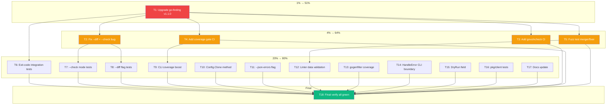

# SUPERB Sprint: golangci-lint-auto-configure

**Date:** 2026-07-06 07:10
**Goal:** Make golangci-lint-auto-configure superb — fix the broken Nix build, harden CI/CD, boost test coverage, and clear the TODO backlog.

---

## Current State Assessment

| Dimension        | Status   | Detail                                                             |
| ---------------- | -------- | ------------------------------------------------------------------ |
| `go build`       | ✅ Pass  | Clean compile                                                      |
| `go test`        | ✅ Pass  | 53 specs, all green                                                |
| `golangci-lint`  | ✅ Clean | 0 issues                                                           |
| Total coverage   | 62.1%    | CLI 9.3%, client 0%, version 51.4%, gogenfilter 63.9% are the gaps |
| Nix format check | ✅ Pass  | `nix flake check --no-build` passes                                |
| Nix build/test   | ❌ FAIL  | go-finding v1.1.0 branded `FilePath` type breaks SSH-fetched build |
| CI               | 4 jobs   | Missing govulncheck, coverage threshold, fuzz tests                |
| Dependencies     | Stale    | go-finding v1.0.0 (v1.1.0 upgrade needed)                          |

### The One Blocking Problem

The flake.lock points to go-finding master (rev `f48b0fa`, revCount 880) which introduced branded types (`Position.File` is now `finding.FilePath` instead of `string`). The go.mod still pins v1.0.0 where `Position.File` is `string`. This means:

- Local `go build` / `go test` work (uses v1.0.0 from Go proxy)
- Nix build fetches the SSH version (v1.1.0 API) → **compilation fails**
- 8 `finding.Position{File: someString}` sites need `finding.FilePath()` casts
- Config-level findings need `Line: 1` (v1.1.0 validates `Line > 0`)

---

## Pareto Breakdown

### The 1% that delivers 51%

**Upgrade go-finding v1.0.0 → v1.1.0.** This single task unblocks the entire Nix pipeline (build, test, race, flake check). Without it, no other Nix-dependent improvement matters.

### The 4% that delivers 64%

The 1% plus:

- **CI quality gates** (govulncheck + coverage threshold) — catches security and regression issues before merge
- **Fix `--diff` + `--check` interaction bug** — user-facing correctness issue
- **Add fuzz test for config merger** — catches bugs in the most complex logic

### The 20% that delivers 80%

All of the above plus:

- CLI integration test coverage (9.3% → 40%+)
- Exit-code integration tests
- Config.Clone() method (replace JSON hack)
- --json error output flag
- HandleError at CLI boundary
- LinterMinVersions / reference preset validation
- gogenfilter coverage boost
- TODO_LIST.md / FEATURES.md refresh
- pkg/client smoke tests

---

## Comprehensive Plan (Medium Granularity)

18 tasks, sorted by impact/effort. Each 30–100 min.

| #   | Tier | Task                                                       | Impact      | Effort | Est    |
| --- | ---- | ---------------------------------------------------------- | ----------- | ------ | ------ |
| T1  | 1%   | Upgrade go-finding v1.0.0 → v1.1.0 (branded types)         | 🔴 Critical | 60min  | 60min  |
| T2  | 4%   | Fix `--diff` + `--check` interaction (showDiff code smell) | 🔴 High     | 45min  | 45min  |
| T3  | 4%   | Add govulncheck to CI                                      | 🟡 Medium   | 30min  | 30min  |
| T4  | 4%   | Add coverage threshold gate to CI                          | 🟡 Medium   | 30min  | 30min  |
| T5  | 4%   | Add fuzz test for config merger + fixer normalization      | 🟡 Medium   | 45min  | 45min  |
| T6  | 20%  | Add exit-code integration tests (Main → os.Exit)           | 🟡 Medium   | 60min  | 60min  |
| T7  | 20%  | Add `--check` mode integration tests                       | 🟡 Medium   | 45min  | 45min  |
| T8  | 20%  | Add `--diff` flag integration tests                        | 🟢 Low      | 30min  | 30min  |
| T9  | 20%  | Increase CLI test coverage (configure/validate/report)     | 🟡 Medium   | 100min | 100min |
| T10 | 20%  | Add `Config.Clone()` method (replace JSON hack)            | 🟢 Low      | 30min  | 30min  |
| T11 | 20%  | Add `--json` error output flag                             | 🟢 Low      | 45min  | 45min  |
| T12 | 20%  | Add LinterMinVersions + reference preset validation tests  | 🟢 Low      | 30min  | 30min  |
| T13 | 20%  | Increase gogenfilter scanner coverage (63.9% → 80%+)       | 🟢 Low      | 45min  | 45min  |
| T14 | 20%  | Add `HandleError` at CLI boundary                          | 🟢 Low      | 45min  | 45min  |
| T15 | 20%  | Add `DryRun bool` field on MigrationResult                 | 🟢 Low      | 30min  | 30min  |
| T16 | 20%  | Add pkg/client smoke tests                                 | 🟢 Low      | 30min  | 30min  |
| T17 | 20%  | Update TODO_LIST.md + FEATURES.md                          | 🟢 Low      | 30min  | 30min  |
| T18 | 80%  | Final verify: build + test + lint + nix + coverage         | 🔴 Critical | 30min  | 30min  |

**Total estimated effort: ~12 hours**

---

## Fine-Grained Breakdown (15-min tasks)

80 tasks, sorted by execution order within each medium task.

| #   | Parent | Micro-task (≤15min)                                                   |
| --- | ------ | --------------------------------------------------------------------- |
| 1   | T1     | Update go.mod: `go-finding v1.0.0` → `v1.1.0`                         |
| 2   | T1     | `go mod tidy` to update go.sum                                        |
| 3   | T1     | Add `finding.FilePath()` cast to converter.go (5 sites)               |
| 4   | T1     | Add `finding.FilePath()` cast to diff_converter.go (2 sites)          |
| 5   | T1     | Add `finding.FilePath()` cast to cmd_validate.go (1 site)             |
| 6   | T1     | Add `configPosition(path, line)` helper with Line default = 1         |
| 7   | T1     | Replace all inline Position constructions with configPosition helper  |
| 8   | T1     | Update AnalysisFindingsByFile return type (helpers.go)                |
| 9   | T1     | Run `go build ./...` — fix any remaining type mismatches              |
| 10  | T1     | Run `go test ./...` — fix test expectations for FilePath/Line changes |
| 11  | T1     | Update Nix vendorHash: `nix build 2>&1 \| rg "got:"`                  |
| 12  | T1     | Verify `nix build` passes                                             |
| 13  | T1     | Verify `nix flake check` passes                                       |
| 14  | T1     | Commit: "feat: upgrade go-finding v1.1.0 with branded FilePath types" |
| 15  | T2     | Read cmd_configure.go showDiff variable definition and all usages     |
| 16  | T2     | Refactor: pass showDiff as parameter (remove package-level var)       |
| 17  | T2     | Fix effectiveDryRunForCheckDiff to use parameter                      |
| 18  | T2     | Fix applyCheckDiff to use parameter                                   |
| 19  | T2     | Add test: --check --diff shows diff and restores original             |
| 20  | T2     | Add test: --check without --diff exits Conflict(1) correctly          |
| 21  | T2     | Run tests, verify all pass                                            |
| 22  | T2     | Commit: "fix: resolve --diff + --check interaction bug"               |
| 23  | T3     | Add govulncheck job to .github/workflows/ci.yml                       |
| 24  | T3     | Test locally: `govulncheck ./...`                                     |
| 25  | T3     | Commit: "ci: add govulncheck security scanning"                       |
| 26  | T4     | Create scripts/coverage-check.sh with per-package thresholds          |
| 27  | T4     | Set thresholds: pkg overall 70%, CLI 15%, client 10% (gradual)        |
| 28  | T4     | Wire coverage-check.sh into ci.yml test-and-build job                 |
| 29  | T4     | Commit: "ci: add per-package coverage threshold gate"                 |
| 30  | T5     | Create pkg/config/merger_fuzz_test.go — FuzzMergeConfigs              |
| 31  | T5     | Add corpus seed: two configs with overlapping linters                 |
| 32  | T5     | Add corpus seed: configs with conflicting exclusion rules             |
| 33  | T5     | Create pkg/linter/fixer_fuzz_test.go — FuzzFixConfigNormalization     |
| 34  | T5     | Add invariant: fixer is idempotent (fix twice = fix once)             |
| 35  | T5     | Run fuzz tests for 30s to verify no panics                            |
| 36  | T5     | Commit: "test: add fuzz tests for config merger and fixer"            |
| 37  | T6     | Create internal/cli/exit_code_test.go scaffold                        |
| 38  | T6     | Test: valid config → exit 0                                           |
| 39  | T6     | Test: missing config → exit 1 (Rejection)                             |
| 40  | T6     | Test: not git repo → exit 1 (Rejection)                               |
| 41  | T6     | Test: golangci-lint not installed → exit 69 (Infrastructure)          |
| 42  | T6     | Test: --check with fixes needed → exit 1 (Conflict)                   |
| 43  | T6     | Commit: "test: add exit-code integration tests for full Main() path"  |
| 44  | T7     | Test: --check on already-optimal config → exit 0                      |
| 45  | T7     | Test: --check --dry-run flag combination                              |
| 46  | T7     | Test: --check --preset minimal → exit 0                               |
| 47  | T7     | Test: --check writes nothing to disk                                  |
| 48  | T7     | Commit: "test: add --check mode integration tests"                    |
| 49  | T8     | Test: --diff shows additions in green                                 |
| 50  | T8     | Test: --diff shows removals in red                                    |
| 51  | T8     | Test: --diff --dry-run shows diff without writing                     |
| 52  | T8     | Commit: "test: add --diff flag integration tests"                     |
| 53  | T9     | Add tests for cmd_configure: preset mode path                         |
| 54  | T9     | Add tests for cmd_configure: detect mode path                         |
| 55  | T9     | Add tests for cmd_configure: auto-merge path                          |
| 56  | T9     | Add tests for cmd_validate: health check path                         |
| 57  | T9     | Add tests for cmd_validate: schema validation path                    |
| 58  | T9     | Add tests for cmd_report: HTML generation path                        |
| 59  | T9     | Add tests for cmd_report: JSON generation path                        |
| 60  | T9     | Add tests for cmd_analyze: version detection path                     |
| 61  | T9     | Run coverage report — verify CLI > 25%                                |
| 62  | T9     | Commit: "test: increase CLI test coverage to 25%+"                    |
| 63  | T10    | Add `Config.Clone()` deep-copy method to types.go                     |
| 64  | T10    | Replace JSON marshal/unmarshal in captureOriginalConfig               |
| 65  | T10    | Add Clone test: modifies clone, original unchanged                    |
| 66  | T10    | Commit: "refactor: add Config.Clone() replacing JSON marshal hack"    |
| 67  | T11    | Add `--json-errors` flag to root command                              |
| 68  | T11    | Wire errorfamily.Error.JSON() into error handler                      |
| 69  | T11    | Test: --json-errors outputs structured JSON on failure                |
| 70  | T11    | Commit: "feat: add --json-errors flag for structured error output"    |
| 71  | T12    | Add test: every LinterMinVersions entry exists in LinterPriorities    |
| 72  | T12    | Add test: reference preset entries all exist in LinterPriorities      |
| 73  | T12    | Add test: presets don't contain disabled linters                      |
| 74  | T12    | Commit: "test: add data integrity validation for linter constants"    |
| 75  | T13    | Read gogenfilter scanner.go to find untested paths                    |
| 76  | T13    | Add tests for generated file content patterns (templ, protobuf)       |
| 77  | T13    | Add tests for edge cases (empty file, binary file, no header)         |
| 78  | T13    | Run coverage — verify gogenfilter > 75%                               |
| 79  | T13    | Commit: "test: increase gogenfilter scanner coverage to 75%+"         |
| 80  | T14    | Read CLI error handling in commands.go Main()                         |
| 81  | T14    | Replace slog.Error with HandleError pattern                           |
| 82  | T14    | Test: error output format matches expectations                        |
| 83  | T14    | Commit: "refactor: adopt HandleError at CLI boundary"                 |
| 84  | T15    | Add `DryRun bool` field to MigrationResult type                       |
| 85  | T15    | Set field in dryRunResult, successResult constructors                 |
| 86  | T15    | Update display logic to show "(dry-run)" suffix                       |
| 87  | T15    | Commit: "feat: add DryRun field to MigrationResult"                   |
| 88  | T16    | Read pkg/client/client.go to understand intent                        |
| 89  | T16    | Add smoke tests or document as internal-only                          |
| 90  | T16    | Commit: "test: add pkg/client smoke tests"                            |
| 91  | T17    | Update TODO_LIST.md — mark completed items, add new ones              |
| 92  | T17    | Update FEATURES.md — add new features from this sprint                |
| 93  | T17    | Commit: "docs: update TODO_LIST.md and FEATURES.md"                   |
| 94  | T18    | Run `go build ./...`                                                  |
| 95  | T18    | Run `go test -race ./pkg/... ./internal/...`                          |
| 96  | T18    | Run `golangci-lint run --config=.golangci.yml --timeout=5m`           |
| 97  | T18    | Run `nix flake check`                                                 |
| 98  | T18    | Run coverage report — verify thresholds met                           |
| 99  | T18    | Final commit: "chore: final verification — all green"                 |
| 100 | T18    | `git push`                                                            |

---

## Execution Graph

### Execution Order

1. **Phase 1 (1%):** T1 — unblock Nix build
2. **Phase 2 (4%):** T2, T3, T4, T5 — parallel CI/bug/fuzz
3. **Phase 3 (20%):** T6–T17 — coverage + TODO items (many parallelizable)
4. **Phase 4 (Final):** T18 — full verification

---

## What's NOT in this plan (deferred to ROADMAP.md)

- Adopting go-finding/pipeline/ (domain mismatch — config mutation ≠ source-byte editing)
- Growing into a DAG (BuildFlow owns that layer)
- Watch mode, runtime plugins (out of scope for a config tool)
- AI-assisted remediation (go-finding FixStrategyAI reserved but no backend)
