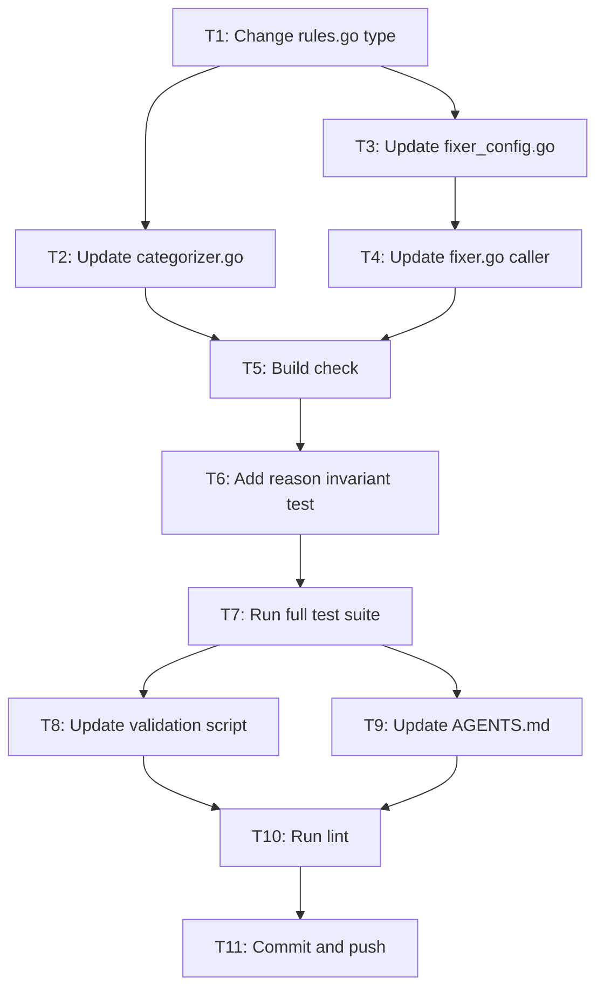

# DisabledLinters Reason Upgrade

**Date:** 2026-07-10
**Status:** ~~In Progress~~ **DONE (2026-07-10, commit `31df177`)** — `DisabledLinters` is now `map[types.LinterName]string`; the non-empty-reason invariant test + `scripts/validate_linter_data.go` checks were added. See the follow-up status report `2026-07-10_14-13_DISABLED-LINTERS-REASON-UPGRADE.md`.

## Problem

`DisabledLinters` is a `Set[LinterName]` — the only linter exclusion mechanism that throws away its reason. `DeprecatedLinters` and `RedundantLinters` both carry structured reasons (`map[LinterName]struct{Reason string}`) and surface them to users. `DisabledLinters` traps its rationale in code comments, invisible to consumers and untested.

When the fixer moves `noinlineerr` from `enable` to `disable`, the user sees a config change with zero explanation.

## Solution

Upgrade `DisabledLinters` from `Set[LinterName]` to `map[LinterName]string`. Surface the reason string in fixer/categorizer logs. Add data integrity test enforcing non-empty reasons.

**Why not a struct?** One field (`Reason`). An anemic single-field struct is the anti-pattern the project principles warn against. `map[LinterName]string` IS the type that says "a name with a reason." Upgrade to struct later if more fields are needed — mechanical, no consumer breakage.

**Why not a finding converter?** Disabled linters are a tool-internal policy, not a user-actionable problem. The fixer log is the honest channel: "here's what I changed and why."

## Pareto Breakdown

| Tier          | Tasks                                                      | Impact                     |
| ------------- | ---------------------------------------------------------- | -------------------------- |
| **1% → 51%**  | Change type in `rules.go`                                  | Reason data now exists     |
| **4% → 64%**  | Update 2 consumers + 1 caller                              | Reason is surfaced in logs |
| **20% → 80%** | Test invariant, update validation script, update AGENTS.md | Long-term reliability      |

## Execution Graph

## Task Breakdown

### Phase 1: Core Data Model (1% → 51%)

| #  | Task                                                                                           | File                           | Est. |
| -- | ---------------------------------------------------------------------------------------------- | ------------------------------ | ---- |
| T1 | Change `DisabledLinters` from `Set[LinterName]` to `map[LinterName]string` with reason strings | `pkg/constants/rules.go:50-55` | 5min |

### Phase 2: Consumer Updates (4% → 64%)

| #  | Task                                                           | File                                 | Est.  |
| -- | -------------------------------------------------------------- | ------------------------------------ | ----- |
| T2 | Update categorizer: map lookup + reason in Debugf              | `pkg/linter/categorizer.go:40-44`    | 5min  |
| T3 | Update fixer: map lookup + reason in Debugf + add logger param | `pkg/linter/fixer_config.go:239-256` | 10min |
| T4 | Update fixer caller: pass `f.logger` to `updateConfigFromSets` | `pkg/linter/fixer.go:242`            | 2min  |

### Phase 3: Build + Test Verification

| #  | Task                                                           | Est. |
| -- | -------------------------------------------------------------- | ---- |
| T5 | Build check (`go build ./...`)                                 | 2min |
| T6 | Add non-empty reason test to `data_integrity_test.go`          | 5min |
| T7 | Run full test suite (`go test -race ./pkg/... ./internal/...`) | 5min |

### Phase 4: Long-term Reliability (20% → 80%)

| #  | Task                                                                       | File                              | Est.  |
| -- | -------------------------------------------------------------------------- | --------------------------------- | ----- |
| T8 | Add DisabledLinters invariant checks to validation script                  | `scripts/validate_linter_data.go` | 10min |
| T9 | Update AGENTS.md item #10 to document `DisabledLinters` type and invariant | `AGENTS.md`                       | 5min  |

### Phase 5: Final Verification + Ship

| #   | Task                                | Est. |
| --- | ----------------------------------- | ---- |
| T10 | Run lint (`golangci-lint run`)      | 5min |
| T11 | Commit with detailed message + push | 5min |

**Total: 11 tasks, ~59min estimated.**
