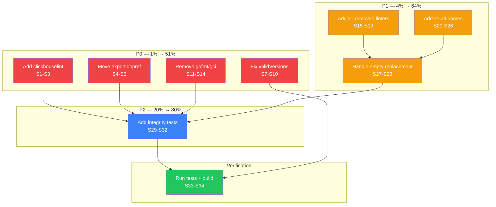

# Linter Data Accuracy & Integrity Fixes

**Date:** 2026-07-10\
**Source:** Deep Architecture & Data Model Review (`docs/reviews/2026-07-10_deep-architecture-data-model-review.md`)\
**Benchmark:** golangci-lint v2.12.2\
**Goal:** Fix all P0-P2 data accuracy gaps identified in the review, verified by cross-map integrity tests

---

## Pareto Breakdown

### 1% that delivers 51% of the result

These three fixes resolve the most impactful correctness issues — missing linters, removed linters treated as active, and broken version migration:

| # | Fix                                                               | Impact                                                     |
| - | ----------------------------------------------------------------- | ---------------------------------------------------------- |
| 1 | Add `clickhouselint` (v2.12.0) — completely missing from all maps | Users on v2.12.0+ never get recommended this linter        |
| 2 | Move `exportloopref` to `DeprecatedLinters` → `copyloopvar`       | Removed in v2; users with it get golangci-lint errors      |
| 3 | Fix `validVersions()` — hardcoded list stops at v2.10.1           | v2.11/v2.12 configs get version reset to "2" unnecessarily |

### 4% that delivers 64% of the result

Adding to the 1%: fixes that eliminate misclassification and prevent future regressions:

| # | Fix                                                              | Impact                                                                    |
| - | ---------------------------------------------------------------- | ------------------------------------------------------------------------- |
| 4 | Remove `gofmt`/`gci` from linter maps (they're formatters in v2) | Dead data, single-source-of-truth violation                               |
| 5 | Add 5 missing v1 removed linters to `DeprecatedLinters`          | golint, scopelint, tenv, ifshort, execinquery — no migration guidance     |
| 6 | Add cross-map integrity tests                                    | Catches formatter-in-linter-map, missing-reason regressions automatically |

### 20% that delivers 80% of the result

Adding to the 4%: complete deprecation coverage and full test guards:

| # | Fix                                                      | Impact                                                              |
| - | -------------------------------------------------------- | ------------------------------------------------------------------- |
| 7 | Add 7 v1 alternative name entries to `DeprecatedLinters` | gas→gosec, goerr113→err113, gomnd→mnd, etc.                         |
| 8 | Handle empty `Replacement` in `fixer_deprecated.go`      | For ifshort/execinquery — just delete, don't add empty string       |
| 9 | Add remaining integrity tests                            | DeprecatedLinters replacement targets valid, formatter cross-checks |

### Remaining 20% (P3 — not in scope for this session)

- Typed linter settings via code generation
- Counter-incrementing wrapper for fixCounts
- `format` preset consideration

---

## Execution Plan — Level 1 (30-100 min tasks)

| ID | Task                                             | Files                                                     | Impact   | Effort | Priority |
| -- | ------------------------------------------------ | --------------------------------------------------------- | -------- | ------ | -------- |
| T1 | Add `clickhouselint` to all data maps            | `linter_priorities.go`, `linter_reasons.go`, `version.go` | Critical | 15min  | P0       |
| T2 | Move `exportloopref` to `DeprecatedLinters`      | `linter_priorities.go`, `linter_reasons.go`, `rules.go`   | Critical | 15min  | P0       |
| T3 | Fix `validVersions()` with prefix matching       | `migration/rules.go`                                      | Critical | 20min  | P0       |
| T4 | Remove `gofmt`/`gci` from linter maps            | `linter_priorities.go`, `linter_reasons.go`               | High     | 10min  | P0       |
| T5 | Add 5 v1 removed linters to `DeprecatedLinters`  | `rules.go`                                                | High     | 15min  | P1       |
| T6 | Add 7 v1 alt-name entries to `DeprecatedLinters` | `rules.go`                                                | Medium   | 15min  | P1       |
| T7 | Handle empty replacement in fixer                | `fixer_deprecated.go`                                     | High     | 20min  | P1       |
| T8 | Add cross-map integrity tests                    | `data_integrity_test.go`                                  | High     | 30min  | P2       |
| T9 | Run full test suite + build verification         | —                                                         | Critical | 15min  | P0       |

---

## Execution Plan — Level 2 (max 15 min tasks)

| Sub-ID | Parent | Task                                                                   | Files                    |
| ------ | ------ | ---------------------------------------------------------------------- | ------------------------ |
| S1     | T1     | Add `clickhouselint` to LinterPriorities (Medium)                      | `linter_priorities.go`   |
| S2     | T1     | Add `clickhouselint` to LinterReasons                                  | `linter_reasons.go`      |
| S3     | T1     | Add `clickhouselint: "v2.12.0"` to LinterMinVersions                   | `version.go`             |
| S4     | T2     | Remove `exportloopref` from LinterPriorities                           | `linter_priorities.go`   |
| S5     | T2     | Remove `exportloopref` from LinterReasons                              | `linter_reasons.go`      |
| S6     | T2     | Add `exportloopref` → `copyloopvar` to DeprecatedLinters               | `rules.go`               |
| S7     | T3     | Replace `validVersions()` hardcoded set with prefix-match function     | `rules.go`               |
| S8     | T3     | Remove `ValidVersions` field from MigrationRules struct                | `rules.go`               |
| S9     | T3     | Update `IsValidVersion` to use prefix matching                         | `rules.go`               |
| S10    | T3     | Update migration tests for prefix-matching behavior                    | `migrator_test.go`       |
| S11    | T4     | Remove `gofmt` from LinterPriorities                                   | `linter_priorities.go`   |
| S12    | T4     | Remove `gci` from LinterPriorities                                     | `linter_priorities.go`   |
| S13    | T4     | Remove `gofmt` from LinterReasons                                      | `linter_reasons.go`      |
| S14    | T4     | Remove `gci` from LinterReasons                                        | `linter_reasons.go`      |
| S15    | T5     | Add `golint` → `revive` to DeprecatedLinters                           | `rules.go`               |
| S16    | T5     | Add `scopelint` → `copyloopvar` to DeprecatedLinters                   | `rules.go`               |
| S17    | T5     | Add `tenv` → `usetesting` to DeprecatedLinters                         | `rules.go`               |
| S18    | T5     | Add `ifshort` → empty to DeprecatedLinters                             | `rules.go`               |
| S19    | T5     | Add `execinquery` → empty to DeprecatedLinters                         | `rules.go`               |
| S20    | T6     | Add `gas` → `gosec` to DeprecatedLinters                               | `rules.go`               |
| S21    | T6     | Add `goerr113` → `err113` to DeprecatedLinters                         | `rules.go`               |
| S22    | T6     | Add `gomnd` → `mnd` to DeprecatedLinters                               | `rules.go`               |
| S23    | T6     | Add `logrlint` → `loggercheck` to DeprecatedLinters                    | `rules.go`               |
| S24    | T6     | Add `megacheck` → `staticcheck` to DeprecatedLinters                   | `rules.go`               |
| S25    | T6     | Add `vet` → `govet` to DeprecatedLinters                               | `rules.go`               |
| S26    | T6     | Add `vetshadow` → `govet` to DeprecatedLinters                         | `rules.go`               |
| S27    | T7     | Add empty-replacement guard in `applyReplacement`                      | `fixer_deprecated.go`    |
| S28    | T7     | Add log message for removal-only deprecations                          | `fixer_deprecated.go`    |
| S29    | T8     | Add test: LinterPriorities keys == LinterReasons keys                  | `data_integrity_test.go` |
| S30    | T8     | Add test: LinterPriorities ∩ FormatterInfo = ∅                         | `data_integrity_test.go` |
| S31    | T8     | Add test: DeprecatedLinters replacement targets valid                  | `data_integrity_test.go` |
| S32    | T8     | Add test: FormatterPriorities keys == FormatterReasons keys            | `data_integrity_test.go` |
| S33    | T9     | Run `go test ./pkg/constants/... ./pkg/linter/... ./pkg/migration/...` | —                        |
| S34    | T9     | Run `go build ./cmd/...`                                               | —                        |

---

## Mermaid Execution Graph

---

## Constraints

1. **GOEXPERIMENT=jsonv2 required** — all `go test`/`go build` commands need `export GOEXPERIMENT=jsonv2`
2. **Never break the build** — tests must pass after every task
3. **Don't verschlimmbesser** — only fix identified issues, don't refactor unrelated code
4. **gomodguard is intentionally in both DeprecatedLinters AND LinterPriorities** — it's version-gated (deprecated only since v2.12.0). The integrity test for "DeprecatedLinters ∉ LinterPriorities" must exclude version-gated entries.

---

## Completion Status (Updated 2026-07-10)

All P0-P2 tasks are **COMPLETE**. P3 tasks (originally out of scope) have also been completed:

- **P0** (3 fixes): clickhouselint added, exportloopref→deprecated, validVersions fixed
- **P1** (2 fixes): 5 removed linters added, 7 alternative-name entries added
- **P2** (3 fixes): cross-map integrity tests added, empty Replacement handling, remaining tests
- **P3** (3 improvements): Typed settings structs, configChangeRecorder, format preset
