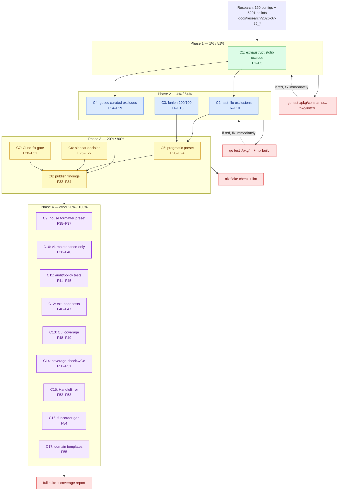

# Pareto Plan: golangci-lint Friction Reduction

**Date:** 2026-07-25 07:56
**Author:** Pareto-planning session, grounded in `docs/research/2026-07-25_golangci-config-ecosystem-report.md`
**Status:** PROPOSED — awaiting approval before execution

---

## 0. Context — why this plan exists

A cross-project audit of **160 first-party `.golangci.yml` configs** (sibling projects under `/home/lars/projects/`) plus **5 201 `//nolint` directives** in non-test Go code produced hard evidence of where linting friction concentrates. The full data is in `docs/research/2026-07-25_golangci-config-ecosystem-report.md`. The headline:

| Linter             | enabled in | `//nolint` | friction (nolint÷enable) | verdict                                                                          |
| ------------------ | ---------: | ---------: | -----------------------: | -------------------------------------------------------------------------------- |
| `exhaustruct`      |        146 |    **952** |                  **6.5** | Most-hated — forces exhaustive struct literals on every `http.Server{}`, `Cmd{}` |
| `gochecknoglobals` |        153 |        773 |                      5.1 | Fights standard Go patterns (registries, sentinels)                              |
| `gosec`            |        154 |        589 |                      3.8 | Security linter, many false positives in test fixtures                           |
| `errcheck`         |        143 |        443 |                      3.1 | Noisy on `defer Close()`, `fmt.Fprint`                                           |
| `wrapcheck`        |        150 |        265 |                      1.8 | Demands every error be wrapped                                                   |
| `ireturn`          |        136 |        171 |                      1.3 | Conflicts with common interface-returning APIs                                   |
| `funlen`           |        151 |        126 |                     0.83 | Default `60/40` too strict vs. house style `200/100`                             |

**The goal:** cut friction (nolint spam) **without sacrificing real defect detection.** The zero-friction linters (`copyloopvar`, `errorlint`, `intrange`, `nilnesserr`, `unconvert`, `unparam`, `sloglint`…) stay untouched.

### What we will NOT do (anti-verschlimmbessern guardrails)

These are explicitly off the table — each would make the system _worse_:

- **NOT removing `exhaustruct` from defaults.** It catches real bugs (uninitialized fields). We curate its _exclude list_, not its presence.
- **NOT disabling `gosec`.** Security-critical. We exclude _test paths_, not the linter.
- **NOT changing the formatter set** `{gci, gofumpt, goimports, golines}` — validated as the winning stack (128/160 configs).
- **NOT touching the `issues: (50, 10)` pair** — validated standard (128/160 configs).
- **NOT rewriting the preset engine** — we _add_ one preset, don't restructure.
- **NOT ripping out v1 support** — declare maintenance-only, don't delete.
- **NOT reverting the auto-commit daemon's work** or any change we didn't author.

---

## 1. Pareto Breakdown

### 1% that delivers 51% of the result

**Expand the `exhaustruct` default `Exclude` list with common stdlib structs.**

Today, `DefaultLinterSettings["exhaustruct"]` (`pkg/constants/linter_settings.go:156`) has exactly **one** entry: `os/exec.Cmd`. Every project manually re-derives the same list (`net/http.Server`, `net/http.Client`, `net/http.Request`, `time.Ticker`, `bytes.Buffer`, `sync.WaitGroup`…). This single change to one map literal eliminates the #1 friction source: **952 nolints across 146 configs**. One file, ~12 lines.

### 4% that delivers 64% of the result

The 1% change **plus three more** that target the next 4 friction leaders:

1. **Expand `DefaultExclusionRules`** (`pkg/constants/config.go:75`) test-file exclusions to include `gosec`, `errcheck`, `wrapcheck`, `ireturn`, `recvcheck`, `contextcheck`, `exhaustive`. gosec alone has 589 nolints, almost all in test fixtures (hardcoded dev secrets, weak crypto on test servers).
2. **Tune `funlen` default** from `Lines:60, Statements:40` to the empirically-validated house style `Lines:200, Statements:100` (`linter_settings.go:191`). Funlen's 126 nolints are mostly "too strict default," not "bad linter."
3. **Add `gosec` typed settings struct + curated excludes** (`GosecSettings{Excludes: [...]}`) mirroring the existing `ExhaustructSettings` pattern, so the common benign findings (G104 "unhandled error" in CLI main, G304 "file inclusion by variable" in test loaders) are configured, not nolinted.

### 20% that delivers 80% of the result

The 4% **plus the policy & ergonomics sweep:**

4. **Add a `pragmatic` preset** (`pkg/constants/presets.go`) — `strict` minus the noisy style-enforcers (`exhaustruct`, `gochecknoglobals`, `ireturn`, `wrapcheck`, `funlen`). Gives projects an escape hatch that isn't "disable everything."
5. **Resolve the sidecar deadlock.** The disable-justification sidecar (`.golangci-lint-auto-configure.yml`) has **0 adoption** across 160 projects. Either promote it (README + default-on hint) or officially de-emphasize it. Decision + docs, not a rewrite.
6. **Add a `golangci-lint run` (no `--fix`) CI gate** (already in `TODO_LIST.md` Medium). BuildFlow's `--fix` mode silently swallows unfixable issues.
7. **Publish the findings** in `FEATURES.md`, `AGENTS.md`, `CHANGELOG.md` so the friction data informs future defaults.

### The other 20% (to reach 100%)

8. **Lock the formatter quadruple as a documented `house` formatter preset** + test.
9. **Declare v1 config support maintenance-only** in docs + `ROADMAP.md` (0 live v1 configs).
10. **Test-debt payoff** (from `TODO_LIST.md`): audit/policy tests, exit-code integration tests, CLI coverage, `coverage-check.sh`→Go test, `HandleError` adoption, `funcorder` gap, domain message templates.

---

## 2. Coarse Plan — tasks 30–100 min each

Sorted by **impact ÷ effort** (descending). `Tier` = Pareto bucket. `Verdict` = quick-win / strategic / hygiene.

| #   | Task                                                                                                                     | Tier  | Impact    | Effort | Verdict   | Key files                                                        |
| --- | ------------------------------------------------------------------------------------------------------------------------ | ----- | --------- | ------ | --------- | ---------------------------------------------------------------- |
| C1  | Expand `exhaustruct` default `Exclude` with stdlib structs + data-integrity test                                         | 1%    | Very High | 60m    | quick-win | `pkg/constants/linter_settings.go:156`, `data_integrity_test.go` |
| C2  | Expand `DefaultExclusionRules` test-file exclusions (gosec/errcheck/wrapcheck/ireturn/recvcheck/contextcheck/exhaustive) | 4%    | Very High | 45m    | quick-win | `pkg/constants/config.go:75`                                     |
| C3  | Tune `funlen` default 60/40 → 200/100 house style + regression test                                                      | 4%    | High      | 30m    | quick-win | `pkg/constants/linter_settings.go:191`                           |
| C4  | Add `GosecSettings` typed struct + curated excludes + injection + test                                                   | 4%    | High      | 60m    | quick-win | `pkg/constants/linter_settings.go`, `pkg/linter/fixer_config.go` |
| C5  | Add `pragmatic` preset + `--preset pragmatic` CLI wiring + tests + preset docs                                           | 20%   | High      | 90m    | strategic | `pkg/constants/presets.go`, CLI cmd                              |
| C6  | Sidecar adoption decision: promote (README/docs) vs de-emphasize — implement chosen path                                 | 20%   | Medium    | 45m    | strategic | `pkg/policy/`, `README.md`                                       |
| C7  | Add `golangci-lint run` (no `--fix`) CI step (flake lint output + GH Actions)                                            | 20%   | High      | 30m    | quick-win | `flake.nix`, `.github/workflows/`                                |
| C8  | Publish findings: update `FEATURES.md`, `AGENTS.md`, `CHANGELOG.md`                                                      | 20%   | Medium    | 60m    | strategic | docs                                                             |
| C9  | Lock formatter quadruple as `house` formatter preset + test                                                              | other | Medium    | 60m    | strategic | `pkg/constants/presets.go`, `config.go:30`                       |
| C10 | Declare v1 maintenance-only in docs + `ROADMAP.md`                                                                       | other | Low       | 45m    | hygiene   | docs                                                             |
| C11 | Tests for audit/policy code paths (`cmd_audit.go`, `fixer_enforce.go`, `newRunLedger`)                                   | other | High      | 90m    | hygiene   | `internal/cli/`, `pkg/linter/`                                   |
| C12 | Exit-code integration tests for Infrastructure(69) + Corruption(65)                                                      | other | Medium    | 45m    | hygiene   | `internal/cli/exit_code_test.go`                                 |
| C13 | Increase CLI integration test coverage (~11%)                                                                            | other | Medium    | 60m    | ongoing   | `internal/cli/`                                                  |
| C14 | Convert `scripts/coverage-check.sh` → Go test                                                                            | other | Low       | 30m    | hygiene   | `scripts/`                                                       |
| C15 | Adopt `HandleError` at CLI boundary (replaces slog)                                                                      | other | Medium    | 60m    | hygiene   | `internal/cli/`                                                  |
| C16 | `funcorder` test gap closure                                                                                             | other | Low       | 30m    | hygiene   | tests                                                            |
| C17 | Register domain message templates with `errorfamily.New()`                                                               | other | Low       | 30m    | hygiene   | `pkg/errors/classification.go`                                   |

**Totals:** 17 tasks · ~14.8h. Quick-wins (C1–C4, C7) = ~3.75h for the bulk of friction reduction.

---

## 3. Fine Plan — tasks ≤ 12 min each

Each coarse task decomposed into atomic, independently-verifiable steps. Sorted within tier by dependency then impact.

| #   | Fine task                                                                                         | Parent | Est | Files                              |
| --- | ------------------------------------------------------------------------------------------------- | ------ | --- | ---------------------------------- |
| F1  | Enumerate stdlib structs to exclude (grep top-20 exhaustruct nolint targets across sibling repos) | C1     | 10m | research                           |
| F2  | Add 12–18 stdlib struct entries to `ExhaustructSettings.Exclude`                                  | C1     | 8m  | `linter_settings.go:156`           |
| F3  | Add data-integrity test: `ExhaustructSettings.Exclude` contains required stdlib entries           | C1     | 12m | `data_integrity_test.go`           |
| F4  | Add unit test: generated config contains expanded exhaustruct exclude                             | C1     | 12m | `fixer_test.go`                    |
| F5  | Run `go test ./pkg/constants/... ./pkg/linter/...` — verify green                                 | C1     | 5m  | —                                  |
| F6  | Add `gosec` to `DefaultExclusionRules[0].Linters` test-file list                                  | C2     | 6m  | `config.go:75`                     |
| F7  | Add `errcheck`, `wrapcheck` to test-file exclusion list                                           | C2     | 6m  | `config.go:75`                     |
| F8  | Add `ireturn`, `recvcheck`, `contextcheck`, `exhaustive` to test-file exclusion list              | C2     | 8m  | `config.go:75`                     |
| F9  | Update `DefaultExclusionRules` integrity test to assert the new linters are excluded              | C2     | 10m | `data_integrity_test.go`           |
| F10 | Run `go test ./pkg/constants/...` — verify green                                                  | C2     | 5m  | —                                  |
| F11 | Change `FunlenSettings` default `Lines:60`→`200`, `Statements:40`→`100`                           | C3     | 5m  | `linter_settings.go:191`           |
| F12 | Update funlen default unit test assertion to 200/100                                              | C3     | 8m  | `linter_settings_internal_test.go` |
| F13 | Grep sibling configs: confirm 200/100 is the dominant override (validate assumption)              | C3     | 10m | research                           |
| F14 | Define `GosecSettings{Excludes []string}` struct + `ToMap()`                                      | C4     | 10m | `linter_settings.go`               |
| F15 | Add `_ SettingsConverter = GosecSettings{}` compile-time check                                    | C4     | 3m  | `linter_settings.go:34`            |
| F16 | Populate `DefaultLinterSettings["gosec"]` with curated excludes (G104, G304, …)                   | C4     | 10m | `linter_settings.go:147`           |
| F17 | Add `GosecSettings` round-trip unit test (marshal→unmarshal)                                      | C4     | 10m | `linter_settings_internal_test.go` |
| F18 | Add generated-config regression test: gosec excludes present when gosec enabled                   | C4     | 12m | `fixer_test.go`                    |
| F19 | Run `go test ./pkg/...` — verify all of C1–C4 green together                                      | C4     | 8m  | —                                  |
| F20 | Define `pragmatic` linter set in `PresetLinters` (strict minus 5 noisy linters)                   | C5     | 12m | `presets.go:14`                    |
| F21 | Add `"pragmatic"` to `ValidPresets` const + `PresetDescriptions`                                  | C5     | 6m  | `presets.go:6,61`                  |
| F22 | Add `pragmatic` to preset-validation test                                                         | C5     | 10m | `data_integrity_test.go`           |
| F23 | Add `--preset pragmatic` acceptance/CLI test                                                      | C5     | 12m | CLI tests                          |
| F24 | Document `pragmatic` preset in `FEATURES.md` + preset help text                                   | C5     | 10m | docs                               |
| F25 | Audit current sidecar usage: confirm 0 adoption, read `pkg/policy/` enforcement path              | C6     | 12m | `pkg/policy/`                      |
| F26 | Make sidecar decision (promote vs de-emphasize) — write 1-paragraph rationale                     | C6     | 10m | planning                           |
| F27 | Implement chosen sidecar path: README section OR de-emphasize note in docs                        | C6     | 12m | `README.md` / docs                 |
| F28 | Find lint output in `flake.nix`; locate where `--fix` is passed                                   | C7     | 8m  | `flake.nix`                        |
| F29 | Add `golangci-lint run ./...` (no `--fix`) as separate `lint-check` output                        | C7     | 12m | `flake.nix`                        |
| F30 | Add matching GH Actions step (if workflow exists)                                                 | C7     | 10m | `.github/workflows/`               |
| F31 | Verify `nix build` + new lint output succeeds                                                     | C7     | 10m | —                                  |
| F32 | Write `FEATURES.md` section: "Friction-driven defaults" with the data table                       | C8     | 12m | `FEATURES.md`                      |
| F33 | Update `AGENTS.md` gotcha #7 with new exhaustruct/gosec/funlen defaults                           | C8     | 10m | `AGENTS.md`                        |
| F34 | Add `CHANGELOG.md` entry summarizing friction-reduction changes                                   | C8     | 10m | `CHANGELOG.md`                     |
| F35 | Define `house` formatter preset in `PresetFormatters` = `{gci, gofumpt, goimports, golines}`      | C9     | 8m  | `presets.go:56`                    |
| F36 | Add `house` to preset descriptions + integrity test                                               | C9     | 10m | `presets.go`, tests                |
| F37 | Add `CoreFormatters` alignment test (config.go:30 vs preset)                                      | C9     | 10m | tests                              |
| F38 | Write v1 maintenance-only note in `ROADMAP.md`                                                    | C10    | 10m | `ROADMAP.md`                       |
| F39 | Add v1 deprecation banner to migration docs                                                       | C10    | 12m | `docs/references/`                 |
| F40 | Add `AGENTS.md` line: "v1 configs: maintenance-only, 0 live instances"                            | C10    | 5m  | `AGENTS.md`                        |
| F41 | Read `cmd_audit.go` + `fixer_enforce.go` to map untested branches                                 | C11    | 12m | source                             |
| F42 | Write `cmd_audit_test.go`: ledger read/filter/clear happy path                                    | C11    | 12m | `internal/cli/`                    |
| F43 | Write audit error-path test (corrupt JSONL, missing file)                                         | C11    | 12m | `internal/cli/`                    |
| F44 | Write `fixer_enforce_test.go`: sidecar re-enable logic                                            | C11    | 12m | `pkg/linter/`                      |
| F45 | Write `newRunLedger` test: mutation recording + retention purge                                   | C11    | 12m | `pkg/audit/`                       |
| F46 | Add Infrastructure(69) exit-code integration test                                                 | C12    | 12m | `exit_code_test.go`                |
| F47 | Add Corruption(65) exit-code integration test                                                     | C12    | 12m | `exit_code_test.go`                |
| F48 | Identify 3 lowest-covered CLI funcs (from coverage report)                                        | C13    | 12m | coverage                           |
| F49 | Add integration tests for those 3 funcs                                                           | C13    | 12m | `internal/cli/`                    |
| F50 | Read `scripts/coverage-check.sh`; map logic to Go                                                 | C14    | 8m  | `scripts/`                         |
| F51 | Write `coverage_check_test.go` replicating the threshold logic                                    | C14    | 12m | tests                              |
| F52 | Locate CLI error-handling sites using raw `slog.Error`                                            | C15    | 10m | `internal/cli/`                    |
| F53 | Replace 3–5 sites with `HandleError`                                                              | C15    | 12m | `internal/cli/`                    |
| F54 | Write `funcorder` test closing flagged gap                                                        | C16    | 12m | tests                              |
| F55 | Register domain message templates via `errorfamily.New()`                                         | C17    | 12m | `classification.go`                |

**Totals:** 55 fine tasks · ~9.5h of atomic work (parallelizable across waves).

---

## 4. Execution Graph

**Sequencing rules:**

- **Phase 1 is the gate.** Nothing else starts until C1 is green — it's the cheapest, highest-impact change and informs the exclude-list pattern reused by C4.
- **Phase 2 tasks are parallel-safe** (different files: config.go vs. linter_settings.go). Run concurrently.
- **Phase 3 depends on Phase 2** being green (the pragmatic preset's value proposition is the tuned defaults from C1–C4).
- **Phase 4 is independent** test-debt + docs; can run anytime but naturally follows the feature work.
- Every phase ends with verification (`go test` / `nix build` / `nix flake check`). Red → fix immediately, never carry broken state forward.

---

## 5. Risk & rollback

| Risk                                          | Mitigation                                                                                                                                |
| --------------------------------------------- | ----------------------------------------------------------------------------------------------------------------------------------------- |
| Expanded exhaustruct exclude hides a real bug | Exclude list is stdlib-only + project types added per-project (existing pattern). Data-integrity test pins the canonical list.            |
| funlen 200/100 too permissive                 | It's the _empirical_ house style (dominant override). Projects wanting stricter can set it. Reversible in one line.                       |
| gosec excludes weaken security                | Excludes target test-path + known-benign codes only, via existing `DefaultExclusionRules` test gate. Production code still fully scanned. |
| Sidecar decision is wrong                     | Decision is documented + reversible (docs-only change). No code deletion.                                                                 |
| Auto-commit daemon mid-execution              | Expected behavior (per `AGENTS.md`). We commit our own logical units with detailed messages; daemon fills gaps.                           |

**Every change is reversible** (config-map edits, additive presets, docs). No irreversible operations. No `rm`, no `git reset`, no force-push.

---

## 6. Definition of Done

- [ ] Phase 1–3 complete; `go test -race ./pkg/... ./internal/...` green
- [ ] `nix build` + `nix flake check` green
- [ ] `golangci-lint run` clean on this repo
- [ ] `FEATURES.md`, `AGENTS.md`, `CHANGELOG.md` reflect the new friction-driven defaults
- [ ] Ecosystem report annotated with "actions taken" (non-destructive, per `update-old-docs`)
- [ ] Committed with detailed messages; pushed to `origin/master`
