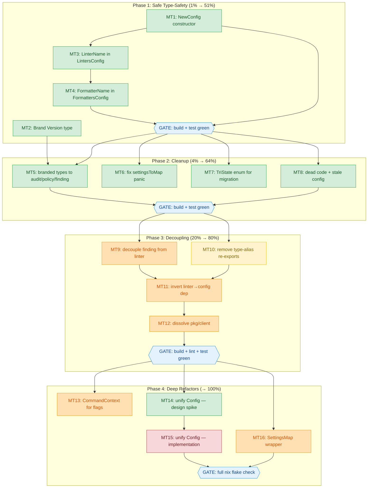

# SUPERB Architecture & Data Model Improvement Plan

**Date:** 2026-07-26
**Author:** Crush (Senior Staff Engineering Partner)
**Trigger:** "Is our architecture and data model superb?" — full review produced two companion reports:

- Architecture review: [`docs/architecture-understanding/2026-07-26_architecture-review.html`](../architecture-understanding/2026-07-26_architecture-review.html) — **Grade: A−**
- Data model review: [`docs/reviews/2026-07-26_data-model-review.html`](../reviews/2026-07-26_data-model-review.html) — **Grade: B+**

**The answer:** Close to superb, but not yet. The architecture is clean (zero import cycles, textbook ISP, wire-format decoupling, no god files). The data model has strong foundations (branded types, generic `Set[T]`, typed enums, exemplary error model). What holds both back from "superb" is a cluster of coupling debts centered on `pkg/linter` reaching into `pkg/config`, branded types applied to only half the codebase, and a split-brain duplicate `Config` type.

**The guiding constraint:** _Do not verschlimmbessern._ Every task below is sequenced so the safe, compiler-verifiable changes come first. The risky behavioral refactors are isolated in Phase 3–4 with explicit test gates.

---

## Consolidated Problem Inventory

15 deduplicated problems, merged from both reviews and existing `TODO_LIST.md` overlaps.

| ID  | Problem                                          | Source    | Impact (1-10) | Effort | Risk    | Value Score |
| --- | ------------------------------------------------ | --------- | ------------- | ------ | ------- | ----------- |
| A1  | Duplicate Config type (types vs migration)       | F2 / P1   | 9             | 8h     | HIGH    | 0.38        |
| A2  | Branded types not propagated to config/audit/etc | P2        | 9             | 4h     | LOW ✅  | 2.25        |
| A3  | No Config constructor — invalid states compile   | P4        | 7             | 1h     | LOW     | 7.0         |
| A4  | pkg/linter → pkg/config coupling                 | F1        | 8             | 4h     | MED     | 1.0         |
| A5  | pkg/finding transitive coupling via linter       | F4        | 6             | 2h     | MED     | 1.5         |
| A6  | pkg/client god-package                           | F3        | 5             | 2h     | MED     | 1.25        |
| A7  | map[string]any in hot paths (design tradeoff)    | P3        | 6             | 4h     | MED     | 0.75        |
| A8  | Version is raw string everywhere                 | P5        | 5             | 1.5h   | LOW     | 3.3         |
| A9  | Global CLI flags (12 package-level vars)         | F5 / TODO | 5             | 3h     | MED     | 0.83        |
| A10 | \*bool tri-state in migration types              | P6        | 3             | 1h     | LOW     | 3.0         |
| A11 | settingsToMap panic on marshal failure           | P7        | 3             | 0.5h   | LOW     | 6.0         |
| A12 | Type-alias re-exports in pkg/config              | F6        | 4             | 2h     | LOW-MED | 1.33        |
| B1  | `format` preset formatter split-brain            | TODO_LIST | 5             | 1h     | LOW     | 5.0         |
| B2  | `EnableGolinesFormatter` dead code               | TODO_LIST | 3             | 0.5h   | LOW     | 6.0         |
| B3  | Stale `G104` in repo's own `.golangci.yml`       | TODO_LIST | 3             | 0.25h  | LOW     | 12.0        |

**Value Score** = Impact ÷ (Effort_hours × Risk_multiplier), where Risk_multiplier: LOW=1, LOW-MED=1.5, MED=2, HIGH=3.

**Key verification:** Branded type propagation (A2) was verified safe — `yaml.v3` round-trips `[]LinterName` identically to `[]string` (tested 2026-07-26). This makes the highest-impact task also low-risk.

---

## Pareto Breakdown

### The 1% that delivers 51%

**A2 (branded types) + A3 (Config constructor).**

These two together transform type safety across the entire codebase. Propagating `LinterName`/`FormatterName` to `LintersConfig.Enable`/`Disable` immediately catches linter-name typos at the type boundary. The `NewConfig` constructor prevents the most common invalid state (`&Config{}` with no version or timeout). Both are additive/mechanical — zero behavior change, compiler-verified correctness.

### The 4% that delivers 64%

**A2 + A3 + A8 (Version type) + A11 (panic fix) + B2/B3 (quick cleanup).**

Completes the branded-type story end-to-end, brands the `Version` type, fixes the one runtime `panic` in the settings path, and removes dead code. After this phase, every core domain identifier is typed and the only `panic` in the type system is gone.

### The 20% that delivers 80%

**All of the above + A10 (tri-state enum) + A5 (decouple finding) + A12 (remove aliases) + B1 (preset fix).**

Adds explicit `TriState` for migration deprecation flags, makes `pkg/finding` a standalone leaf (no transitive config dependency), removes the ambiguous type-alias re-exports, and fixes the formatter preset split-brain. After this phase, the dependency graph is clean and imports are unambiguous.

### The remaining 20% to reach 100%

**A4 (invert linter→config) + A6 (dissolve client) + A9 (CommandContext) + A1 (unify Config) + A7 (SettingsMap).**

The deep refactors. Each carries behavioral risk and needs careful test gating. The Config unification (A1) is the single highest-impact, highest-risk item — it deserves its own design spike before implementation.

---

## Execution Graph

**Reading the graph:** Green = safe (compiler verifies correctness). Yellow = low-medium risk. Orange = medium risk (needs behavioral testing). Red = high risk (needs design spike first). Blue gates = mandatory build+test checkpoints between phases.

---

## Medium-Granularity Plan (30–100 min per task)

16 tasks across 4 phases. Sorted within each phase by impact/effort ratio.

### Phase 1 — Safe Type-Safety Wins (1% → 51%)

| Task | Problem | Description                                                               | Impact | Effort | Risk |
| ---- | ------- | ------------------------------------------------------------------------- | ------ | ------ | ---- |
| MT1  | A3      | Add `NewConfig()` constructor to `pkg/types` with functional options      | 7      | 45min  | LOW  |
| MT2  | A8      | Brand `Version` type (`type Version string`) with `Valid()`/`Compare()`   | 5      | 30min  | LOW  |
| MT3  | A2      | Change `LintersConfig.Enable`/`Disable` from `[]string` to `[]LinterName` | 9      | 50min  | LOW  |
| MT4  | A2      | Change `FormattersConfig.Enable`/`Disable` to `[]FormatterName`           | 9      | 30min  | LOW  |

### Phase 2 — Cleanup & Completion (4% → 64%)

| Task | Problem  | Description                                                                    | Impact | Effort | Risk |
| ---- | -------- | ------------------------------------------------------------------------------ | ------ | ------ | ---- |
| MT5  | A2       | Propagate branded types to audit `Entry`, policy `Policy`, finding, report     | 9      | 45min  | LOW  |
| MT6  | A11      | Replace `panic` in `settingsToMap` with safe error handling                    | 3      | 20min  | LOW  |
| MT7  | A10      | Create `TriState` enum; replace 7 `*bool` fields in migration types            | 3      | 45min  | LOW  |
| MT8  | B1/B2/B3 | Remove dead code (`EnableGolinesFormatter`), stale `G104`, fix `format` preset | 5      | 30min  | LOW  |

### Phase 3 — Architectural Decoupling (20% → 80%)

| Task | Problem | Description                                                                              | Impact | Effort | Risk    |
| ---- | ------- | ---------------------------------------------------------------------------------------- | ------ | ------ | ------- |
| MT9  | A5      | Decouple `pkg/finding` from `pkg/linter` — pass metadata as params                       | 6      | 60min  | MED     |
| MT10 | A12     | Remove `type X = types.X` aliases; update all callers to `types.X`                       | 4      | 50min  | LOW-MED |
| MT11 | A4      | Move config helpers behind `fixerConfigLoader`; remove `config` import from `pkg/linter` | 8      | 90min  | MED     |
| MT12 | A6      | Dissolve `pkg/client` into `internal/cli` or give focused API                            | 5      | 45min  | MED     |

### Phase 4 — Deep Refactors (→ 100%)

| Task | Problem | Description                                                             | Impact | Effort | Risk |
| ---- | ------- | ----------------------------------------------------------------------- | ------ | ------ | ---- |
| MT13 | A9      | Replace 12 global flag vars with per-command `CommandContext` struct    | 5      | 90min  | MED  |
| MT14 | A1      | Design spike: map Config differences, write ADR, identify test gaps     | 9      | 60min  | LOW  |
| MT15 | A1      | Implement Config unification (migration shim over `types.Config`)       | 9      | 90min  | HIGH |
| MT16 | A7      | Extract `SettingsMap` wrapper with typed getters; centralize assertions | 6      | 60min  | MED  |

---

## Fine-Granularity Breakdown (max 12 min per task)

Every medium task decomposed into compiler-verifiable or test-verifiable sub-steps.

### Phase 1 — Safe Type-Safety Wins

| Sub-Task | Parent | Description                                                                      | Est   |
| -------- | ------ | -------------------------------------------------------------------------------- | ----- |
| FT1.1    | MT1    | Read `pkg/config/loader.go:300-320` — understand `newDefaultConfig`              | 5min  |
| FT1.2    | MT1    | Read `pkg/types/validation.go` — catalog the invariants constructor must enforce | 5min  |
| FT1.3    | MT1    | Create `pkg/types/config_constructor.go` — `NewConfig()` + `ConfigOption` type   | 12min |
| FT1.4    | MT1    | Move `DefaultTimeout` constant reference (import from `constants`)               | 5min  |
| FT1.5    | MT1    | Write unit tests: `NewConfig()` sets Version+Timeout; options apply              | 10min |
| FT1.6    | MT1    | Run `GOEXPERIMENT=jsonv2 go test ./pkg/types/...`                                | 3min  |
| FT2.1    | MT2    | Create `type Version string` in `pkg/types/version_type.go`                      | 5min  |
| FT2.2    | MT2    | Add `Valid()` and `Compare(other Version) int` methods                           | 8min  |
| FT2.3    | MT2    | Change `ConfigVersionV2` to `Version` type; update `validateVersion`             | 5min  |
| FT2.4    | MT2    | Change `Config.Version` field to `Version`; fix compiler errors                  | 8min  |
| FT2.5    | MT2    | Run build + `go test ./pkg/types/...`                                            | 4min  |
| FT3.1    | MT3    | Grep all consumers of `LintersConfig.Enable`/`.Disable` (expect ~15)             | 5min  |
| FT3.2    | MT3    | Change `Enable`/`Disable` to `[]LinterName` in `config_types.go`                 | 8min  |
| FT3.3    | MT3    | Fix compiler errors in `pkg/linter/fixer.go` (append/contains)                   | 10min |
| FT3.4    | MT3    | Fix compiler errors in `pkg/config/loader.go` + `merger_linters.go`              | 10min |
| FT3.5    | MT3    | Fix compiler errors in `pkg/linter/fixer_config.go` + `fixer_enforce.go`         | 10min |
| FT3.6    | MT3    | Fix remaining consumers (audit, detection, constants)                            | 10min |
| FT3.7    | MT3    | Run full `go build ./...` + `go test ./pkg/... ./internal/...`                   | 7min  |
| FT4.1    | MT4    | Change `FormattersConfig.Enable`/`Disable` to `[]FormatterName`                  | 5min  |
| FT4.2    | MT4    | Fix `pkg/linter/fixer_formatters.go`                                             | 8min  |
| FT4.3    | MT4    | Fix `pkg/config/merger_formatters.go`                                            | 8min  |
| FT4.4    | MT4    | Fix `pkg/constants/config.go` (`CoreFormatters`, `FormatterOrder`)               | 8min  |
| FT4.5    | MT4    | Run build + test                                                                 | 4min  |

### Phase 2 — Cleanup & Completion

| Sub-Task | Parent | Description                                                                | Est   |
| -------- | ------ | -------------------------------------------------------------------------- | ----- |
| FT5.1    | MT5    | Change `audit.Entry.Linter` to `types.LinterName`                          | 8min  |
| FT5.2    | MT5    | Change `Recorder.Record` param + `Ledger.Record` param to `LinterName`     | 5min  |
| FT5.3    | MT5    | Change `policy.Policy.Disabled` map key to `LinterName`                    | 8min  |
| FT5.4    | MT5    | Change `finding.GolangciLintIssue.FromLinter` to `LinterName`              | 8min  |
| FT5.5    | MT5    | Change `report.JSONReport` linter slices to `[]LinterName`                 | 8min  |
| FT5.6    | MT5    | Run build + test                                                           | 5min  |
| FT6.1    | MT6    | Change `settingsToMap` to return `(map[string]any, error)`                 | 8min  |
| FT6.2    | MT6    | Update all `ToMap()` methods to propagate error or use `mustSettingsToMap` | 8min  |
| FT6.3    | MT6    | Run `go test ./pkg/constants/...`                                          | 3min  |
| FT7.1    | MT7    | Define `type TriState int` + `Unspecified`/`Enabled`/`Disabled` consts     | 5min  |
| FT7.2    | MT7    | Add `UnmarshalYAML` for `TriState` (nil→Unspecified, true→Enabled, etc.)   | 12min |
| FT7.3    | MT7    | Replace 7 `*bool` fields in `migration/config_types.go` with `TriState`    | 10min |
| FT7.4    | MT7    | Update migration logic reading these fields (`!= nil` → `!= Unspecified`)  | 10min |
| FT7.5    | MT7    | Run migration tests (`go test ./pkg/migration/...`)                        | 5min  |
| FT8.1    | MT8    | Remove `EnableGolinesFormatter` + dead call site in `fixer.go:260`         | 8min  |
| FT8.2    | MT8    | Remove stale `G104` block from `.golangci.yml`                             | 5min  |
| FT8.3    | MT8    | Add `golines` to `format` preset (align with `CoreFormatters`)             | 10min |
| FT8.4    | MT8    | Run lint + test                                                            | 5min  |

### Phase 3 — Architectural Decoupling

| Sub-Task | Parent | Description                                                             | Est   |
| -------- | ------ | ----------------------------------------------------------------------- | ----- |
| FT9.1    | MT9    | Identify exactly what `pkg/finding` imports from `pkg/linter`           | 5min  |
| FT9.2    | MT9    | Define a `LinterMetadata` struct or callback in `pkg/finding`           | 10min |
| FT9.3    | MT9    | Change `finding.Detector` to accept metadata as constructor param       | 12min |
| FT9.4    | MT9    | Update `internal/cli` wiring to pass metadata from analyzer             | 10min |
| FT9.5    | MT9    | Remove `pkg/linter` import from all `pkg/finding` files                 | 5min  |
| FT9.6    | MT9    | Run build + test                                                        | 8min  |
| FT10.1   | MT10   | Grep all `config.Config`/`config.RunConfig`/etc. alias usages           | 5min  |
| FT10.2   | MT10   | Update `internal/cli/*.go` — change `config.X` → `types.X`              | 12min |
| FT10.3   | MT10   | Update `pkg/linter/*.go` — change `config.X` → `types.X`                | 10min |
| FT10.4   | MT10   | Update `pkg/client/client.go` — change `config.X` → `types.X`           | 8min  |
| FT10.5   | MT10   | Update `pkg/finding/*.go` + `pkg/report/*.go`                           | 8min  |
| FT10.6   | MT10   | Remove alias block (`type Config = types.Config` etc.) from `loader.go` | 5min  |
| FT10.7   | MT10   | Run build + test                                                        | 5min  |
| FT11.1   | MT11   | Audit `fixer_config.go` — list every `config` package symbol used       | 5min  |
| FT11.2   | MT11   | Move config-mutation helpers into `pkg/linter` (behind interface)       | 20min |
| FT11.3   | MT11   | Remove `import "..."` config from `fixer_config.go`                     | 10min |
| FT11.4   | MT11   | Verify CLI wiring still passes `*config.Loader` at boundary             | 10min |
| FT11.5   | MT11   | Update fixer tests — mock the new interface methods                     | 12min |
| FT11.6   | MT11   | Run full build + test                                                   | 10min |
| FT12.1   | MT12   | Analyze `pkg/client` — list public API + callers                        | 5min  |
| FT12.2   | MT12   | Move client wiring code to `internal/cli` (or extract focused facade)   | 15min |
| FT12.3   | MT12   | Update `examples/api-usage/main.go` if it imports client                | 10min |
| FT12.4   | MT12   | Run build + test                                                        | 5min  |

### Phase 4 — Deep Refactors

| Sub-Task | Parent | Description                                                             | Est   |
| -------- | ------ | ----------------------------------------------------------------------- | ----- |
| FT13.1   | MT13   | Design `CommandContext` struct (flags + logger + analyzer refs)         | 10min |
| FT13.2   | MT13   | Replace 12 global `var` declarations in `commands.go`                   | 12min |
| FT13.3   | MT13   | Update `newConfigureCommand` to use `CommandContext`                    | 12min |
| FT13.4   | MT13   | Update `newAnalyzeCommand` + `newValidateCommand`                       | 10min |
| FT13.5   | MT13   | Update `newReportCommand` + `newAuditCommand` + presets                 | 10min |
| FT13.6   | MT13   | Update `cmd_configure_fixer.go` + `cmd_configure_preset.go`             | 12min |
| FT13.7   | MT13   | Run full build + test                                                   | 8min  |
| FT14.1   | MT14   | Diff `types.Config` vs `migration.Config` — list every field difference | 10min |
| FT14.2   | MT14   | Design the v1→v2 normalizing shim (what converts, what collapses)       | 15min |
| FT14.3   | MT14   | Write ADR `docs/adr/ADR-006-Unify-Config-Type.md`                       | 12min |
| FT14.4   | MT14   | Identify migration test coverage gaps; list tests to add before impl    | 10min |
| FT15.1   | MT15   | Create `migration.ShimConfig` type wrapping `types.Config`              | 12min |
| FT15.2   | MT15   | Implement v1→v2 field normalization (issues nesting, exclude-rules)     | 12min |
| FT15.3   | MT15   | Update `migrator.go` to use shim                                        | 12min |
| FT15.4   | MT15   | Delete duplicate sub-structs from `migration/config_types.go`           | 10min |
| FT15.5   | MT15   | Fix all consumer compiler errors                                        | 12min |
| FT15.6   | MT15   | Run full migration test suite + golden files                            | 10min |
| FT16.1   | MT16   | Design `SettingsMap` type — typed `GetString`/`GetSlice`/`GetMap`       | 10min |
| FT16.2   | MT16   | Implement `SettingsMap` with centralized type assertions                | 12min |
| FT16.3   | MT16   | Migrate `pkg/types/clone.go` to use `SettingsMap`                       | 10min |
| FT16.4   | MT16   | Migrate `pkg/config/merger_helpers.go`                                  | 10min |
| FT16.5   | MT16   | Migrate `pkg/config/settings_validator.go`                              | 8min  |
| FT16.6   | MT16   | Migrate `pkg/linter/fixer_config.go` settings access                    | 10min |

**Total: 16 medium tasks, 88 fine-grained sub-tasks.**

---

## Risk Mitigation Strategy

### What could go wrong (and how we prevent it)

| Risk                                           | Likelihood     | Mitigation                                                                          |
| ---------------------------------------------- | -------------- | ----------------------------------------------------------------------------------- |
| Branded type breaks YAML/JSON serialization    | **Eliminated** | Verified 2026-07-26: `yaml.v3` round-trips `[]LinterName` identically to `[]string` |
| Constructor changes default-config behavior    | Low            | `NewConfig` is additive; existing `&Config{}` literals still compile                |
| Removing aliases breaks external consumers     | Low            | Aliases are type aliases (`type X = Y`), not new types — internal only              |
| Config unification breaks migration round-trip | Medium         | Phase 4 has a design spike (MT14) before implementation (MT15)                      |
| Inverting linter→config breaks fixer behavior  | Medium         | Fixer tests are comprehensive (BDD specs); gate after MT11                          |
| `settingsToMap` error handling changes output  | Low            | Marshal of static structs cannot fail in practice; the fix is defensive             |

### The Verschlimmbessern Test

Before each phase, ask:

1. **Does this change alter any output?** If yes, verify with golden tests / round-trip tests.
2. **Does this remove a capability?** If yes, document why and get approval.
3. **Is the compiler catching my errors?** If yes (type changes), the change is safe. If no (behavioral refactor), add tests first.
4. **Am I making the codebase worse to make it "cleaner"?** If the refactored code is harder to understand, stop.

### Phase Gate Criteria

| Gate   | Must pass before proceeding                                                     |
| ------ | ------------------------------------------------------------------------------- |
| GATE 1 | `GOEXPERIMENT=jsonv2 go build ./...` + `go test -race ./pkg/... ./internal/...` |
| GATE 2 | Same + `golangci-lint run --config=.golangci.yml --timeout=5m`                  |
| GATE 3 | Same + verify no new transitive dependencies introduced                         |
| GATE 4 | `nix flake check` (full hermetic build + format + test)                         |

---

## Verification Checklist

- [ ] Phase 1: All branded types compile; `go test ./pkg/types/...` green
- [ ] Phase 1: Config round-trip test (`json_roundtrip_test.go`) still passes
- [ ] Phase 2: No `panic` remaining in settings path
- [ ] Phase 2: Migration tests pass with `TriState` enum
- [ ] Phase 3: `pkg/finding` no longer imports `pkg/linter`
- [ ] Phase 3: `pkg/linter` no longer imports `pkg/config`
- [ ] Phase 3: `grep -r "config.Config\b" internal/ pkg/` returns zero alias hits
- [ ] Phase 4: `nix flake check` passes
- [ ] Phase 4: Migration golden files unchanged (or diff reviewed and approved)
- [ ] Final: `golangci-lint run` on the repo's own config reports zero issues

---

## Dependencies and Sequencing Notes

- **MT3 (LinterName) must precede MT4 (FormatterName)** — same pattern, do the harder one first while context is fresh.
- **MT9 (decouple finding) must precede MT11 (invert linter→config)** — finding currently imports linter; if linter's imports change first, finding breaks.
- **MT10 (remove aliases) should follow MT3/MT4** — branded type changes touch the same files; do them together to avoid double-editing.
- **MT14 (design spike) must precede MT15 (implementation)** — Config unification is too risky to implement without a design document.
- **MT13 (CommandContext) is independent** — can be done in parallel with any Phase 3/4 task.
- **MT16 (SettingsMap) is independent** — can be done in parallel with MT13/MT15.

---

## What This Plan Does NOT Include

- **Linter data accuracy** (missing linters, stale priorities) — covered by the prior `docs/reviews/2026-07-10_deep-architecture-data-model-review.md`; those are data fixes, not architecture.
- **Release cut** — tracked separately in `TODO_LIST.md` (High Priority).
- **YAML indentation preservation** — tracked separately in `TODO_LIST.md` (Medium Priority); orthogonal to type safety.
- **`--force-settings` flag** — tracked separately in `TODO_LIST.md`; product feature, not architecture.

---

_Generated 2026-07-26 by Crush. Companion reports: [architecture review](../architecture-understanding/2026-07-26_architecture-review.html) · [data model review](../reviews/2026-07-26_data-model-review.html)._
