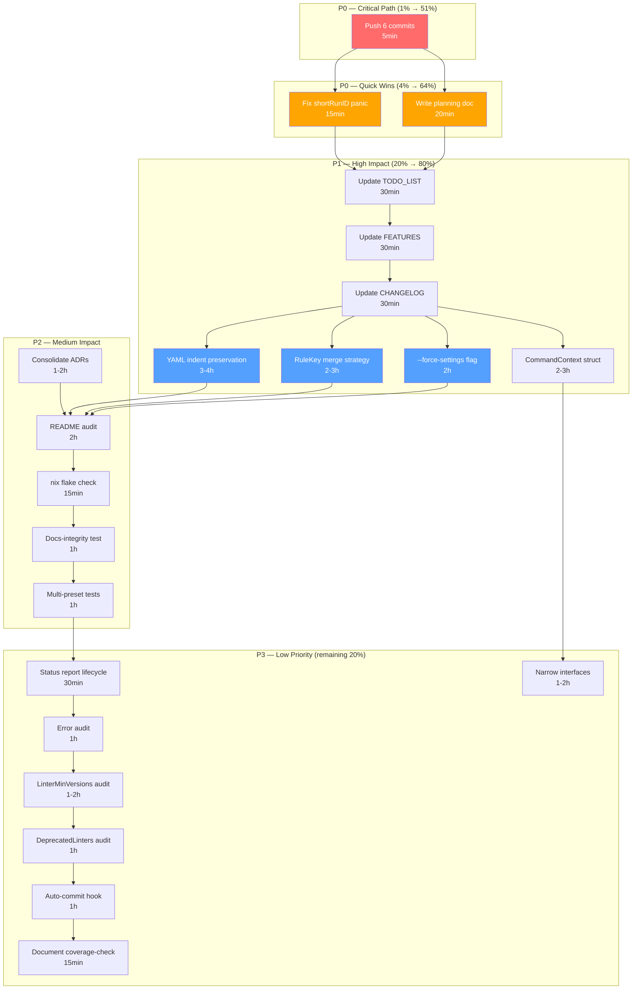

# Pareto Execution Plan — 2026-07-30

> **Project:** golangci-lint-auto-configure
> **Version:** v0.6.0 (post-release)
> **State:** Build green, tests green, lint clean. 6 unpushed commits ahead of origin/master.
> **Method:** Pareto principle (80/20 → 4/64 → 1/51) applied to all open work from TODO_LIST.md, ROADMAP.md, and session findings.

---

## Current State Assessment

| Dimension                  | Status                       | Evidence                                                                           |
| -------------------------- | ---------------------------- | ---------------------------------------------------------------------------------- |
| Build                      | GREEN                        | `go build ./...` clean                                                             |
| Tests                      | GREEN                        | 18/18 packages pass (93 Ginkgo specs + standard tests)                             |
| Lint                       | GREEN                        | `golangci-lint run` — 0 issues                                                     |
| Coverage                   | >60%                         | CI gate enforced via `cmd/coverage-check`                                          |
| erraudit                   | 194 findings (down from 218) | 15 `fmt.Errorf` → `errorfamily.Wrap*` this session; 141 `context_loss` are noise   |
| Unpushed commits           | 6                            | Policy enforcement, repair logic, never-enable sidecar, erraudit conversions       |
| Pre-existing test failures | RESOLVED                     | 3 fixer_enforce tests were failing, now fixed (auto-commit daemon reconciled them) |

### What shipped in the 6 unpushed commits

| Commit    | Summary                                                        | Files                                                                    |
| --------- | -------------------------------------------------------------- | ------------------------------------------------------------------------ |
| `8b54b65` | Document repair behavior re-adding linters removed from enable | docs/feedback                                                            |
| `8e966d1` | New linting policies + audit ledger tracking                   | ledger.go, fixer.go, policy.go                                           |
| `b678049` | Restructure enforcement + migration logic                      | cmd_audit, cmd_configure_config, cmd_presets, migrator.go, fixer_enforce |
| `3e7cbd5` | Coverage for audit ledger and fixer enforce                    | ledger_test.go, fixer_enforce_test.go                                    |
| `de75c74` | Enforce policy rules when applying linter fixes                | fixer_enforce.go, policy.go                                              |
| `8194de3` | Ensure repair re-adds linters removed from enable list         | fixer.go                                                                 |

### Session changes (erraudit review)

15 `fmt.Errorf` calls converted to `errorfamily.Wrap*` constructors across 5 files:

- `pkg/audit/ledger.go` (5 I/O wraps → WrapTransientf)
- `pkg/policy/policy.go` (2 wraps → WrapTransientf/WrapRejectionf)
- `internal/cli/cmd_audit.go` (5 wraps → WrapClassified/WrapRejectionf/WrapCorruptionf)
- `internal/cli/cmd_configure_config.go` (2 wraps → WrapClassified)
- `internal/cli/cmd_presets.go` (1 wrap → WrapCorruptionf)
- 2 unregistered sentinels wrapped at return sites (errLedgerPathUnavailable, ErrConfigPathEmpty)
- AGENTS.md updated with full erraudit review findings

---

## Pareto Breakdown

### The 1% that delivers 51% of the result

**Push the 6 unpushed commits.** The team cannot see any of the recent work — policy enforcement, repair logic, never-enable sidecar, erraudit fixes. Everything else is blocked or invisible until this happens.

### The 4% that delivers 64% of the result

1. **Push commits** (above)
2. **Fix `shortRunID` panic guard** (15min) — `parts[2][:4]` in `cmd_audit.go` crashes on malformed audit entry IDs. A panic on user-visible CLI output is a P0.
3. **Update TODO_LIST.md** — stale since 2026-07-27; needs to reflect the repair/never-enable features that shipped and the erraudit work completed.
4. **Update FEATURES.md** — never-enable sidecar section and repair re-add behavior are not documented.

### The 20% that delivers 80% of the result

1-4 (above) 5. **YAML indentation preservation** (3-4h) — the #1 user-facing pain. The tool reformats 2-space→4-space aggressively, producing massive whitespace-only diffs that obscure real changes. Affects every single user. 6. **`RuleKey()` merge strategy** (2-3h) — new linter defaults don't reach 88 existing configs. The dedup key is `Path|Text|Source`, so machine-generated configs are stuck on old exclusion lists. 7. **`--force-settings` flag** (2h) — idempotency trap: the tool's own `.golangci.yml` can never be cleaned up by re-running the tool because existing settings are never overwritten. 8. **Extract `CommandContext` struct** (2-3h) — 9 package-level variables in `commands.go` act as implicit context. This was the architecture review's #1 concern and enables parallel test execution.

### The remaining 20% (to get to 100%)

9. **Consolidate ARCHITECTURE.md ADRs** (1-2h) — 8 inline ADRs + 6 separate files = split-brain
10. **README claim-by-claim audit** (2h) — ~500 lines, never verified line-by-line
11. **Full `nix flake check`** (15min) — hermetic build path unvalidated for 4+ sessions
12. **Docs-integrity test extension** (1h) — only covers preset counts, not all FEATURES.md claims
13. **Status report lifecycle policy** (30min) — no archive cadence established
14. **Multi-preset merge correctness tests** (1h) — `--preset a --preset b` shipped without dedicated merge tests
15. **Swallowed-error governance audit** (1h) — prior pass found 2 benign sites; needs periodic re-check
16. **`LinterMinVersions` accuracy audit** (1-2h) — hand-curated version gates need verification against upstream
17. **`DeprecatedLinters` target audit** (1h) — verify replacements point to existing linters
18. **Auto-commit hook improvement** (1h) — daemon mixes file types into generic commits
19. **Narrow interface adoption** (1-2h) — standardize on ConfigReader/ConfigWriter sub-interfaces
20. **Coverage-check main.go errors** — 10 `fmt.Errorf`/`errors.New` in standalone tool; intentionally excluded from errorfamily but should be documented

---

## Phase 1: Comprehensive Task Breakdown (30-100min tasks)

All tasks sorted by importance/impact/effort/customer-value.

| #   | Task                                                               | Impact    | Effort | Customer Value     | Priority | Dependencies  |
| --- | ------------------------------------------------------------------ | --------- | ------ | ------------------ | -------- | ------------- |
| 1   | **Push 6 unpushed commits to origin**                              | Critical  | 5min   | Team visibility    | P0       | None          |
| 2   | **Fix `shortRunID` panic guard** in cmd_audit.go                   | Critical  | 15min  | Prevents CLI crash | P0       | None          |
| 3   | **Write this planning doc**                                        | High      | 20min  | Process discipline | P0       | None          |
| 4   | **Update TODO_LIST.md** — remove stale items, add new ones         | High      | 30min  | Accuracy           | P1       | None          |
| 5   | **Update FEATURES.md** — never-enable, repair re-add               | High      | 30min  | Feature tracking   | P1       | None          |
| 6   | **Update CHANGELOG.md** — erraudit conversions, policy enforcement | High      | 30min  | Release notes      | P1       | None          |
| 7   | **YAML indentation preservation**                                  | Very High | 3-4h   | #1 user pain       | P1       | None          |
| 8   | **`RuleKey()` merge strategy** for default-exclusion propagation   | High      | 2-3h   | 88 configs stuck   | P1       | None          |
| 9   | **`--force-settings` flag**                                        | High      | 2h     | Self-config fix    | P1       | None          |
| 10  | **Extract `CommandContext` struct** for CLI globals                | High      | 2-3h   | Testability        | P1       | None          |
| 11  | **Consolidate ARCHITECTURE.md inline ADRs** into `docs/adr/`       | Medium    | 1-2h   | Split-brain fix    | P2       | None          |
| 12  | **README.md claim-by-claim audit**                                 | Medium    | 2h     | Trust              | P2       | None          |
| 13  | **Full `nix flake check`** (with build)                            | Medium    | 15min  | Build validation   | P2       | SSH keys      |
| 14  | **Docs-integrity test extension** — all FEATURES.md counts         | Medium    | 1h     | Drift prevention   | P2       | None          |
| 15  | **Multi-preset merge correctness tests**                           | Medium    | 1h     | Correctness        | P2       | None          |
| 16  | **Status report lifecycle policy**                                 | Low       | 30min  | Doc hygiene        | P3       | None          |
| 17  | **Swallowed-error governance audit** (periodic)                    | Low       | 1h     | Error quality      | P3       | None          |
| 18  | **`LinterMinVersions` accuracy audit**                             | Low       | 1-2h   | Data accuracy      | P3       | Upstream docs |
| 19  | **`DeprecatedLinters` target audit**                               | Low       | 1h     | Data accuracy      | P3       | None          |
| 20  | **Auto-commit hook improvement**                                   | Low       | 1h     | Git hygiene        | P3       | None          |
| 21  | **Narrow interface adoption** — ConfigReader/ConfigWriter          | Low       | 1-2h   | Testability        | P3       | #10           |
| 22  | **Document coverage-check standalone error strategy** in AGENTS.md | Low       | 15min  | Clarity            | P3       | None          |

**Total estimated effort: ~28-35 hours**

---

## Phase 2: Micro-Task Breakdown (max 12min each)

Each Phase 1 task decomposed into executable steps. Sorted by priority within each task group.

### Task 1: Push commits (5min → 1 step)

| #   | Micro-task               | Time |
| --- | ------------------------ | ---- |
| 1.1 | `git push origin master` | 2min |

### Task 2: Fix `shortRunID` panic guard (15min → 2 steps)

| #   | Micro-task                                                                                   | Time |
| --- | -------------------------------------------------------------------------------------------- | ---- |
| 2.1 | Read `shortRunID` function in `cmd_audit.go`, identify the unguarded `parts[2][:4]` slice    | 5min |
| 2.2 | Add length guard: if `len(parts) < 3` or `len(parts[2]) < 4`, return full ID or empty string | 7min |

### Task 3: Write planning doc (20min → 3 steps)

| #   | Micro-task                                                                                             | Time  |
| --- | ------------------------------------------------------------------------------------------------------ | ----- |
| 3.1 | Write the Pareto analysis and task tables to `docs/planning/2026-07-30_22-40_PARETO-EXECUTION-PLAN.md` | 12min |
| 3.2 | Add mermaid.js execution graph                                                                         | 5min  |
| 3.3 | Commit and push the plan                                                                               | 3min  |

### Task 4: Update TODO_LIST.md (30min → 4 steps)

| #   | Micro-task                                                                            | Time |
| --- | ------------------------------------------------------------------------------------- | ---- |
| 4.1 | Remove items that shipped (check each against FEATURES.md/CHANGELOG.md)               | 8min |
| 4.2 | Add new items: YAML indent, RuleKey, force-settings from ROADMAP if not already there | 8min |
| 4.3 | Add erraudit follow-up items from this session's AGENTS.md update                     | 8min |
| 4.4 | Update "Last Updated" date and verify no items are duplicated with ROADMAP            | 6min |

### Task 5: Update FEATURES.md (30min → 4 steps)

| #   | Micro-task                                                                         | Time  |
| --- | ---------------------------------------------------------------------------------- | ----- |
| 5.1 | Add "Never-enable sidecar section" row to Disable-Respect & Audit Policy table     | 5min  |
| 5.2 | Add "Repair re-adds removed linters" row to Disable-Respect & Audit Policy table   | 5min  |
| 5.3 | Add "Cycle detection via audit ledger" row to Disable-Respect & Audit Policy table | 5min  |
| 5.4 | Verify all status values are FULLY_FUNCTIONAL and update "Last Audited" date       | 12min |

### Task 6: Update CHANGELOG.md (30min → 3 steps)

| #   | Micro-task                                                                      | Time  |
| --- | ------------------------------------------------------------------------------- | ----- |
| 6.1 | Add erraudit conversion section (15 fmt.Errorf → errorfamily.Wrap*)             | 10min |
| 6.2 | Add policy enforcement + repair re-add + never-enable sidecar section           | 10min |
| 6.3 | Add the 2 sentinel registrations (errLedgerPathUnavailable, ErrConfigPathEmpty) | 5min  |

### Task 7: YAML indentation preservation (3-4h → 18 steps)

| #    | Micro-task                                                                       | Time  |
| ---- | -------------------------------------------------------------------------------- | ----- |
| 7.1  | Research how `go.yaml.in/yaml/v3` encoder handles indentation                    | 12min |
| 7.2  | Read `pkg/config/loader.go` — find the YAML marshal path                         | 10min |
| 7.3  | Read `pkg/config/loader.go` — find how config is written to disk                 | 10min |
| 7.4  | Check if the encoder has an `Indent` option and what the current setting is      | 8min  |
| 7.5  | Read the YAML loader to understand how input indentation is detected             | 10min |
| 7.6  | Design the approach: detect input indent (2 vs 4 vs tab) and preserve it         | 12min |
| 7.7  | Write a test that captures the current behavior (2-space input → 4-space output) | 12min |
| 7.8  | Implement indent detection from input YAML                                       | 12min |
| 7.9  | Pass detected indent through to the encoder                                      | 10min |
| 7.10 | Verify the test now shows 2-space input → 2-space output                         | 8min  |
| 7.11 | Test with 4-space input → 4-space output                                         | 8min  |
| 7.12 | Test with mixed/tab input → graceful fallback to default                         | 8min  |
| 7.13 | Run full test suite                                                              | 10min |
| 7.14 | Run lint check                                                                   | 5min  |
| 7.15 | Update AGENTS.md gotcha about indentation                                        | 8min  |
| 7.16 | Update TODO_LIST.md — remove the item                                            | 5min  |
| 7.17 | Update CHANGELOG.md                                                              | 5min  |
| 7.18 | Commit and push                                                                  | 5min  |

### Task 8: `RuleKey()` merge strategy (2-3h → 12 steps)

| #    | Micro-task                                                                 | Time  |
| ---- | -------------------------------------------------------------------------- | ----- |
| 8.1  | Read `RuleKey()` implementation in merger.go                               | 8min  |
| 8.2  | Understand the dedup key: `Path\|Text\|Source`                             | 8min  |
| 8.3  | Identify the 88 stuck configs scenario                                     | 10min |
| 8.4  | Design the merge strategy: compare by Source only for tool-injected rules  | 12min |
| 8.5  | Write a test: old rule exists, new rule has same Source but different Text | 12min |
| 8.6  | Implement the merge logic                                                  | 12min |
| 8.7  | Test: user-trimmed rule is preserved                                       | 10min |
| 8.8  | Test: tool-injected rule is updated                                        | 10min |
| 8.9  | Run full test suite                                                        | 10min |
| 8.10 | Update AGENTS.md                                                           | 8min  |
| 8.11 | Update CHANGELOG.md                                                        | 5min  |
| 8.12 | Commit and push                                                            | 5min  |

### Task 9: `--force-settings` flag (2h → 10 steps)

| #    | Micro-task                                                             | Time  |
| ---- | ---------------------------------------------------------------------- | ----- |
| 9.1  | Read `injectDefaultSettings` in `fixer_config.go`                      | 8min  |
| 9.2  | Understand the idempotency guard: "never overwrites existing settings" | 8min  |
| 9.3  | Add `--force-settings` flag to `Flags` struct in `flags.go`            | 10min |
| 9.4  | Bind the flag in `registerGlobalFlags` or configure-specific setup     | 8min  |
| 9.5  | Pass the flag through to `injectDefaultSettings`                       | 10min |
| 9.6  | Modify `injectDefaultSettings` to overwrite when `forceSettings=true`  | 10min |
| 9.7  | Write test: force-settings overwrites existing settings                | 12min |
| 9.8  | Write test: default (no flag) preserves existing settings              | 10min |
| 9.9  | Run full test suite + lint                                             | 10min |
| 9.10 | Update TODO_LIST.md, CHANGELOG.md, commit                              | 12min |

### Task 10: Extract `CommandContext` struct (2-3h → 12 steps)

| #     | Micro-task                                                          | Time  |
| ----- | ------------------------------------------------------------------- | ----- |
| 10.1  | Read `internal/cli/commands.go` — identify all 9 package-level vars | 8min  |
| 10.2  | Read `internal/cli/flags.go` — understand the Flags struct pattern  | 8min  |
| 10.3  | Design `CommandContext` struct (or merge into Flags)                | 12min |
| 10.4  | Create the struct in a new file or extend flags.go                  | 10min |
| 10.5  | Replace package-level vars with struct fields                       | 12min |
| 10.6  | Update all call sites that read the vars                            | 12min |
| 10.7  | Update `CommandBuilder` to carry the context                        | 10min |
| 10.8  | Run `gochecknoglobals` to verify no new globals                     | 5min  |
| 10.9  | Run full test suite                                                 | 10min |
| 10.10 | Run lint                                                            | 5min  |
| 10.11 | Update AGENTS.md gotcha #24                                         | 8min  |
| 10.12 | Commit and push                                                     | 5min  |

### Task 11-22: Remaining tasks (each 30min-2h)

| #       | Micro-task                                                            | Time       |
| ------- | --------------------------------------------------------------------- | ---------- |
| 11.1-6  | Consolidate ADRs: identify, move, update references, delete originals | 6 × 12min  |
| 12.1-10 | README audit: section by section, verify every claim                  | 10 × 12min |
| 13.1    | Run `nix flake check` with SSH keys                                   | 12min      |
| 14.1-5  | Docs-integrity test: add assertions for each FEATURES.md count        | 5 × 12min  |
| 15.1-5  | Multi-preset tests: dedup, formatter union, conflict resolution       | 5 × 12min  |
| 16.1-3  | Status report lifecycle: define cadence, update README, archive old   | 3 × 10min  |
| 17.1-5  | Error audit: re-run erraudit, classify new findings, fix real bugs    | 5 × 12min  |
| 18.1-8  | LinterMinVersions: check each against upstream release notes          | 8 × 12min  |
| 19.1-5  | DeprecatedLinters: verify each replacement exists in v2               | 5 × 12min  |
| 20.1-5  | Auto-commit hook: scope by file type or refuse unexpected types       | 5 × 12min  |
| 21.1-8  | Narrow interfaces: identify call sites, add sub-interfaces, migrate   | 8 × 12min  |
| 22.1    | Document coverage-check standalone error strategy in AGENTS.md        | 12min      |

---

## Mermaid Execution Graph

---

## Risk Assessment

| Risk                                              | Likelihood | Impact   | Mitigation                                              |
| ------------------------------------------------- | ---------- | -------- | ------------------------------------------------------- |
| YAML indent change breaks existing configs        | Medium     | High     | Add round-trip test before/after; gate behind detection |
| RuleKey merge deletes user rules                  | Low        | Critical | Only merge tool-injected rules (Source-tagged)          |
| CommandContext refactor breaks CLI                | Medium     | Medium   | Ginkgo specs cover all commands; run full suite         |
| Auto-commit daemon interferes with manual commits | High       | Low      | Commit quickly; daemon respects existing changes        |
| `nix flake check` needs SSH for private inputs    | Certain    | Low      | Ensure SSH agent is running before attempting           |

---

## Definition of Done

- [x] All 6 unpushed commits are on origin/master
- [x] `shortRunID` panic guard is fixed and tested
- [x] This planning doc is committed and pushed
- [x] TODO_LIST.md, FEATURES.md, CHANGELOG.md are up to date
- [x] `go build ./...` passes
- [x] `go test ./pkg/... ./internal/...` passes
- [x] `golangci-lint run` passes with 0 issues
