# SUPERB Pareto Execution Plan — v0.8.1 Delivery & Trust Restoration

**Created:** 2026-09-11 09:28 CEST
**Source:** `TODO_LIST.md` (2026-09-11 edition: 5 High / 17 Medium / 16 Low) + the f-section delta of `docs/status/2026-09-11_09-23_docs-health-archive-and-living-docs-pass.md` + ROADMAP ideas. **Every open TODO is placed** — either in the execution tables below or in the Scheduled/Deferred table.

**Goal in one sentence:** ship the config-schema fix to users (v0.8.1), then rebuild the automated trust fabric (schema gate, drift guards, watchdog) so the July-class silent failures cannot recur.

---

## 1. Pareto Breakdown

| Tier | Tasks (of 27) | Cumulative value | What it is | Why it dominates |
|------|---------------|------------------|------------|------------------|
| **1%** | T1 | **~51%** | **Cut v0.8.1 and watch the release pipeline end-to-end** | The release is the *delivery moment*: it ships the Critical `min-len` fix + CI rehab to users, publishes the first-ever GHCR image, proves the buildx fix after 3 consecutive failed releases, and validates homebrew/scoop + ldflags + cosign in one pass. Highest value per effort (S) in the entire backlog — nothing else touches customers. |
| **4%** | T1 + T2 + T3 | **~64%** | + **Key-normalization pass** (`min-length` → `min-len` in user configs), + **CI schema-compat gate** | T2 repairs every downstream config the tool silently broke (the worst self-inflicted wound, unfixable by re-running the tool today); T3 makes "the tool emits valid config" a *verified invariant* instead of an assumption — this one gate would have caught the entire incident class before release. |
| **20%** | + T4–T10 | **~80%** | + exhaustruct_v5 migration, + vendorHash guard, + generated-file drift guard, + CI-health watchdog, + BDD spec debt + varnamelen trim, + `go install` e2e | The tool's core value is *deprecation mapping* (currently stale on v2.13); the three guards close the three known silent-failure channels (broken builds for all clones, silently rotting reference file, disabled-workflow blindness); the spec debt fixes *wrong defaults injected into every project* (gin/koanf types); the install e2e verifies the public promise. |
| **Remaining 80%** | T11–T27 | last ~20% | Release-adjacent verification, repo protections, hygiene, docs audits, decisions | Necessary, non-differentiating: keeps the backlog honest, the docs truthful, and the repo governable. |

**Execution order ≠ value order:** T1 is the 1% but *depends on* T2 (ship the repair with the release) and benefits from T3 (verify before tagging). So we execute guards first, then the 4% fixes, then the 1% release, then the 20% remainder in parallel tracks.

---

## 2. Comprehensive Plan — Medium granularity (27 tasks, 30–100 min each)

Sorted by importance/impact/effort/customer-value. Effort: S ≤30min, M 30–100min.

| #   | Tier | Task                                                                                                | Impact for customer | Effort | Depends on |
|-----|------|-----------------------------------------------------------------------------------------------------|---------------------|--------|------------|
| T1  | 1%   | **Release v0.8.1**: finalize CHANGELOG, tag, push, watch pipeline, verify GHCR image + binaries + manifests | Ships all fixes     | M      | T2, T3     |
| T2  | 4%   | **Key-normalization pass**: rewrite `goconst.min-length` → `min-len` in existing user configs (bypass idempotency guard for known-bad keys only) | Repairs broken configs | M   | —          |
| T3  | 4%   | **CI schema-compat gate**: fixture config with every injected default, `golangci-lint config verify` in CI | Prevents bug class  | M      | —          |
| T4  | 20%  | **exhaustruct → exhaustruct_v5 migration**: constants, curated excludes, deprecation table, data tests | Core value: deprecation mapping | M | — |
| T5  | 20%  | **vendorHash guard**: `nix build` fires when go.mod/go.sum change; surfaces/updates the `got:` hash   | Unbreaks all clones | M      | —          |
| T6  | 20%  | **Generated-file drift guard**: regenerate + `git diff --exit-code` in CI                            | Kills silent rot    | S      | —          |
| T7  | 20%  | **CI-health watchdog**: weekly check that `ci.yml` is active + master green; issue on drift           | Ends 2-month blindness | S   | —          |
| T8  | 20%  | **BDD spec debt** (12 features from 2026-08-08): ToMap specs + health-check + prune specs             | Correctness proof   | M      | —          |
| T9  | 20%  | **varnamelen trim**: drop `*gin.Context`/`*httpx.Context`/`*koanf.Koanf` from shared defaults         | Stops wrong defaults | S     | T8         |
| T10 | 20%  | **`go install …@latest` in a clean `GOMODCACHE`** + run the installed binary                          | Verifies the public promise | S | T1 |
| T11 | rest | Release-adjacent verification: homebrew/scoop manifests live, cosign/SBOM README docs, `workflow_dispatch` confirm | Install trust | S | T1 |
| T12 | rest | **Backfill GHCR image for v0.8.0** (buildx from existing tag)                                          | Container installs  | S      | T1         |
| T13 | rest | **Branch/tag protection rulesets** (`master`, `v*`) + `auto-tag.yml` fate                              | Supply-chain safety | S      | —          |
| T14 | rest | **Dependabot failures** (08-23/30, 09-06) root-cause + ci.yml pin custom-manager eval                   | Green dependabot    | S      | —          |
| T15 | rest | **gitleaks full-history scan** + triage + quantified risk note                                         | Public-repo hygiene | M      | —          |
| T16 | rest | **Buildflow**: locate config, raise `test-coverage` timeout, e2e re-run, "9 tools" health check         | Green tooling       | M      | —          |
| T17 | rest | **generate-settings schema-version awareness** + goconst-drift decision (regenerate+annotate vs exclude) | Docs/tooling truth  | M      | —          |
| T18 | rest | **internal/cli coverage sprint**: BDD specs for untested command paths (incl. FixConfig sidecar integration test) | Test debt | M | — |
| T19 | rest | **Suite speedup**: profile the 116s `-race` suite, parallelize/trim                                     | Unblocks buildflow  | M      | —          |
| T20 | rest | **json/v2 `omitempty` → `omitzero`** in `config_types.go` + goldens                                     | Correct JSON output | M      | —          |
| T21 | rest | **ADR consolidation**: 8 inline ADRs → `docs/adr/`, fix naming scheme                                   | Single source       | M      | —          |
| T22 | rest | **README claim-by-claim audit, part 1** (Purpose → Usage, vs actual binary)                             | Truthful sales page | M      | T1         |
| T23 | rest | **README audit, part 2** (flags/presets tables vs code) + CI/CD section                                 | Truthful sales page | M      | T22        |
| T24 | rest | **Sibling sweep** for emitted `min-length` keys + repair                                                | Ecosystem repair    | M      | T2         |
| T25 | rest | **Small-code-fixes bundle**: FindingsHidden dead field, multi-preset merge tests, `errUnsupportedFormat` registration | Debt | M | — |
| T26 | rest | **Docs-hygiene bundle**: annotate 08-05 report, route lost 07-31 ideas, version-ref sweep, cadence policy, TODO prune | Fresh docs | S | — |
| T27 | rest | **Decisions + docs-integrity**: PARTS/PROJECT_SPLIT/BDD_TESTS_REVIEW fates, homepage/announcement routing; extend docs-integrity test | Closes questions | M | — |

**Coverage check:** all 5 High, 17 Medium, 16 Low TODO_LIST items + the f-section delta map onto T1–T27 or the Scheduled table below. Nothing dropped.

---

## 3. Detailed Breakdown — Micro tasks (144 tasks, ≤12 min each)

Legend: each micro is independently verifiable. Times are max minutes.

### T1 — Release v0.8.1 (45)

| ID  | Micro task                                                                 | Min |
|-----|-----------------------------------------------------------------------------|-----|
| 1.1 | Move `[Unreleased]` CHANGELOG entries into a `0.8.1` section with date      | 8   |
| 1.2 | Verify version-tagging procedure against `docs/references/release-process.md`; bump what needs bumping | 10 |
| 1.3 | Run `scripts/pre-release-check.sh` and clear findings                       | 12  |
| 1.4 | Full local gate: `go build`, `-race` suite, lint, `nix build`               | 12  |
| 1.5 | Commit prep, create annotated tag `v0.8.1`, push branch + tag               | 8   |
| 1.6 | Watch release workflow; confirm GHCR image tags appear                      | 12  |
| 1.7 | Verify binaries report `v0.8.1` (ldflags), checksums, cosign, SBOM assets   | 12  |
| 1.8 | Verify homebrew/scoop manifests live; run `post-release-verify.sh`; record  | 12  |

### T2 — Key-normalization pass (60)

| ID  | Micro task                                                                                     | Min |
|-----|-------------------------------------------------------------------------------------------------|-----|
| 2.1 | Grep all `min-length` emission sites; write failing BDD spec (config with bad key stays broken today) | 10 |
| 2.2 | Add `KnownBadSettingsKeys` map (bad key → good key) in `pkg/constants`                          | 10 |
| 2.3 | Implement normalization pass in fixer (bypasses idempotency guard ONLY for mapped keys)          | 12 |
| 2.4 | Wire into `FixConfig` pipeline + record `configChangeRecorder` action                            | 10 |
| 2.5 | BDD spec: nested `goconst` map rewritten correctly                                               | 10 |
| 2.6 | BDD spec: clean configs untouched (byte-identical); unrelated `goconst` keys preserved           | 10 |
| 2.7 | AGENTS.md gotcha note + configure-summary line mentioning the repair                             | 8   |
| 2.8 | Full suite + lint + manual fixture verify                                                        | 12  |

### T3 — CI schema-compat gate (42)

| ID  | Micro task                                                                                  | Min |
|-----|----------------------------------------------------------------------------------------------|-----|
| 3.1 | Fixture generator/`make`-style target: config containing every `DefaultLinterSettings` + `DefaultFormatterSettings` entry | 12 |
| 3.2 | Run `golangci-lint config verify` locally against fixture; fix any findings                  | 12  |
| 3.3 | Add CI job running the verify (fails on any invalid injected key)                            | 10  |
| 3.4 | Guard the fixture itself: regen + diff check so new settings can't skip the gate             | 10  |
| 3.5 | README/AGENTS note: injected defaults are schema-verified in CI                              | 8   |

### T4 — exhaustruct_v5 migration (63)

| ID  | Micro task                                                                                  | Min |
|-----|----------------------------------------------------------------------------------------------|-----|
| 4.1 | Grep every `exhaustruct` reference (constants, presets, tests, docs, exclusion rules)        | 8   |
| 4.2 | Rename key in `linter_priorities.go` + `linter_reasons.go`                                   | 10  |
| 4.3 | Rename `ExhaustructSettings` map key + verify yaml tags in `linter_settings.go`              | 12  |
| 4.4 | Update `rules.go` NeverAutoEnable entry + reason text                                        | 8   |
| 4.5 | Update `DefaultExclusionRules` + curated excludes (ported verbatim)                          | 10  |
| 4.6 | Update data-integrity tests + validator script expectations                                  | 12  |
| 4.7 | Add deprecation-table entry: `exhaustruct → exhaustruct_v5` (v2.13.0)                        | 10  |
| 4.8 | Update FEATURES/AGENTS #19/README counts                                                     | 10  |
| 4.9 | Full gates + confirm the v2.13 deprecation warning is gone                                   | 12  |

### T5 — vendorHash guard (42)

| ID  | Micro task                                                                                  | Min |
|-----|----------------------------------------------------------------------------------------------|-----|
| 5.1 | Pick mechanism: CI step vs pre-push hook (inspect existing hooks + CI budget)                | 10  |
| 5.2 | Implement: go.mod/go.sum in diff → `nix build` → capture `got:` hash                         | 12  |
| 5.3 | Auto-write `vendorHash.nix` or fail with exact paste-in instructions                         | 10  |
| 5.4 | Test: simulate a dep bump on a scratch branch; verify the guard fires                        | 10  |
| 5.5 | Update AGENTS.md gotcha #3 (manual procedure → automated guard)                              | 8   |

### T6 — Drift guard (36)

| ID  | Micro task                                                                                  | Min |
|-----|----------------------------------------------------------------------------------------------|-----|
| 6.1 | CI step: `go run ./cmd/generate-settings` + `git diff --exit-code` on the generated file     | 12  |
| 6.2 | Make the schema input path explicit; cache it between steps                                  | 8   |
| 6.3 | Verify locally: corrupt file → red; restore → green                                          | 10  |
| 6.4 | AGENTS #35 addendum: drift guard exists                                                      | 6   |

### T7 — Watchdog (36)

| ID  | Micro task                                                                                  | Min |
|-----|----------------------------------------------------------------------------------------------|-----|
| 7.1 | Create `.github/workflows/ci-watchdog.yml` with weekly cron                                  | 8   |
| 7.2 | Check script: `gh api` workflow state (`active`) + last master run conclusion                | 12  |
| 7.3 | On drift: open/update an issue (idempotent, labeled `ci-health`)                             | 10  |
| 7.4 | Test via `workflow_dispatch` (force a fake-drift dry mode)                                   | 8   |

### T8 — BDD spec debt (part 1: settings structs) (40)

| ID  | Micro task                                                                                  | Min |
|-----|----------------------------------------------------------------------------------------------|-----|
| 8.1 | `Gocognit`/`Gocyclo`/`Nestif` ToMap specs (key + exact value)                                | 12  |
| 8.2 | `Goconst` ToMap specs (`min-len`, `min-occurrences`, `ignore-tests`)                          | 12  |
| 8.3 | `Tagalign` ToMap specs (align/order/sort + ordering)                                         | 10  |
| 8.4 | `mnd` specs (`ignored-files`, `ignored-numbers` intentionally absent)                        | 10  |
| 8.5 | Run `pkg/constants` suite; lint                                                               | 6   |

### T9 — BDD spec debt (part 2: wrapcheck/errcheck/varnamelen/checks) (46) *(labeled T8b in IDs)*

| ID  | Micro task                                                                                  | Min |
|-----|----------------------------------------------------------------------------------------------|-----|
| 8b.1| `wrapcheck.IgnoreSigRegexps`: count + sample-pattern spec                                    | 12  |
| 8b.2| `errcheck.CheckTypeAssertions: true` spec                                                    | 8   |
| 8b.3| `varnamelen` typed `ignore-decls` + distance/name-length spec                                | 12  |
| 8b.4| `checkAbsolutePathExclusions`: Unix + Windows + glob-ignored specs                           | 12  |
| 8b.5| `checkDuplicateExclusionLinters` + `pruneUnenabledLinterSettings` specs                      | 12  |

*(adjust: this section = 56 min total; keep as one task T8b ≈ 56 min)*

### T10 — varnamelen trim (38)

| ID  | Micro task                                                                                  | Min |
|-----|----------------------------------------------------------------------------------------------|-----|
| 10.1| Remove `*gin.Context`, `*httpx.Context`, `*koanf.Koanf` from `IgnoreDecls`                    | 8   |
| 10.2| Update the 8b.3 spec to stdlib-only expectation                                              | 8   |
| 10.3| Sanity: grep sibling configs for framework-typed varnamelen reliance                          | 12  |
| 10.4| Suite + CHANGELOG `[Unreleased]` note                                                        | 10  |

### T11 — go install e2e (30)

| ID  | Micro task                                                                                  | Min |
|-----|----------------------------------------------------------------------------------------------|-----|
| 11.1| Clean-`GOMODCACHE` env; `go install …/cmd/golangci-lint-auto-configure@v0.8.1`               | 12  |
| 11.2| Run installed binary: `--version` + `analyze` on a fixture                                   | 10  |
| 11.3| Record result (TODO row removal + CHANGELOG/README note if needed)                           | 8   |

### T12 — Release-adjacent verification (38)

| ID  | Micro task                                                                                  | Min |
|-----|----------------------------------------------------------------------------------------------|-----|
| 12.1| Verify homebrew cask + scoop manifest URLs for v0.8.1                                        | 12  |
| 12.2| README: artifact-verification section (`cosign verify checksums.txt`, SBOM)                  | 12  |
| 12.3| `gh workflow run ci.yml`; confirm the dispatch path is green                                 | 10  |
| 12.4| Prune the TODO rows this closes                                                              | 8   |

### T13 — GHCR backfill (42)

| ID  | Micro task                                                                                  | Min |
|-----|----------------------------------------------------------------------------------------------|-----|
| 13.1| Buildx-build the v0.8.0 image exactly as the release workflow does                           | 12  |
| 13.2| Push to `ghcr.io` with `v0.8.0` tag                                                          | 10  |
| 13.3| Verify anonymous pull + attestation                                                          | 12  |
| 13.4| Decide v0.7.x backfill (yes/no) + note rationale                                             | 8   |

### T14 — Protections (40)

| ID  | Micro task                                                                                  | Min |
|-----|----------------------------------------------------------------------------------------------|-----|
| 14.1| Draft master ruleset (require CI; propose linear history)                                    | 10  |
| 14.2| Tag ruleset: `v*` creatable only by release path                                             | 10  |
| 14.3| Decide + execute `auto-tag.yml` fate; record decision                                        | 10  |
| 14.4| Apply via `gh api`; screenshot/verify settings                                               | 12  |

### T15 — Dependabot (40)

| ID  | Micro task                                                                                  | Min |
|-----|----------------------------------------------------------------------------------------------|-----|
| 15.1| Read the 3 failed run logs; classify the failure cause                                       | 12  |
| 15.2| Fix the cause (config or dependency)                                                         | 12  |
| 15.3| Evaluate custom manager for the `ci.yml` golangci-lint input pin                             | 12  |
| 15.4| Document outcome + TODO update                                                               | 8   |

### T16 — gitleaks (46)

| ID  | Micro task                                                                                  | Min |
|-----|----------------------------------------------------------------------------------------------|-----|
| 16.1| Ensure gitleaks; run the full-history scan                                                   | 12  |
| 16.2| Triage findings: real secrets vs sibling-name references                                     | 12  |
| 16.3| Quantify + write the risk summary into the ROADMAP history question                          | 10  |
| 16.4| Allowlist known-benign patterns if any; re-run clean                                         | 12  |

### T17 — Buildflow (60)

| ID  | Micro task                                                                                  | Min |
|-----|----------------------------------------------------------------------------------------------|-----|
| 17.1| Locate the buildflow config (global paths, `--help`, docs)                                   | 12  |
| 17.2| Raise `test-coverage` timeout (committed override or global)                                 | 10  |
| 17.3| Investigate "9 tools unavailable" health check with `--verbose`                              | 12  |
| 17.4| Full buildflow run end-to-end; confirm 0 failures                                            | 12  |
| 17.5| Record outcome; update TODO/ROADMAP rows                                                     | 8   |

### T18 — generate-settings schema awareness (46) *(includes goconst-drift decision)*

| ID  | Micro task                                                                                  | Min |
|-----|----------------------------------------------------------------------------------------------|-----|
| 18.1| Generator header: document schema snapshot version + tool minimum supported                  | 10  |
| 18.2| Implement warning when schema version > tool minimum                                         | 12  |
| 18.3| Decide goconst drift: regenerate+annotate vs exclude goconst                                 | 12  |
| 18.4| Execute the decision; run tests                                                              | 10  |
| 18.5| AGENTS #35 extension                                                                          | 8   |

### T19 — internal/cli coverage sprint (66)

| ID  | Micro task                                                                                  | Min |
|-----|----------------------------------------------------------------------------------------------|-----|
| 19.1| Coverage report: rank untested `cmd_*` paths by user impact                                  | 10  |
| 19.2| Specs: `cmd_check` exit-code branches                                                        | 12  |
| 19.3| Specs: `cmd_analyze` output modes                                                            | 12  |
| 19.4| Specs: `cmd_configure_config` flag branches                                                  | 12  |
| 19.5| Specs: `cmd_presets --json` edge cases                                                       | 12  |
| 19.6| Spec: FixConfig sidecar + ledger integration (never-enable e2e — old Low TODO)               | 12  |
| 19.7| Coverage delta report; prune TODO rows                                                       | 10  |

### T20 — Suite speedup (56)

| ID  | Micro task                                                                                  | Min |
|-----|----------------------------------------------------------------------------------------------|-----|
| 20.1| Profile: per-suite timing of `internal/cli` under `-race`                                    | 12  |
| 20.2| Identify sleeps + serial bottlenecks (build-once BeforeSuite)                                | 12  |
| 20.3| Parallelize independent Describe suites                                                      | 12  |
| 20.4| Re-measure; target ≤60s; iterate once                                                        | 12  |
| 20.5| Record result (may retire the buildflow timeout need)                                        | 8   |

### T21 — omitzero (54)

| ID  | Micro task                                                                                  | Min |
|-----|----------------------------------------------------------------------------------------------|-----|
| 21.1| Inventory `bool`/`int + omitempty` json tags in `config_types.go`                            | 10  |
| 21.2| Per-field decision: `omitzero` vs keep (round-trip risk)                                     | 12  |
| 21.3| Apply edits                                                                                  | 12  |
| 21.4| Update JSON-format output tests/goldens                                                      | 12  |
| 21.5| Close out AGENTS #17 latent note                                                             | 8   |

### T22 — ADR consolidation (52)

| ID  | Micro task                                                                                  | Min |
|-----|----------------------------------------------------------------------------------------------|-----|
| 22.1| Extract ADR-001…004 from `ARCHITECTURE.md` into `docs/adr/ADR-00x-*.md`                      | 12  |
| 22.2| Extract ADR-005…008                                                                          | 12  |
| 22.3| Rename `001-yaml-dependency-decision.md` to the `ADR-NNN-` scheme                            | 8   |
| 22.4| Replace inline ADR sections with a linked index                                              | 12  |
| 22.5| Link sweep + markdownlint + AGENTS pointer                                                   | 8   |

### T23 — README audit part 1 (56)

| ID  | Micro task                                                                                  | Min |
|-----|----------------------------------------------------------------------------------------------|-----|
| 23.1| Verify Purpose + install claims (commands exist, flags real)                                 | 12  |
| 23.2| Verify Requirements + example outputs vs the actual binary                                   | 12  |
| 23.3| Verify linter counts/priority tables vs constants                                            | 12  |
| 23.4| Fix the drift found                                                                          | 12  |
| 23.5| Record audit progress in TODO                                                                | 8   |

### T24 — README audit part 2 + CI/CD (54)

| ID  | Micro task                                                                                  | Min |
|-----|----------------------------------------------------------------------------------------------|-----|
| 24.1| Audit flags table vs cobra registration                                                      | 12  |
| 24.2| Audit presets table vs `presets.go` counts                                                   | 10  |
| 24.3| Audit reports/sidecar/audit-ledger sections                                                  | 12  |
| 24.4| Add the CI/CD section (workflows + gates table)                                              | 12  |
| 24.5| markdownlint + close the TODO rows                                                           | 8   |

### T25 — Sibling sweep (42)

| ID  | Micro task                                                                                  | Min |
|-----|----------------------------------------------------------------------------------------------|-----|
| 25.1| Sweep script: find `min-length` under sibling `.golangci.yml` files                          | 12  |
| 25.2| Run across ~160 repos; collect the hit list                                                  | 10  |
| 25.3| Repair each hit (tool run with T2 fix, or targeted edit)                                     | 12  |
| 25.4| Summarize repaired count + outstanding                                                       | 8   |

### T26 — Small-code-fixes bundle (54)

| ID  | Micro task                                                                                  | Min |
|-----|----------------------------------------------------------------------------------------------|-----|
| 26.1| `FindingsHidden`: grep usages → remove-or-implement decision                                 | 12  |
| 26.2| Multi-preset test: two-preset linter union fixture                                           | 12  |
| 26.3| Multi-preset test: formatter union + dedup assertions                                        | 12  |
| 26.4| `errUnsupportedFormat`: verify go-error-family registration; register if missing             | 10  |
| 26.5| Suite green                                                                                  | 8   |

### T27 — Docs-hygiene + decisions bundle (60)

| ID  | Micro task                                                                                  | Min |
|-----|----------------------------------------------------------------------------------------------|-----|
| 27.1| Annotate `2026-08-05_03-25_humanize-linter-status.md` as resolved                            | 8   |
| 27.2| Route the dropped 07-31 F-ideas into ROADMAP (or consciously drop)                           | 10  |
| 27.3| Version-reference sweep (AGENTS #11, docs/references)                                        | 12  |
| 27.4| Status cadence policy into `docs/status/README.md`                                           | 10  |
| 27.5| Decision note: PARTS/PROJECT_SPLIT/BDD_TESTS_REVIEW fates + homepage/announcement routing    | 12  |
| 27.6| Extend docs-integrity test beyond preset counts; run gates                                   | 12  |

**Micro total: 144 tasks.**

---

## 4. Execution Graph

```mermaid
flowchart TD
    subgraph TIER1["1% — 51% of value"]
        T1["T1 · Release v0.8.1<br/>(GHCR + binaries + manifests)"]
    end

    subgraph TIER2["4% — cumulative 64%"]
        T2["T2 · Key-normalization<br/>min-length → min-len"]
        T3["T3 · CI schema gate<br/>config verify fixture"]
    end

    subgraph TIER3["20% — cumulative 80%"]
        T4["T4 · exhaustruct_v5"]
        T5["T5 · vendorHash guard"]
        T6["T6 · drift guard"]
        T7["T7 · CI watchdog"]
        T8["T8 · BDD spec debt"]
        T9["T9 · varnamelen trim"]
        T10["T10 · go install e2e"]
    end

    subgraph REST["Remaining 80% of tasks"]
        T11["T11 · release verify"]
        T12["T12 · GHCR backfill"]
        T13["T13 · protections"]
        T14["T14 · dependabot"]
        T15["T15 · gitleaks"]
        T16["T16 · buildflow"]
        T17["T17 · generate-settings"]
        T18["T18 · cli coverage"]
        T19["T19 · suite speedup"]
        T20["T20 · omitzero"]
        T21["T21 · ADR consolidation"]
        T22["T22 · README audit 1"]
        T23["T23 · README audit 2"]
        T24["T24 · sibling sweep"]
        T25["T25 · small fixes"]
        T26["T26 · docs hygiene"]
        T27["T27 · decisions + integrity"]
    end

    T2 --> T1
    T3 --> T1
    T1 --> T10
    T1 --> T11
    T1 --> T12
    T1 --> T22
    T2 --> T24
    T8 --> T9
    T5 -.parallel.-> T4
    T6 -.parallel.-> T7
    T18 -.parallel.-> T19
    T22 --> T23
    T16 -.informed by.-> T19

    style T1 fill:#1a7f37,color:#fff
    style T2 fill:#0969da,color:#fff
    style T3 fill:#0969da,color:#fff
    style T4 fill:#8250df,color:#fff
    style T5 fill:#8250df,color:#fff
    style T6 fill:#8250df,color:#fff
    style T7 fill:#8250df,color:#fff
    style T8 fill:#8250df,color:#fff
    style T9 fill:#8250df,color:#fff
    style T10 fill:#8250df,color:#fff
```

**Critical path:** T2 → T1 (the repair must ship *with* the release). Guards (T5–T7) and exhaustruct (T4) run in parallel tracks — none block the release. Everything in the rest tier is order-free except README audit (needs a released binary to verify against) and the sibling sweep (needs the T2 fix).

---

## 5. Verschlimmbesserung Guardrails (how this plan avoids making things worse)

1. **T2 bypasses the idempotency guard ONLY for the exact mapped bad key** (`goconst.min-length`). No general "overwrite user settings" loophole — the guard's guarantee stays intact for everything else, enforced by spec 2.6 (clean configs stay byte-identical).
2. **T4 keeps backward compatibility**: old `exhaustruct` name stays in the deprecation table (replaced → `exhaustruct_v5`), so old configs migrate instead of breaking.
3. **T3 must not become flaky CI**: the fixture is generated from the same constants the tool ships (single source), and the drift check (3.4) fails loud instead of silently skipping.
4. **T21 (omitzero)**: field-by-field round-trip decision, goldens updated in the same task — no blind sed across config types.
5. **T22 (ADR move)**: links replaced + sweep; no dangling references (learned from the 09-09 deletion-without-sweep miss).
6. **No release without green local gates** (1.4) — the July lesson (disabled CI masking regressions) applied in reverse.
7. **Plans are snapshots**: this file will be annotated by docs-health (ANNOTATE mode), never rewritten.

---

## 6. Scheduled / Deferred (ALL remaining todos, so nothing is lost)

| Item                                                     | When                          | Source                     |
|----------------------------------------------------------|-------------------------------|----------------------------|
| Quarterly erraudit re-check                               | ~2026-10                      | TODO_LIST Low              |
| `nix flake update` + validated rebuild (2026-era revs)    | after v0.8.1 stabilizes       | 09-09 f20                  |
| Multi-system flake checks (`--all-systems`)               | backlog                       | ROADMAP theme 4            |
| Error-code registry/convention test                       | backlog                       | ROADMAP theme 5            |
| Website launch (homepage field)                           | user decision                 | ROADMAP theme 6 / g-questions |
| Demo GIF/asciinema in README                              | after website decision        | ROADMAP theme 6            |
| Announcement (r/golang, HN, X)                            | user decision (support posture) | ROADMAP theme 6 / T27    |
| Community tier (issue/PR templates)                       | after posture decision        | ROADMAP theme 6            |
| Go-finding/gogenfilter dependency refresh sweep           | next minor release window     | 09-09 f21/f22              |
| `--reset-exclusions` / `--indent` / fuzz-test ideas       | routed by T27.2               | 07-31 F-list               |
| History sanitization (filter-repo vs accept-forever)      | user decision (g1)            | ROADMAP Open questions     |
| gohumanize everywhere-strategy                            | user decision (g2)            | ROADMAP Open questions     |
| Daemon-mangled commit messages (rewrite vs notes)         | user decision (g3)            | ROADMAP Open questions     |
