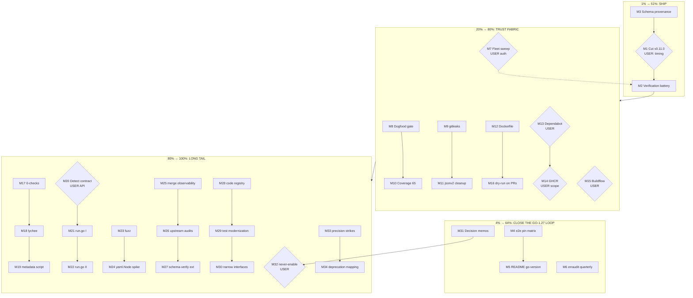

# SUPERB Pareto Execution Plan v2 — Ship the Value, Close the Loop

**Created:** 2026-10-07 03:26 CEST
**Sources:** TODO_LIST.md (19 rows, harvested 2026-10-07), ROADMAP.md themes 1–6 + 6 open questions, docs-health third-sweep residue (docs/status/2026-10-07_02-57…md), Go-1.27 frontier (docs/archive/status/2026-09-28_21-59…md).
**Rule:** every macro task is 30–100 min; every micro task ≤12 min; nothing executed without its verification gate (anti-Verschlimmbesser).

---

## 1. Pareto analysis — what actually delivers the result

The project is a **public Go CLI that auto-configures golangci-lint**. Value = working configs for users + trust fabric (CI, supply chain, docs that don't lie).

| Tier | Share of result | The work | Why this and nothing else |
| ---- | --------------- | -------- | ------------------------- |
| **1%** | **51%** | **M1+M2: Cut v0.11.0 with the full verification battery.** `[Unreleased]` carries the Go 1.27 readiness (run.go cap/rescue), atomic config writes, and the jsondeterminism gate — none of it reaches a single user until a tag exists. One release delivers the accumulated value of three months. | Everything else is polish; the release is the product. |
| **4%** | **64%** | 1% **+ M3+M4+M5+M6: close the Go-1.27 quality loop** — dated schema snapshot (provenance-blind drift guard today), e2e pin matrix (cap path only tested against v2.14.0), README go-version section (users can't discover the rescue), erraudit quarterly (due now; governance honesty). | These four turn "shipped" into "proven, documented, governed". |
| **20%** | **80%** | 4% **+ M7–M16: the trust fabric + real-world delivery** — fleet sweep (160 siblings get the run.go fix — the tool's actual purpose), dogfood gate, gitleaks schedule, coverage 65, tag cleanup, Dockerfile slim, Dependabot policy, Buildflow posture, release dry-run on PRs. | This is the Medium tier: every item prevents a known failure class from recurring. |
| **remaining 80%** | **100%** | M17–M34: ROADMAP themes 1–3 hardening (run.go tail, fuzz, yaml.Node, exclusion observability, schema-verify extension, upstream audits), theme 4/5 governance (error-code registry, daemon quality memos), and the 6 user-gated decisions prepared as decision memos. | Long-tail robustness + decisions only Lars can make, prepared so they cost him 5 minutes each. |

**Explicitly NOT in this plan** (decided against, do not re-open): CBOR, GUI, DAG pipeline, v1 features, sidecar promotion, repo split, SettingsMap helper surface, typed OutputConfig.Formats (all ROADMAP non-goals or declined-for-now with reasons).

---

## 2. Macro plan (30–100 min tasks, sorted by impact/effort/value)

| ID | Task | Impact | Effort | Gate / dependency |
|----|------|--------|--------|-------------------|
| M1 | **Cut release v0.11.0** — CHANGELOG [Unreleased] → versioned section, tag, watch pipeline | CRITICAL (ships 3 months of work) | 90m | ⛔ USER: release timing. Needs M3 done first (schema header in release notes) |
| M2 | **Post-release verification battery** — pre-release-check.sh, download binary, cosign verify, GHCR pull, `go install`@tag, post-release-verify.sh | CRITICAL (proves the 1%) | 45m | after M1 |
| M3 | **Schema snapshot provenance** — regenerate from golangci-lint v2.13.x with `-schema-version`, update CI command, commit fixture+generated together | High | 60m | — |
| M4 | **e2e golangci-lint pin matrix** — run suite against min v2.10.1 + expected v2.13.2 + current v2.14.0; exercises the run.go cap path | High | 90m | — |
| M5 | **README "Go version handling" section** — cap/rescue/user-facing semantics | High (discoverability) | 30m | — |
| M6 | **erraudit quarterly re-check** — full pass over ./..., triage new findings, update AGENTS #26 count | Medium (due ~2026-10) | 60m | — |
| M7 | **Fleet sweep: `configure` on 160 siblings** — patch-form run.go fixes, scripted + spot-verified | High (real-world) | 100m | ⛔ USER: cross-repo write auth |
| M8 | **Dogfood CI gate** — `configure --check` on own .golangci.yml in ci.yml | High (self-trust) | 45m | — |
| M9 | **Scheduled gitleaks job** — weekly full-history scan workflow | Medium | 30m | — |
| M10 | **Coverage gate 60→65** — measure, fix weakest package or adjust | Medium | 30m | — |
| M11 | **goexperiment.jsonv2 cleanup** — remove build-tag from .golangci.yml (flake/CI env = USER-GATED separately) | Medium | 30m | — |
| M12 | **Dockerfile slim variant** — build as second tag OR delete the dead commented block | Medium | 45m | — |
| M13 | **Dependabot vendorHash policy** — decide auto-commit vs continue-on-error; implement + document | Medium | 45m | ⛔ USER: policy choice |
| M14 | **GHCR hygiene** — delete stray `:master` tag, smoke-test backfill-image on fresh tag | Medium | 30m | ⛔ USER: delete:packages scope |
| M15 | **Buildflow findings-gate posture** — decide fail_on/skip_steps vs fix 44 erraudit advisory; implement | Medium | 45m | ⛔ USER: posture choice |
| M16 | **Release dry-run on PRs** — goreleaser snapshot job, path-filtered | Medium | 60m | — |
| M17 | **`nix flake check` 0-checks root cause** — debug eval-vs-run discrepancy | Medium | 60m | — |
| M18 | **lychee link checker + archive render-check** in CI | Medium | 45m | — |
| M19 | **Metadata checklist script** — one `gh api` pass over description/topics/badges/workflows/release-page | Medium | 60m | — |
| M20 | **Detect() error-path contract** — decide (ProjectType, error) vs nil-on-error, implement + classify | Medium | 90m | ⛔ API decision (deferred twice) |
| M21 | **run.go hardening I** — 1.27.0 ≡ 1.27 no-op; go.mod-driven overspecification rescue | Medium | 90m | — |
| M22 | **run.go hardening II** — analyze/report/validate `--fix` affordance for the classified run.go error + doctor-style go-version output | Medium | 90m | — |
| M23 | **Fuzz targets** — NormalizeGoMajorMinor, CompareGoMajorMinor, detectYAMLIndent, mergeExclusionLinters | Medium | 90m | — |
| M24 | **yaml.Node comment-preserving round-trip spike** — feasibility + ADR or decline | Low–Med | 100m | — |
| M25 | **Exclusion-merge observability** — `--show-merged-rules` dry-run + ledger records for rule merges | Low–Med | 100m | — |
| M26 | **Upstream data audits** — LinterMinVersions `since` values + DeprecatedLinters targets vs current release notes | Medium | 60m | — |
| M27 | **Schema-verify extension** — `golangci-lint config verify` over examples/*.golangci.yml + test.golangci.yml in CI | Medium | 45m | — |
| M28 | **Error-code registry + convention test** — register ~40 ad-hoc codes, test forbids unregistered | Low–Med | 100m | — |
| M29 | **Test modernization** — b.N→b.Loop (7 gopls warnings) + trim serial cmd/ tail | Low | 45m | — |
| M30 | **ConfigReader/Writer narrow interfaces** in remaining CLI paths | Low | 100m | — |
| M31 | **Decision memos** for the 6 user-gated questions (history, gohumanize, daemon msgs, homepage/announcement, cross-repo auth, tap posture) — 1 page each: options, recommendation, cost | High (unblocks 6 rows) | 60m | — |
| M32 | **never-enable × replaceLinters guard** — central canAddToEnable or documented decline | Low | 60m | ⛔ USER: g1 |
| M33 | **Precision live-report strikes** — remaining ~250 bare items in 31 live reports get per-item evidence | Low | 60m | — |
| M34 | **docs-integrity derivation for the deprecation-mapping table** (FEATURES counts) | Low | 45m | — |

---

## 3. Micro plan (≤12 min each — complete breakdown)

Legend: `▸` = verification gate (anti-Verschlimmbesser — never skip).

### M1 Cut v0.11.0 (⛔ USER timing)
| # | Micro task | Min |
|---|-----------|-----|
| 1.1 | Run `scripts/pre-release-check.sh` — all green? | 10 |
| 1.2 | Rewrite CHANGELOG [Unreleased] → `## [0.11.0] - YYYY-MM-DD` (keep-a-changelog sections) | 12 |
| 1.3 | Cross-check [Unreleased] claims against code (atomic writes, jsondeterminism, run.go) | 10 |
| 1.4 | Tag `v0.11.0` annotated + push tag ▸ watch release.yml start | 5 |
| 1.5 | Watch release.yml — dockers_v2, cosign, SBOM steps green | 12 |
| 1.6 | Verify GitHub Release notes are curated (not a commit dump) | 8 |
| 1.7 | Update FEATURES.md version header + README badge if version-pinned | 10 |

### M2 Post-release verification (after M1)
| # | Micro task | Min |
|---|-----------|-----|
| 2.1 | `scripts/post-release-verify.sh v0.11.0` — 9/9 checks | 10 |
| 2.2 | Download binary, run `--version` + `analyze` on a fixture | 8 |
| 2.3 | `cosign verify` the artifact + SBOM presence | 8 |
| 2.4 | `docker pull ghcr…:v0.11.0` + run container on fixture | 10 |
| 2.5 | Clean GOMODCACHE `go install …@v0.11.0` + smoke run | 12 |

### M3 Schema snapshot provenance
| # | Micro task | Min |
|---|-----------|-----|
| 3.1 | Capture live golangci-lint JSON schema (`golangci-lint cache status`/docs source) | 10 |
| 3.2 | `go run ./cmd/generate-settings -schema=… -schema-version=v2.13.x` | 8 |
| 3.3 | Diff generated file — confirm only header + known drift | 8 |
| 3.4 | Update ci.yml schema-verify regen command with `-schema-version` | 5 |
| 3.5 | Regenerate schema fixture + `golangci-lint config verify` ▸ green | 10 |
| 3.6 | `go test ./pkg/constants/...` ▸ green; commit generated+fixture+ci together | 10 |

### M4 e2e pin matrix
| # | Micro task | Min |
|---|-----------|-----|
| 4.1 | Read ci.yml test job; design matrix (v2.10.1 / v2.13.2 / v2.14.0) | 10 |
| 4.2 | Add matrix strategy + per-cell golangci-lint install | 12 |
| 4.3 | Assert run.go cap behavior per cell (fixture with run.go 1.27.1) | 12 |
| 4.4 | Run matrix locally (act or scripted) ▸ all cells green | 12 |
| 4.5 | PR + observe CI ▸ green; document matrix in README CI section | 10 |

### M5 README go-version section
| # | Micro task | Min |
|---|-----------|-----|
| 5.1 | Draft section: major.minor form, cap at binary Go, rescue on broken configs | 10 |
| 5.2 | Add example: broken run.go → `configure` repairs, audit trail `rescued-run-go` | 8 |
| 5.3 | Place after Requirements; markdownlint ▸ clean | 5 |

### M6 erraudit quarterly
| # | Micro task | Min |
|---|-----------|-----|
| 6.1 | `erraudit ./...` full run — capture count | 8 |
| 6.2 | Diff vs 2026-07-30 baseline (194) — list new findings | 10 |
| 6.3 | Triage new findings: real bug / idiomatic / noise | 12 |
| 6.4 | Fix any real bugs + tests | 12 |
| 6.5 | Update AGENTS #26 counts + TODO_LIST row (next due date) | 8 |

### M7 Fleet sweep (⛔ USER auth)
| # | Micro task | Min |
|---|-----------|-----|
| 7.1 | Build list: sibling repos with patch-form run.go in .golangci.yml | 10 |
| 7.2 | Script: for each repo, run built binary `configure` in a scratch clone | 12 |
| 7.3 | Spot-verify 5 diffs (run.go normalized, nothing else changed) ▸ | 10 |
| 7.4 | Batch 1: commit+push 8 repos (min-len backlog too) | 12 |
| 7.5 | Batch 2–3: remaining repos | 12 |
| 7.6 | Re-run `golangci-lint config verify` per touched repo ▸ green | 12 |
| 7.7 | Record ledger story (repos touched, fixes applied) in TODO_LIST row removal | 8 |

### M8 Dogfood gate
| # | Micro task | Min |
|---|-----------|-----|
| 8.1 | Add ci.yml step: build binary, `configure --check .golangci.yml` | 10 |
| 8.2 | Run locally first ▸ exit 0 (config optimal) or fix config | 10 |
| 8.3 | PR + CI ▸ green; README CI/CD section mention | 8 |

### M9 Scheduled gitleaks
| # | Micro task | Min |
|---|-----------|-----|
| 9.1 | Write .github/workflows/gitleaks.yml (weekly cron, gitleaks/gitleaks-action@SHA) | 10 |
| 9.2 | Pin action SHA; test run ▸ 0 leaks | 10 |

### M10 Coverage gate 65
| # | Micro task | Min |
|---|-----------|-----|
| 10.1 | `go test -cover` per package — find weakest vs 65 target | 8 |
| 10.2 | Bump ci.yml -min=65 ▸ if red, add targeted specs for the gap | 12 |
| 10.3 | CI ▸ green | 5 |

### M11 goexperiment.jsonv2 cleanup
| # | Micro task | Min |
|---|-----------|-----|
| 11.1 | Remove tag from .golangci.yml build-tags; run own lint ▸ 0 issues | 8 |
| 11.2 | Ask USER re flake/CI env (inert) — if yes: remove from flake.nix + ci.yml GOEXPERIMENT | 12 |
| 11.3 | Update AGENTS gotcha 13/27 wording | 8 |

### M12 Dockerfile slim
| # | Micro task | Min |
|---|-----------|-----|
| 12.1 | Decide (recommend: delete dead block — no consumer ask) | 5 |
| 12.2 | Implement delete OR `--target slim` tag in release buildx | 10 |
| 12.3 | `docker build` ▸ image runs fixture | 10 |

### M13 Dependabot vendorHash policy (⛔ USER choice)
| # | Micro task | Min |
|---|-----------|-----|
| 13.1 | Write 1-page memo: auto-commit bot vs continue-on-error vs vendorHash-less CI | 10 |
| 13.2 | Implement chosen option in ci.yml nix job condition | 12 |
| 13.3 | Merge one Dependabot PR end-to-end ▸ green | 12 |
| 13.4 | Document policy in .github/DEPENDABOT.md or README CI section | 8 |

### M14 GHCR hygiene (⛔ delete:packages scope)
| # | Micro task | Min |
|---|-----------|-----|
| 14.1 | Delete `:master` tag via gh api (needs scope) | 8 |
| 14.2 | Trigger backfill-image on a scratch tag; verify image + cosign | 12 |
| 14.3 | Delete scratch tag; record result in TODO row → close | 5 |

### M15 Buildflow posture (⛔ USER choice)
| # | Micro task | Min |
|---|-----------|-----|
| 15.1 | Memo: 44 erraudit advisory + 190 branching-flow — gate vs document | 10 |
| 15.2 | Implement chosen `.buildflow.yml` posture | 12 |
| 15.3 | Run buildflow e2e ▸ exit 0 (or documented-red per decision) | 12 |

### M16 Release dry-run on PRs
| # | Micro task | Min |
|---|-----------|-----|
| 16.1 | Add path/job: goreleaser `release --snapshot --clean` on .goreleaser/go.mod changes | 12 |
| 16.2 | Test on a draft PR ▸ snapshot artifacts produced | 12 |
| 16.3 | Ensure job doesn't publish (skip_upload/PAT absent) ▸ verify | 8 |

### M17 nix flake check 0-checks
| # | Micro task | Min |
|---|-----------|-----|
| 17.1 | `nix flake check` vs `nix eval` — enumerate checks each sees | 10 |
| 17.2 | Bisect cause (system filter? checks attr shape?) | 12 |
| 17.3 | Fix or document with upstream link | 12 |

### M18 lychee + render-check
| # | Micro task | Min |
|---|-----------|-----|
| 18.1 | Add lychee job (exclude archive/timestamped URLs config) | 12 |
| 18.2 | Fix any broken links found (excludes docs/status+archive per TODO row?) | 12 |
| 18.3 | Verify struck archive tables render (markdownlint table rule + manual spot) | 10 |

### M19 Metadata checklist script
| # | Micro task | Min |
|---|-----------|-----|
| 19.1 | Write scripts/metadata-check.sh: description/topics/homepage/badges/workflows/release-page in one gh api pass | 12 |
| 19.2 | Run ▸ report; fix flags (e.g. missing homepage note) | 10 |
| 19.3 | Document in README dev-tools | 5 |

### M20 Detect() contract (⛔ API decision)
| # | Micro task | Min |
|---|-----------|-----|
| 20.1 | Memo: (ProjectType, error) vs nil-on-error; consumer impact | 10 |
| 20.2 | Decide + implement chosen signature (or document keep) | 12 |
| 20.3 | Classification for the new error path + tests | 12 |
| 20.4 | Update TODO_LIST row + CHANGELOG | 8 |

### M21 run.go hardening I
| # | Micro task | Min |
|---|-----------|-----|
| 21.1 | Spec: NormalizeGoMajorMinor("1.27.0") ≡ "1.27" no-op (no rewrite churn) | 8 |
| 21.2 | Implement no-op comparison | 8 |
| 21.3 | Spec + implement go.mod-driven rescue (go directive > binary → cap + warn) | 12 |
| 21.4 | `go test ./pkg/...` ▸ green; CHANGELOG entry | 10 |

### M22 run.go hardening II
| # | Micro task | Min |
|---|-----------|-----|
| 22.1 | Design --fix affordance: analyze/report/validate suggest `configure` on run.go error | 10 |
| 22.2 | Implement suggestion output + test | 12 |
| 22.3 | Doctor line: local Go vs golangci-lint build Go in analyze verbose output | 12 |
| 22.4 | Docs (README section from M5 cross-link) | 8 |

### M23 Fuzz targets
| # | Micro task | Min |
|---|-----------|-----|
| 23.1 | FuzzNormalizeGoMajorMinor/CompareGoMajorMinor (invariants: idempotent, total order) | 12 |
| 23.2 | FuzzDetectYAMLIndent (never panics; falls back to 2) | 12 |
| 23.3 | FuzzMergeExclusionLinters (dup-heavy inputs; already partly exists — extend) | 12 |
| 23.4 | Short fuzz run in CI (30s -fuzztime) ▸ green | 10 |

### M24 yaml.Node spike
| # | Micro task | Min |
|---|-----------|-----|
| 24.1 | Spike: SaveConfig via yaml.Node on a fixture with comments | 12 |
| 24.2 | Measure: comment/blank-line preservation, indent stability | 12 |
| 24.3 | ADR (adopt in v2 save path) or documented decline | 12 |

### M25 Exclusion-merge observability
| # | Micro task | Min |
|---|-----------|-----|
| 25.1 | `--show-merged-rules` dry-run flag: print RuleKey merges + unioned linters | 12 |
| 25.2 | Tests for the output | 10 |
| 25.3 | Ledger record: ActionExclusionRuleMerged on merge | 12 |
| 25.4 | README flags table + CHANGELOG | 8 |

### M26 Upstream data audits
| # | Micro task | Min |
|---|-----------|-----|
| 26.1 | Fetch golangci-lint release notes; diff LinterMinVersions `since` values | 12 |
| 26.2 | Diff DeprecatedLinters replacements against current v2 linter list | 12 |
| 26.3 | Fix drift + data-integrity ▸ green | 12 |

### M27 Schema-verify extension
| # | Micro task | Min |
|---|-----------|-----|
| 27.1 | CI step: `golangci-lint config verify` over examples/*.yml + test.golangci.yml | 10 |
| 27.2 | Fix any invalid example configs ▸ verify green | 12 |

### M28 Error-code registry
| # | Micro task | Min |
|---|-----------|-----|
| 28.1 | Inventory ~40 codes (grep) → codes.go registry | 12 |
| 28.2 | Convention test: every errorfamily code string registered | 12 |
| 28.3 | Fix stragglers ▸ tests green | 12 |

### M29 Test modernization
| # | Micro task | Min |
|---|-----------|-----|
| 29.1 | b.N→b.Loop in 7 bench sites; gopls clean | 10 |
| 29.2 | Profile cmd/ serial tail; parallelize or tag the 3 slowest | 12 |

### M30 ConfigReader/Writer adoption
| # | Micro task | Min |
|---|-----------|-----|
| 30.1 | Grep remaining `*config.Loader` params; list call sites | 8 |
| 30.2 | Convert 3–4 sites to sub-interfaces + mocks | 12 |
| 30.3 | Convert remaining + tests ▸ green | 12 |

### M31 Decision memos (unblocks 6 gated rows)
| # | Micro task | Min |
|---|-----------|-----|
| 31.1 | Memo: history sanitization (names-only exposure; cost of filter-repo) | 10 |
| 31.2 | Memo: gohumanize strategy (stock-binary breakage matrix) | 10 |
| 31.3 | Memo: daemon commit messages (rebase risk vs notes vs leave) | 8 |
| 31.4 | Memo: homepage/announcement posture (OSS vs portfolio) | 10 |
| 31.5 | Memo: cross-repo auth + tap posture (repos list, PAT scope) | 12 |
| 31.6 | Deliver memos; record answers in ROADMAP | 10 |

### M32 never-enable × replaceLinters (⛔ g1)
| # | Micro task | Min |
|---|-----------|-----|
| 32.1 | Memo: is deprecated-replacement bypassing never-enable real? (trace) | 10 |
| 32.2 | Implement canAddToEnable guard + tests (if USER says yes) | 12 |
| 32.3 | Composition test --pragmatic × never-enable | 10 |

### M33 Precision live-report strikes
| # | Micro task | Min |
|---|-----------|-----|
| 33.1 | Strike DONE bare items in 09-09 + 06-38 + 08-33 (evidence per item) | 12 |
| 33.2 | Strike 09-23 + 23-26 residue | 12 |
| 33.3 | Sweep-verify with check-rows ▸ no PARTIAL tables | 10 |

### M34 docs-integrity deprecation mapping

| # | Micro task | Min |
|---|-----------|-----|
| 34.1 | Spec: DeprecatedLinters count == FEATURES migration-table rows | 10 |
| 34.2 | Fix drift if any ▸ CI green | 8 |

---

## 4. Execution graph

---

## 5. Guardrails (anti-VerschlIMMBESSER)

1. **Never run M7 (fleet sweep) without a scratch-clone diff check per repo** — a bad write to 160 configs is the biggest blast radius in this plan.
2. **M1 release is USER-gated** — no tag without explicit go, and only after M3 (so release notes cite a dated schema snapshot).
3. **Every CI-affecting task (M8–M16, M27) runs locally or on a draft PR before merge.**
4. **M20/M32 are API/behavior changes** — memo first, implement second; both have a documented decline path.
5. **Docs-only sweeps (M33) never rewrite history** — inline strikes + banners only.
6. Rollback for every task is git revert; release rollback per docs/references/release-process.md.
